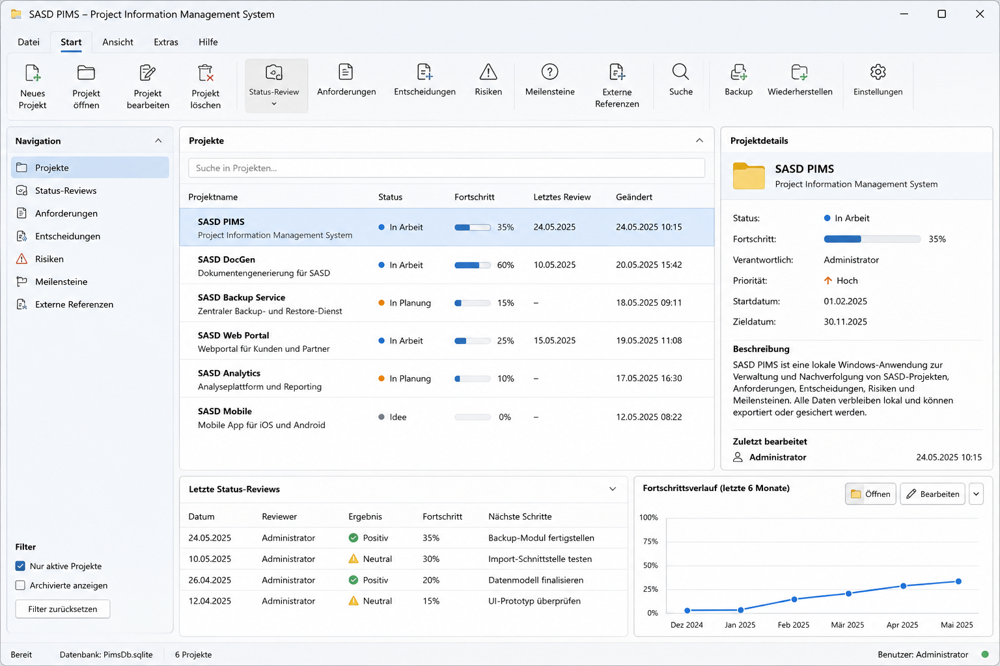
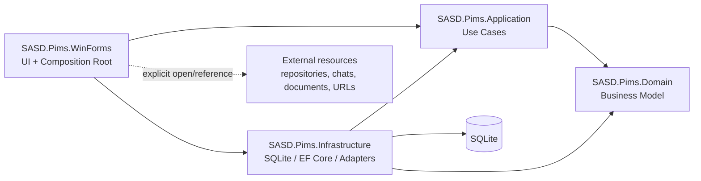

# SASD PIMS

> **Status:** `0.0.1-internal` vertical-slice implementation complete on the local development branch.
> The implemented PoC proves minimal Project creation, SQLite persistence/reopen, export, diagnostics and verified recovery.
> **This is an internal architecture proof, not a supported production release.**

**SASD PIMS (Project Information Management System)** is a planned local-first Windows desktop application for maintaining the information that describes and governs SASD software projects. It is intentionally not a general task-management platform or Jira replacement.

## Problem

Project knowledge tends to become fragmented across repositories, documents, chats, notes, spreadsheets and ad-hoc lists. This makes it difficult to answer basic questions reliably:

- Which projects and products exist?
- What is their current status?
- Which requirements, milestones, decisions and risks belong to them?
- Where are the relevant repositories, documents and discussion links?
- Which information is authoritative and which is only a reference?

SASD PIMS is intended to provide one local, structured point of reference for this information without introducing a large server stack or mandatory cloud service.

## Intended benefit

The application is designed to reduce information fragmentation while keeping operational overhead low. The architectural target is a small modular monolith that runs locally on Windows, stores its authoritative data in SQLite and remains usable without network access.

The expected benefits are:

- structured project and product information;
- explicit separation of project, product, requirement, task, milestone and release concepts;
- traceability between relevant project information;
- typed references to repositories, documents, chats and other external resources;
- reliable local persistence, backup and restore;
- controlled import/export;
- low infrastructure and administration effort.

## Scope and planned functions

The following capabilities are **planned**, not necessarily implemented.

| Area | Planned capability | Earliest roadmap stage |
| --- | --- | --- |
| Project catalog | Create, view and maintain project master data | 0.0.1 / 0.1.0 |
| Project status | Status, review information and blockers | 0.2.0 |
| Requirements | Structured requirements and acceptance information | 0.3.0 |
| References | Typed links to repositories, chats, documents, files and URLs | 0.3.0 |
| Search | Local search and filtering across supported information | 0.4.0 |
| Import / export | Versioned, validated exchange formats | 0.4.0 / 0.5.0 |
| Backup / restore | Verifiable local backup and staged restore | 0.0.1 PoC, hardened by MVP |
| Governance | Milestones, decisions and risks | 0.6.0 |
| Product relation | Minimal product/project relationship | 0.7.0 |
| Reporting | Focused views and exportable information, where justified | post-MVP |

### Explicit non-goals

SASD PIMS is not intended to become:

- a general task manager;
- a Jira, Trello or full project-management replacement;
- a general note-taking application;
- the SASD Prompt Manager;
- a mandatory cloud or multi-user service;
- a generic Kanban framework;
- an IDE or document-management system.

These boundaries are intentional and should only be changed through an explicit architecture or scope decision.

## UI concept and screenshots

> **Design concept — not an implemented application screenshot.**  
> The following image is a generated UI/UX concept used to make the intended desktop experience tangible. It deliberately shows several later-roadmap areas and therefore must not be read as evidence that these functions already exist.



*UI concept for discussion and implementation guidance. The ribbon-like command area is visual inspiration only; it does not change the current architecture decision to prefer standard Windows Forms controls and a small dependency footprint. A real ribbon or external UI framework would require a separate justified decision.*

### Future verified screenshots

The first **real application screenshots** will replace or complement the concept image only after the corresponding workflows are implemented and verified.

> **[SCREENSHOT PLACEHOLDER — Main project catalog]**  
> Add after the corresponding 0.1.0 functionality is implemented and verified.

> **[SCREENSHOT PLACEHOLDER — Project editor]**  
> Add after create/edit/reopen workflows are implemented.

> **[SCREENSHOT PLACEHOLDER — Requirements and external references]**  
> Add no earlier than 0.3.0.

See [`docs/assets/screenshots/README.md`](docs/assets/screenshots/README.md) for the screenshot and demo policy.

## Technology baseline

The current architecture baseline specifies:

- **.NET 10**
- **Windows Forms**
- **SQLite**
- **Entity Framework Core**
- a small modular-monolith solution structure
- offline-first / local-first operation

Additional UI, logging, validation, Markdown, charting, packaging or update libraries are not to be added merely for convenience. They require a demonstrated need and an explicit dependency decision.

## Architecture overview



Key dependency rule: the domain must not depend on Windows Forms, Entity Framework Core, SQLite, filesystem APIs or external providers.

The approved architecture baseline is versioned under `docs/architecture/baseline-v1.0/`. Implementation evidence remains separate from architectural acceptance.


## Documentation baseline

The repository contains the implementation baseline used for the first vertical slice:

- [`docs/baseline/BASELINE.md`](docs/baseline/BASELINE.md) — approval record, source hierarchy and reconciliations;
- [`docs/requirements/lastenheft-v0.1/documents/SASD-PIMS-Lastenheft-v0.1.md`](docs/requirements/lastenheft-v0.1/documents/SASD-PIMS-Lastenheft-v0.1.md) — functional requirements;
- [`docs/specification/pflichtenheft-v0.1/documents/SASD-PIMS-Pflichtenheft-v0.1.md`](docs/specification/pflichtenheft-v0.1/documents/SASD-PIMS-Pflichtenheft-v0.1.md) — technical specification;
- [`docs/architecture/baseline-v1.0/documents/SASD-PIMS-Software-Architecture-Document-v1.0.md`](docs/architecture/baseline-v1.0/documents/SASD-PIMS-Software-Architecture-Document-v1.0.md) — approved architecture baseline;
- [`docs/database/SASD-PIMS-Datenbankspezifikation-v0.1.md`](docs/database/SASD-PIMS-Datenbankspezifikation-v0.1.md) — persistence design for `0.0.1-internal` and `0.1.0`;
- [`docs/ui/SASD-PIMS-UI-UX-Spezifikation-v0.1.md`](docs/ui/SASD-PIMS-UI-UX-Spezifikation-v0.1.md) — minimal UI behaviour for the first two stages;
- [`docs/testing/SASD-PIMS-Test-und-Abnahmespezifikation-v0.1.md`](docs/testing/SASD-PIMS-Test-und-Abnahmespezifikation-v0.1.md) — vertical-slice verification plan;
- [`docs/implementation/VERTICAL-SLICE-0.0.1.md`](docs/implementation/VERTICAL-SLICE-0.0.1.md) — executable scope and Definition of Done.

The existence of a specification does not mean the corresponding functionality has been implemented.

## Repository structure

The intended structure is:

```text
SASD-PIMS/
├── .github/
│   ├── ISSUE_TEMPLATE/
│   └── PULL_REQUEST_TEMPLATE.md
├── docs/
│   ├── architecture/
│   ├── assets/screenshots/
│   └── github/
├── src/
│   ├── Sasd.Pims.Domain/
│   ├── Sasd.Pims.Application/
│   ├── Sasd.Pims.Infrastructure/
│   └── Sasd.Pims.WinForms/
├── tests/
│   ├── Sasd.Pims.Domain.Tests/
│   ├── Sasd.Pims.Application.Tests/
│   ├── Sasd.Pims.Infrastructure.Tests/
│   └── Sasd.Pims.Architecture.Tests/
├── scripts/
├── .editorconfig
├── .gitignore
├── CHANGELOG.md
├── CONTRIBUTING.md
├── SECURITY.md
└── README.md
```

The project directories are placeholders until the vertical slice is scaffolded. Do not create empty architectural layers solely to match this tree; each project must have a concrete responsibility.

## Installation

### Developer prerequisites

To build the current vertical slice:

- Windows 11 x64;
- .NET 10 SDK;
- Git;
- an IDE/editor with C# and Windows Forms support.

Build and test from the repository root:

```powershell
dotnet restore Sasd.Pims.slnx
dotnet build Sasd.Pims.slnx -c Release
dotnet test Sasd.Pims.slnx -c Release
```

Create the evaluated internal self-contained ZIP (generated files remain under ignored `artifacts/`):

```powershell
powershell -NoProfile -ExecutionPolicy Bypass -File .\scripts\build-0.0.1-internal.ps1
```

## Usage

The executable vertical slice (`0.0.1-internal`) implements this deliberately narrow path:

1. start the application;
2. create a project;
3. validate input;
4. persist it to SQLite;
5. close the application;
6. reopen and load the project;
7. exercise a minimal export;
8. exercise backup and restore;
9. verify logging and failure handling.

Runtime data is stored under `%LOCALAPPDATA%\SASD\PIMS`; user-selected exports and backups
are written to the selected path. Version `0.1.0` will turn this proof into a practically
usable local project catalog; that milestone has not started.

## Privacy and security

SASD PIMS is designed around local data ownership.

Architectural security targets include:

- no mandatory cloud connection;
- no telemetry by default;
- secrets must not be written to logs;
- imported data and external links are treated as untrusted input;
- optional external integrations must be isolated behind adapters;
- backup files must be verifiable before restore;
- restore must not destroy the current database before validation;
- diagnostic packages must be user-controlled and data-minimising;
- dependency and release artifacts must be traceable.

These are **design requirements**. Their implementation status must be proven by tests before a release claims them as completed security properties.

Security issues must not be reported through a public issue when they expose a vulnerability. See [`SECURITY.md`](SECURITY.md).

## Roadmap

| Version | Goal | Character |
| --- | --- | --- |
| `0.0.1-internal` | Validate the vertical architecture slice | Internal PoC |
| `0.1.0` | Usable local project catalog | First practical version |
| `0.2.0` | Status, reviews and blockers | Project steering |
| `0.3.0` | Requirements and typed references | Traceability foundation |
| `0.4.0` | Search, traceability and portable export | Information retrieval |
| `0.5.0` | Complete mandatory MVP scope | MVP |
| `0.6.0` | Milestones, decisions and risks | Governance |
| `0.7.0` | Minimal product relationship | Integrated pre-1.0 use |
| `0.8.0` | Feature-complete beta | Stabilisation |
| `0.9.0` | Release candidate | Release qualification |
| `1.0.0` | Stable, accepted baseline | Production release |

The roadmap is intentionally incremental. Version `0.1.0` does **not** represent the complete product.

See [`docs/ROADMAP.md`](docs/ROADMAP.md) for milestone detail.

## Contributing

The repository is expected to be maintained primarily by SASD, but contributions should remain possible without creating a heavyweight process.

Before contributing, read [`CONTRIBUTING.md`](CONTRIBUTING.md). Significant scope or architecture changes should be discussed in an issue before implementation.

The project uses short-lived branches, a release-ready `main` branch, conventional commit messages and automated quality checks as they become available.

## License

SASD PIMS is licensed under the **Apache License 2.0**.

See [`LICENSE`](LICENSE) for the full licence text. Third-party dependencies remain subject to their respective licences and must be recorded before release.

## Project status

The technically accepted `0.0.1-internal` implementation and local release evidence are complete.
Development now targets `0.1.0 — Practical project catalog`. No public release artifact has been
published. Issues, screenshots and release notes distinguish between:

- planned;
- implemented;
- verified;
- released.

Do not mark functionality as complete solely because it is described in requirements or architecture documentation.
