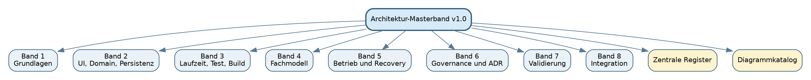
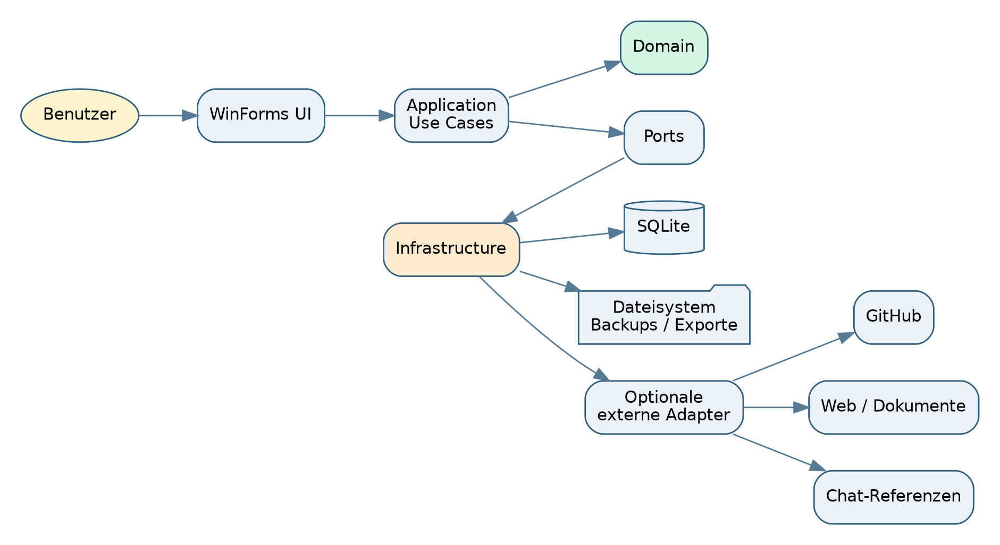
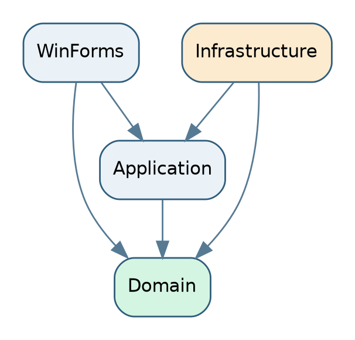
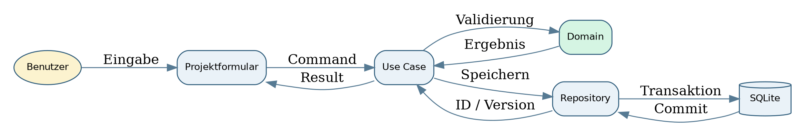
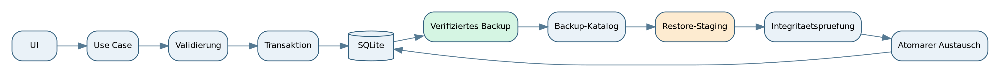
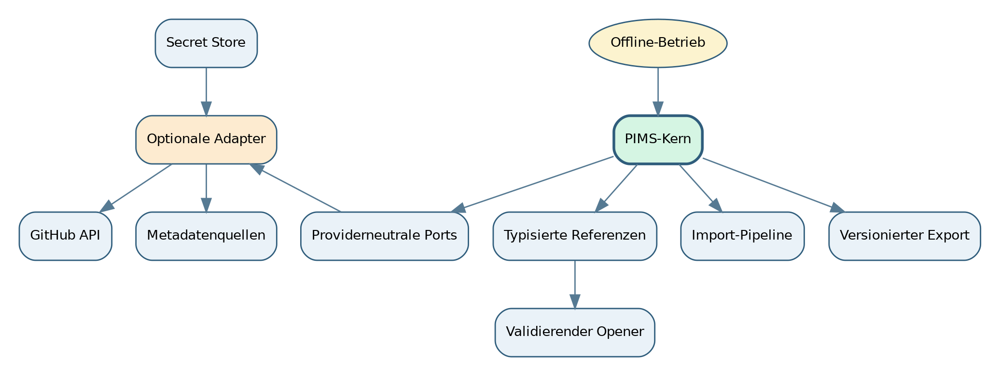

# SASD PIMS - Software Architecture Documentation

## Architekturkompendium und verbindliche Baseline 1.0

**Dokumentstatus:** Freigegebene Architekturbaseline  
**Version:** 1.0  
**Stand:** 4. August 2026  
**Projekt:** SASD Project Information Management System (PIMS)  
**Herausgeber:** SASD-GmbH  
**Dokumenttyp:** Software Architecture Document (SAD)  

> Dieses Hauptdokument konsolidiert die acht fachlichen Architekturbaende zu einer verbindlichen, wartbaren Architekturbaseline. Es ersetzt die Detailbaende nicht. Bei Detailfragen gilt der jeweils referenzierte Band; bei Widerspruechen gilt dieses Masterdokument, bis der Widerspruch durch ein ADR bereinigt ist.

# 1. Dokumentenlenkung

| Merkmal | Wert |
|---|---|
| Dokument | SASD PIMS - Software Architecture Documentation |
| Version | 1.0 |
| Status | Freigegebene Architekturbaseline |
| Freigabedatum | 4. August 2026 |
| Geltungsbereich | MVP und darauf aufbauende Evolution bis zu einer expliziten Architekturrevision |
| Normative Quellen | Projektsteckbrief, Lastenheft, Pflichtenheft, Architekturbaende 1 bis 8 |
| Aenderungsverfahren | Querschnittliche Aenderungen ueber ADR und Auswirkungsanalyse |
| Implementierungsstatus | Architektur angenommen; technische Nachweise sind noch nicht vollstaendig erbracht |

## 1.1 Freigabebedeutung

Mit Version 1.0 wird die Sollarchitektur als Arbeits- und Implementierungsgrundlage freigegeben. Die Freigabe bedeutet nicht, dass jede Entscheidung bereits im Code umgesetzt oder durch Tests belegt ist. Der Status wird deshalb zweidimensional gefuehrt:

- **Architekturstatus:** Accepted, Open oder Deferred.
- **Implementierungsstatus:** nicht nachgewiesen, teilweise nachgewiesen oder implementiert und evidenzbasiert bestaetigt.

Diese Trennung verhindert, dass Dokumentfreigabe faelschlich als technische Fertigstellung interpretiert wird.

## 1.2 Dokumentenreihe

| Band | Titel | Status |
| --- | --- | --- |
| 1 | Architekturgrundlagen, Systemkontext und Strukturentscheidungen | Normativer Detailband der Baseline 1.0 |
| 2 | UI-, Domaenen-, Persistenz-, Sicherheits- und Wiederherstellungsarchitektur | Normativer Detailband der Baseline 1.0 |
| 3 | Laufzeit-, Test-, Build-, Auslieferungs- und Betriebsarchitektur | Normativer Detailband der Baseline 1.0 |
| 4 | Fachliche Bausteine, Informationsmodell, Beziehungen, Suche und Reporting | Normativer Detailband der Baseline 1.0 |
| 5 | Betriebs-, Diagnose-, Resilienz-, Sicherheits- und Wartungsarchitektur | Normativer Detailband der Baseline 1.0 |
| 6 | Architekturgovernance, Entscheidungsregister, Evolutions- und UI-Komponentenstrategie | Normativer Detailband der Baseline 1.0 |
| 7 | Architekturvalidierung, Referenzschnitt, Nachweis- und Implementierungsfreigabe | Normativer Detailband der Baseline 1.0 |
| 8 | Schnittstellen-, Integrations- und Austauscharchitektur | Normativer Detailband der Baseline 1.0 |

# 2. Management Summary

SASD PIMS wird als lokale, offline-faehige Windows-Desktopanwendung entwickelt. Die Architektur folgt einem kleinen modularen Monolithen mit Windows Forms, .NET 10 LTS, EF Core und SQLite. Das System verwaltet Projektinformationen, Produkte, Anforderungen, Meilensteine, Releases, Entscheidungen, Risiken und externe Referenzen. Es ist ausdruecklich kein allgemeiner Task-Manager, keine Jira-Kopie und keine technische Integrationsplattform.

Die Architektur priorisiert Datenintegritaet, Wartbarkeit, Nachvollziehbarkeit, einfache Betriebsfaehigkeit und geringe Abhaengigkeit. Komplexitaet wird nur bei nachgewiesenem Bedarf eingefuehrt. Externe Systeme bleiben im MVP referenzierte Ziele; aktive Integrationen sind optionale Adapter und duerfen den Offline-Kernbetrieb nicht beeintraechtigen.

Die Dokumentation ist inhaltlich abgeschlossen. Der naechste Erkenntnisschritt ist kein weiterer Architekturband, sondern der vertikale Referenzschnitt aus Band 7. Erst dessen Evidenz darf kritische Entscheidungen als implementiert bestaetigen.

# 3. Architekturziele und Qualitaetsprioritaeten

## 3.1 Architekturziele

1. **Verlaessliche lokale Informationshaltung:** Projektinformationen bleiben ohne Cloud- oder Serverdienst nutzbar.
2. **Klare fachliche Semantik:** Projekt, Produkt, Anforderung, Aufgabe, Meilenstein und Release sind getrennte Konzepte.
3. **Datenintegritaet vor Komfort:** Migration, Import, Backup und Restore werden kontrolliert und pruefbar ausgefuehrt.
4. **Wartbare Struktur:** UI, Anwendungsfaelle, Domaene und Infrastruktur besitzen klare Verantwortungsgrenzen.
5. **Geringe Abhaengigkeit:** Bordmittel und kleine, gekapselte Bibliotheken werden umfassenden Frameworks vorgezogen.
6. **Nachvollziehbare Entscheidungen:** Architekturentscheidungen, technische Schulden und Ausnahmen werden sichtbar gefuehrt.
7. **Evidenzbasierte Freigabe:** Kritische Regeln werden durch Tests, Reports und Buildartefakte belegt.

## 3.2 Priorisierte Qualitaetsziele

| Prioritaet | Qualitaetsziel | Architekturfolge |
|---:|---|---|
| 1 | Datenintegritaet und Wiederherstellbarkeit | Transaktionen, Vorab-Backup, Staging-Restore, Integritaetspruefungen |
| 2 | Wartbarkeit und Verstaendlichkeit | kleiner modularer Monolith, klare Abhaengigkeitsrichtung, keine vorschnelle Pluginarchitektur |
| 3 | Offline-Faehigkeit und lokale Kontrolle | SQLite, lokales Dateisystem, keine zwingenden Onlineabhaengigkeiten |
| 4 | Nachvollziehbarkeit | ADRs, Auditfelder, Fehlercodes, Evidenzpakete und Traceability |
| 5 | Bedienbarkeit und Barrierefreiheit | native WinForms-Basis, DPI-, Tastatur- und Accessibility-Gates |
| 6 | Sicherheit und Datenschutz | minimale Secrets, datensparsame Logs, kontrolliertes Oeffnen externer Ziele |
| 7 | Performance | begrenzte Abfragen, Paging/Virtualisierung nach Messung, keine voreilige Spezialkomponente |

## 3.3 Wesentliche Trade-offs

- Ein lokaler Monolith reduziert Betriebs- und Verteilungsaufwand, begrenzt jedoch Mehrbenutzer- und Cloud-Szenarien.
- Native WinForms-Controls reduzieren Lock-in und verbessern die Ausgangslage fuer Accessibility, wirken aber weniger modern als umfassende UI-Suiten.
- SQLite vereinfacht Installation und Backup, ist aber keine spaetere Mehrbenutzer-Serverdatenbank durch blosses Umschalten.
- Selektives Audit bietet Nachvollziehbarkeit ohne Event-Sourcing-Komplexitaet, bildet jedoch nicht jede historische Zustandsaenderung vollstaendig ab.
- Manuelle externe Referenzen sind robust und offline-faehig, liefern aber keine automatische Synchronisation.

# 4. Systemkontext und Systemgrenze

## 4.1 Innerhalb der Systemgrenze

- Windows-Forms-Benutzeroberflaeche
- Application Use Cases und neutrale Ports
- technikfreie Domaene
- EF-Core-/SQLite-Persistenz
- lokale Konfiguration und strukturierte Diagnose
- Import, Export, Backup und Restore
- typisierte externe Referenzen
- optionale, fest verdrahtete Adapter

## 4.2 Ausserhalb der Systemgrenze

- GitHub, GitLab oder andere Repositorydienste
- ChatGPT-Chats und andere Gespraechssysteme
- Browser, Dateimanager und externe Dokumentbetrachter
- E-Mail-, Kalender-, Jira- oder Cloud-Synchronisationsdienste
- allgemeine Task-Management- oder Prompt-Management-Funktionen

## 4.3 Vertrauensgrenzen

Externe URLs, lokale Pfade, Importdateien, Backups, Updatepakete und spaetere API-Antworten sind nicht vertrauenswuerdig. Sie werden validiert, versioniert, begrenzt und erst nach expliziter Benutzeraktion verarbeitet. Das System oeffnet externe Ziele zentral und schemageprueft; es deserialisiert Fremdinhalte nicht direkt in Domaenenobjekte.

# 5. Architekturprinzipien

1. **Einfachheit vor hypothetischer Erweiterbarkeit.**
2. **Domaene frei von WinForms-, EF-Core-, Logging- und Provider-Typen.**
3. **Anwendungsfaelle orchestrieren; Forms enthalten keine Persistenzlogik.**
4. **Abhaengigkeiten zeigen nach innen.**
5. **Ein schreibender Prozess pro Datenbestand im MVP.**
6. **Migration, Import und Restore sind kontrollierte Prozesse, keine Nebenwirkungen beim beliebigen Objektzugriff.**
7. **Fehler werden klassifiziert und benutzergerecht kommuniziert.**
8. **Logs sind strukturiert, lokal, begrenzt und datensparsam.**
9. **Externe Bibliotheken besitzen ein Nutzen-, Lizenz-, Aktivitaets- und Exit-Argument.**
10. **Erweiterungspunkte werden explizit und intern eingefuehrt, bevor ein Pluginmodell erwogen wird.**
11. **Architekturentscheidungen werden durch ADRs und Fitness-Gates geschuetzt.**
12. **Eine vorgeschlagene Architektur gilt erst mit Evidenz als implementiert.**

# 6. Loesungs- und Abhaengigkeitsarchitektur

## 6.1 Produktivprojekte

| Projekt | Verantwortung | Darf kennen |
|---|---|---|
| `Sasd.Pims.WinForms` | Forms, UserControls, Presenter/Controller, Composition Root | Application, Domain; UI-spezifische Adapter |
| `Sasd.Pims.Application` | Use Cases, Commands, Queries, Ports, DTOs und Resultmodelle | Domain |
| `Sasd.Pims.Domain` | Entitaeten, Value Objects, Invarianten, fachliche Services | keine technischen Projekte |
| `Sasd.Pims.Infrastructure` | EF Core, SQLite, Dateisystem, Loggingadapter, Import/Export, Backup, Provideradapter | Application, Domain |

Die Vier-Projekt-Struktur ist die Startbaseline. Zusaetzliche Assemblies werden nur bei realem Isolations-, Deployment- oder Wiederverwendungsbedarf eingefuehrt.

## 6.2 Composition Root

Die konkrete Verdrahtung erfolgt an einer zentralen Stelle im Anwendungsstart. Lebensdauern werden dort sichtbar festgelegt. `DbContext`-Instanzen sind kurzlebig und an einen Use Case beziehungsweise eine klar begrenzte Unit of Work gebunden. Globale Service-Locator und versteckte statische Abhaengigkeiten sind untersagt.

# 7. Fachliche Architektur

## 7.1 Verbindliche Begriffstrennung

| Konzept | Bedeutung | Abgrenzung |
|---|---|---|
| Projekt | zeitlich und organisatorisch begrenztes Vorhaben | nicht das dauerhaft gepflegte Produkt |
| Produkt | dauerhaftes Ergebnis oder Angebot | kann durch mehrere Projekte und Releases weiterentwickelt werden |
| Anforderung | fachlich oder technisch geforderte Eigenschaft | keine ausfuehrende Aufgabe |
| Aufgabe | konkrete Arbeitseinheit | gehoert nicht zum Kernumfang eines vollwertigen Task-Managers |
| Meilenstein | bedeutender Ziel- oder Entscheidungspunkt | kein Release und keine Aufgabe |
| Release | definierter auslieferbarer Produktstand | besitzt Versions- und Freigabebedeutung |
| Entscheidung | nachvollziehbare Festlegung mit Kontext und Folgen | nicht bloss eine Notiz |
| Risiko | unsicheres Ereignis mit Auswirkung und Behandlung | getrennt von Fehler oder Aufgabe |
| Referenz | typisierter Verweis auf externe oder lokale Ressource | keine Kopie des Fremdobjekts |

## 7.2 Aggregate und Identitaet

Aggregate bleiben klein und referenzieren andere Aggregate ueber stabile IDs. Technische GUIDs dienen als dauerhafte Identitaet; optionale Fachcodes erhoehen Lesbarkeit. Statusaenderungen erfolgen ueber Domaenenmethoden, nicht durch beliebige Setter. Harte Loeschung ist Ausnahme; Archivierung schuetzt Beziehungen und Nachvollziehbarkeit.

## 7.3 Pipeline, Portfolio, Suche und Reporting

Pipeline und Portfolio sind Read-Model-Projektionen auf denselben Datenbestand, keine zweiten Wahrheiten. Suche verwendet begrenzte Abfragen und kann nach einem PoC um SQLite-FTS erweitert werden. Berichte werden aus nachvollziehbaren Datenstaenden erzeugt; ob versionierte Snapshots notwendig sind, bleibt eine offene Entscheidung.

# 8. Laufzeit-, Persistenz- und Datenarchitektur

## 8.1 Einheitliches Use-Case-Modell

Jeder schreibende Ablauf folgt derselben Grundfolge:

1. Eingabe in ein Command-/DTO-Modell ueberfuehren.
2. syntaktisch und fachlich validieren.
3. Domaenenobjekte laden oder erzeugen.
4. Invarianten und Nebenlaeufigkeit pruefen.
5. in einer klaren Transaktion speichern.
6. ein typisiertes Ergebnis an die UI zurueckgeben.
7. Erfolg, Warnung oder Fehler ohne interne Details anzeigen.

## 8.2 Persistenz

SQLite ist die alleinige produktive MVP-Persistenz. EF Core kapselt Mapping und Migrationen. Domaenenobjekte tragen keine EF-Core-Attribute, sofern dadurch technische Abhaengigkeit entsteht. Abfragen laden nur benoetigte Daten und verwenden Read Models, wenn die UI keine vollstaendigen Aggregate benoetigt.

## 8.3 Migration

Vor einer Schemamigration werden Dateizugriff, freier Speicher, Datenbankintegritaet und Sicherungsfaehigkeit geprueft. Es wird eine Vorab-Sicherung erstellt. Nach der Migration folgen Integritaets- und Kompatibilitaetspruefungen. Ein Daten-Downgrade wird nicht versprochen; die Rueckfallgrenze wird vor jedem Release dokumentiert.

## 8.4 Import und Export

Importe durchlaufen unveraenderlichen Eingangssnapshot, Formaterkennung, Versionspruefung, syntaktische und semantische Validierung, Vorschau, explizite Freigabe und transaktionale Uebernahme. Exporte besitzen Format-ID und Version und werden ueber temporaere Datei plus atomaren Austausch geschrieben.

# 9. UI- und Komponentenarchitektur

## 9.1 Strategie

WinForms-Bordmittel bilden die Standardbasis. Vollstaendige externe UI-Suiten sind im MVP ausgeschlossen. Eigene SASD-UserControls kapseln nur wiederkehrende fachliche Muster. Externe Spezialkomponenten werden erst nach einem Proof of Concept und hinter einem Adapter eingesetzt.

## 9.2 Empfohlene Muster

- Forms und UserControls verwalten Darstellung, Fokus und Bedienzustand.
- Presenter/Controller koordinieren die UI, enthalten jedoch keine Persistenzlogik.
- DTOs und View Models verhindern die direkte Bindung von EF-Entitaeten.
- `DataGridView`, `TreeView`, `TabControl`, `SplitContainer` und Standarddialoge werden bevorzugt.
- Paging und Filterung gehen einer voreiligen Fremdgrid- oder Virtualisierungsloesung voraus.
- Pipelineansichten erhalten eine alternative Listenansicht und duerfen Status nicht nur farblich darstellen.

## 9.3 DPI und Barrierefreiheit

Per-Monitor-DPI, Skalierung von 100 bis 200 Prozent, Tastaturbedienung, Fokusreihenfolge, AccessibleName, Kontrast und Screenreader-Spotchecks sind Release-Gates. Selbst gezeichnete Controls benoetigen besondere UI-Automation-Pruefung. Jede Diagramm- oder Boarddarstellung erhaelt eine textuelle beziehungsweise tabellarische Alternative.

# 10. Logging, Fehler und Diagnose

Erwartbare Fehler werden ueber typisierte Resultmodelle behandelt; Ausnahmen bleiben unerwarteten technischen Fehlern vorbehalten. Stabile Fehlercodes und Korrelations-IDs verbinden Benutzerhinweis, Logeintrag und Diagnose. Standardlogs enthalten keine Fachtexte, Dokumentinhalte, Tokens, Passwoerter oder vollstaendige externe Nutzdaten.

Supportpakete werden nur benutzerinitiiert erzeugt, vor Versand angezeigt und nicht automatisch uebertragen. Eine zentrale Redaktionsregel entfernt oder maskiert sensible Inhalte. Der konkrete Loggingprovider ist vor der ersten Diagnosefunktion zu entscheiden.

# 11. Betrieb, Sicherheit, Backup und Recovery

## 11.1 Betriebszustaende

PIMS kennt explizite Zustaende: Normalbetrieb, eingeschraenkter Betrieb, Nur-Lesen, Recovery/Wartung und sicheres Beenden. Bei zweifelhaftem Datenzustand wird nicht automatisch repariert, sondern in einen sicheren Modus gewechselt.

## 11.2 Backup und Restore

Backups enthalten Datenbankkopie, Manifest, Versionsinformationen und Pruefsummen. Generationen werden in einem Katalog gefuehrt. Restore erfolgt in einem Stagingbereich, wird dort geprueft und ersetzt den Produktivbestand erst nach erfolgreicher Validierung. Vor einem Restore wird eine Rueckfallsicherung des aktuellen Bestands erstellt.

## 11.3 Sicherheit

- minimale lokale Berechtigungen
- keine Secrets in Konfigurationsdateien oder Logs
- spaetere API-Secrets ausschliesslich ueber `ISecretStore`
- Schema-, Groessen- und Pfadpruefung fuer Import und Restore
- zentrale URI-Allowlist und Bestaetigung fuer externe Ziele
- Releaseinventar, Pruefsummen und SBOM
- keine Hintergrundtelemetrie im MVP

# 12. Test-, Build-, Release- und Evidenzarchitektur

## 12.1 Testpyramide

- Domaenen- und Application-Unit-Tests
- SQLite-Integrationstests mit realen temporaeren Datenbankdateien
- Migrations-, Backup-, Restore- und Import-/Export-Systemtests
- wenige fokussierte UI-Automationstests
- manuelle DPI-, Tastatur- und Accessibility-Pruefung
- Fault Injection fuer kritische Recoverypfade

Ein EF-Core-InMemory-Provider ersetzt keine SQLite-Integrationstests.

## 12.2 Qualitaetsgates

| ID | Gate | Kriterium | Wirkung |
| --- | --- | --- | --- |
| QG-01 | Reproduzierbarer Build | Clean restore/build ohne lokale Sonderkonfiguration | blockierend |
| QG-02 | Unit Tests | Alle Domain- und Application-Tests erfolgreich | blockierend |
| QG-03 | Architekturtests | Keine verbotene Projektreferenz; Domain kennt weder EF Core noch WinForms | blockierend |
| QG-04 | Integration | Persistenz-, Transaktions- und Round-trip-Tests erfolgreich | blockierend |
| QG-05 | Migration/Restore | Vorab-Backup, Migration, Nachprüfung und Rückfall getestet | blockierend |
| QG-06 | UI Baseline | DPI, Tastatur, Fokus, AccessibleName und keine sichtbaren Layoutdefekte | blockierend für ersten Release |
| QG-07 | Performance Baseline | Messwerte dokumentiert; keine Regression über vereinbartem Toleranzband | warnend, später blockierend |
| QG-08 | Supply Chain | Lizenzinventar, feste Paketversionen, bekannte Schwachstellen geprüft | blockierend |
| QG-09 | Dokumentation | ADR, Traceability, Runbook und Änderungsprotokoll aktualisiert | blockierend |
| QG-10 | Evidenzpaket | Manifest, Prüfsummen und Links auf Commit/Build vorhanden | blockierend |

## 12.3 Release

Der Build ist reproduzierbar und verwendet feste Paketversionen. CI prueft Build, Tests, Architekturregeln, Supply Chain und Dokumentation. Die Releasefreigabe bleibt bewusst manuell. Jeder Releasekandidat erzeugt ein Evidenzpaket aus Commit, Testreports, SBOM, Manifest und Pruefsummen.

# 13. Schnittstellen-, Referenz- und Integrationsarchitektur

## 13.1 MVP-Standard

GitHub-Repositories, ChatGPT-Chats, Webressourcen, Dokumente, lokale Dateien und Ordner werden als typisierte Referenzen gespeichert. PIMS besitzt nicht den Fremdinhalt und synchronisiert im MVP keine vollstaendigen Fremdobjekte.

## 13.2 Optionale Adapter

Aktive Integrationen werden ueber providerneutrale Application-Ports und austauschbare Infrastrukturadapter eingefuehrt. Der Kern bleibt offline voll nutzbar. Provider-Metadaten sind optionale, versionierte Snapshots. Ein produktiver Adapter benoetigt einen separaten PoC und ein ADR.

## 13.3 Format- und Sicherheitsregeln

Backupformat und Austauschformat bleiben getrennte Vertraege. CSV erhaelt eigene Encoding-, Mapping- und Formula-Injection-Regeln. Externe Antworten werden begrenzt, validiert und nicht ungeprueft in Domaenenobjekte uebernommen.

# 14. Architekturgovernance und ADR-Baseline

## 14.1 Statusuebersicht

| Status | Anzahl | Bedeutung |
| --- | --- | --- |
| Accepted | 79 | Verbindliche Architekturbaseline; Implementierung ist getrennt nachzuweisen. |
| Open | 10 | Entscheidung vor dem jeweiligen Trigger erforderlich. |
| Deferred | 3 | Bewusst nicht Bestandteil des MVP oder erst spaeter neu zu bewerten. |

Die vollstaendige Liste `ADR-0001` bis `ADR-0092` liegt als maschinenlesbares Masterregister bei. Accepted bedeutet verbindliche Sollentscheidung. Implemented darf erst nach referenzierbarer Evidenz gesetzt werden. Open- und Deferred-Entscheidungen duerfen nicht stillschweigend im Code vorweggenommen werden.

## 14.2 Aenderungsregeln

Ein ADR ist erforderlich, wenn eine Aenderung mehrere Schichten betrifft, ein Daten- oder Austauschformat veraendert, eine neue schwer austauschbare Abhaengigkeit einfuehrt, Sicherheits- oder Recoveryverhalten aendert oder eine bestehende Architekturregel aussetzt. Jede Ausnahme ist begruendet, befristet und mit Rueckkehrkriterium versehen.

# 15. Offene Entscheidungen und technische Schulden

## 15.1 Offene Entscheidungen

| ID | Entscheidung | Faellig | Bezug |
| --- | --- | --- | --- |
| OD-001 | Konkreter Loggingprovider | Vor erster Diagnosefunktion | ADR-0009 |
| OD-002 | Installer- und Updateverfahren | Vor erstem extern installierbaren Release | ADR-0010, ADR-0028 |
| OD-003 | Volltextsuche mit SQLite FTS | Nach realistischem Suchdaten-PoC | ADR-0036 |
| OD-004 | Versionierte Report-Snapshots | Vor verbindlichen Berichten | ADR-0037 |
| OD-005 | Markdownvorschau und Diagrammkomponenten | Nur bei priorisiertem Bedarf | ADR-0054 |
| OD-006 | Performance-Schwellenwerte | Nach stabilem Vertikalschnitt | ADR-0073 |
| OD-007 | Verbindliche MVP-Referenztypen | Vor Referenzmodul | ADR-0079 bis ADR-0080 |
| OD-008 | Lokale Dateien nur verlinken oder auch anhaengen | Vor Datenbankspezifikation | Teil 8 OD-INT-02 |
| OD-009 | Relative Pfade im Projektarbeitsbereich | Vor Dateireferenz-PoC | Teil 8 OD-INT-03 |
| OD-010 | CSV-Import-/Exportumfang | Vor oeffentlichem Austauschformat | ADR-0090 |
| OD-011 | Aufbewahrungs- und Loeschfristen | Vor Archivierungsfeature | TD-012 |
| OD-012 | Aktiver GitHub-Metadatenadapter | Nach Nutzung manueller Referenzen | ADR-0092 |

## 15.2 Technische Schulden

| ID | Typ | Sachverhalt | Risiko | Trigger/Frist |
| --- | --- | --- | --- | --- |
| TD-001 | Decision Debt | Projektstruktur ADR-0005 noch nicht durch Vertikalschnitt bestätigt | Mittel | Vor erstem produktiven Feature |
| TD-002 | Decision Debt | UI-Bindungs- und Presentermodell ADR-0008/0014 nicht praktisch validiert | Mittel | Vor Ausbau mehrerer Formulare |
| TD-003 | Decision Debt | Loggingprovider ADR-0009 offen | Niedrig | Vor erster Diagnosefunktion |
| TD-004 | Decision Debt | Installer und Updateweg ADR-0010/0028 offen | Hoch | Vor erstem extern installierbaren Release |
| TD-005 | Implementation Debt | Architektur-Fitness-Gates noch nicht implementiert | Mittel | Mit Aufbau der CI |
| TD-006 | Evidence Debt | Reale Datenmengen und UI-Performanceannahmen nicht vermessen | Mittel | Vor Optimierungen oder Fremdgrid |
| TD-007 | Decision Debt | Markdownvorschau noch nicht MVP-verbindlich | Niedrig | Wenn formatierte Vorschau priorisiert wird |
| TD-008 | Decision Debt | Diagrammfunktion noch nicht MVP-verbindlich | Niedrig | Wenn Berichtsgrafiken priorisiert werden |
| TD-009 | Evidence Debt | Accessibility- und DPI-Baseline fehlt | Hoch | Vor UI-Freeze |
| TD-010 | Evidence Debt | Migrations- und Restore-Rückfallgrenze nicht prototypisch belegt | Hoch | Vor erster produktiver Schemamigration |
| TD-011 | Specification Debt | Import- und Exportformate noch nicht vollständig versioniert | Mittel | Vor öffentlichem Exportformat |
| TD-012 | Specification Debt | Aufbewahrungs- und Löschfristen noch nicht fachlich entschieden | Mittel | Vor produktivem Archivierungsfeature |
| TD-013 | Evidence Debt | Architekturbaseline 1.0 ist dokumentiert, aber noch nicht durch den vertikalen Referenzschnitt nachgewiesen. | Hoch | Vor breiter MVP-Featureentwicklung |
| TD-014 | Documentation Debt | Lastenheft-, Pflichtenheft- und Architekturkennungen sind noch nicht in einer maschinenlesbaren Gesamttraceability zusammengefuehrt. | Mittel | Vor Release Candidate |

Die offenen Punkte blockieren nicht das Anlegen des Repositorys oder den vertikalen Referenzschnitt. Sie blockieren jedoch jeweils den in der Spalte `Faellig` beziehungsweise `Trigger/Frist` genannten Entwicklungsschritt.

# 16. Vertikaler Referenzschnitt und Implementierungsfreigabe

Die erste Umsetzung bleibt bewusst klein:

1. Anwendung startet mit kontrollierter Konfiguration und Datenpfaden.
2. Benutzer legt ein Projekt an.
3. Eingaben werden fachlich validiert.
4. Projekt wird transaktional in SQLite gespeichert.
5. Anwendung wird geordnet geschlossen.
6. Projekt wird nach Neustart identisch geladen.
7. versionierter Export wird erzeugt und wieder eingelesen.
8. Backup und Staging-Restore werden positiv und negativ getestet.
9. Fehlercodes, Logs und Diagnosepaket werden geprueft.
10. DPI-, Tastatur- und Accessibility-Baseline wird dokumentiert.

Erst nach bestandenen Gates wird die breitere MVP-Featureentwicklung freigegeben. PoC-Code geht nicht automatisch in Produktion; seine Uebernahme erfordert Review und Refactoringentscheidung.

# 17. Verworfen oder bewusst nicht Bestandteil des MVP

- Microservices oder verteilte Dienste
- Serverdatenbank und Mehrbenutzerbetrieb
- Cloud-Synchronisation
- Event Sourcing als allgemeines Persistenzmodell
- generische Pluginarchitektur
- vollstaendige externe UI-Suite
- IDE-artiges Docking ohne fachlichen Nachweis
- automatische Hintergrundtelemetrie
- automatische Reparatur beschaedigter Datenbestaende
- vollstaendige GitHub- oder Chat-Synchronisation
- Fork eines UI- oder Renderingframeworks ohne dauerhaften Wartungsfall

# 18. Rueckverfolgbarkeit und Quellen der Wahrheit

Die Architektur wird ueber folgende Artefakte gesteuert:

1. Projektsteckbrief fuer Ziel und Systemgrenze.
2. Lastenheft fuer fachliche Anforderungen.
3. Pflichtenheft fuer technische Umsetzungsvorgaben.
4. dieses Masterdokument fuer die konsolidierte Architekturbaseline.
5. Detailbaende fuer vertiefte Regeln und Begruendungen.
6. ADR-Masterregister fuer einzelne Entscheidungen.
7. Traceability-, Risiko-, Schulden- und Qualitaetsgate-Register.
8. Code, Tests und Evidenzpakete als Implementierungsnachweis.

Bei Abweichungen zwischen Dokument und Code ist die Abweichung ein Fehler oder eine dokumentationspflichtige Architekturentscheidung, nicht automatisch eine neue Wahrheit.

# 19. Architekturreview und Freigabekriterien

Die Architekturbaseline 1.0 ist inhaltlich vollstaendig, wenn folgende Aussagen gelten:

- Systemgrenze, Qualitaetsziele und Nichtziele sind dokumentiert.
- Fachkonzepte und Verantwortungsgrenzen sind eindeutig.
- Schicht- und Abhaengigkeitsregeln sind pruefbar.
- Persistenz, Migration, Import, Export, Backup und Restore besitzen kontrollierte Pfade.
- UI-, DPI- und Accessibilitystrategie sind festgelegt.
- Fehler-, Logging-, Sicherheits- und Diagnosegrenzen sind definiert.
- Test-, Build-, Release- und Evidenzgates sind beschrieben.
- externe Referenzen und optionale Adapter verletzen Offline-first nicht.
- ADRs, offene Entscheidungen und technische Schulden sind zentral registriert.
- die naechste Arbeit ist als vertikaler Referenzschnitt begrenzt.

Diese Kriterien sind mit der vorliegenden Dokumentenreihe erfuellt. Die Architekturdokumentation wird deshalb mit Version 1.0 redaktionell abgeschlossen. Neue Baende entstehen nur bei einer echten neuen Architekturdomäne; normale Aenderungen erfolgen als ADR und gezielte Aktualisierung der betroffenen Abschnitte.

# 20. Dokumenten- und Diagrammindex

## 20.1 Detailbaende

| Band | Titel | Status |
| --- | --- | --- |
| 1 | Architekturgrundlagen, Systemkontext und Strukturentscheidungen | Normativer Detailband der Baseline 1.0 |
| 2 | UI-, Domaenen-, Persistenz-, Sicherheits- und Wiederherstellungsarchitektur | Normativer Detailband der Baseline 1.0 |
| 3 | Laufzeit-, Test-, Build-, Auslieferungs- und Betriebsarchitektur | Normativer Detailband der Baseline 1.0 |
| 4 | Fachliche Bausteine, Informationsmodell, Beziehungen, Suche und Reporting | Normativer Detailband der Baseline 1.0 |
| 5 | Betriebs-, Diagnose-, Resilienz-, Sicherheits- und Wartungsarchitektur | Normativer Detailband der Baseline 1.0 |
| 6 | Architekturgovernance, Entscheidungsregister, Evolutions- und UI-Komponentenstrategie | Normativer Detailband der Baseline 1.0 |
| 7 | Architekturvalidierung, Referenzschnitt, Nachweis- und Implementierungsfreigabe | Normativer Detailband der Baseline 1.0 |
| 8 | Schnittstellen-, Integrations- und Austauscharchitektur | Normativer Detailband der Baseline 1.0 |

## 20.2 Zentrale Register

- `ADR-Masterregister-v1.0.csv`
- `Offene-Entscheidungen-v1.0.csv`
- `Technische-Schulden-v1.0.csv`
- `Architektur-Qualitaetsgates-v1.0.csv`
- `Traceability-Master-v1.0.csv`
- `Bandregister-v1.0.csv`
- `Diagrammregister-v1.0.csv`

## 20.3 Diagramme

Alle Mermaid-Quellen, DOT-Quellen, SVG- und PNG-Grafiken liegen sowohl fuer den Masterband als auch fuer die acht Detailbaende im strukturierten Paket vor. Das Diagrammregister ordnet jede Grafik ihrem Band und ihren Quelldateien zu.

# 21. Aenderungsprotokoll

| Version | Datum | Aenderung | Status |
|---|---|---|---|
| 0.1 | Juli/August 2026 | Erstellung der acht Architekturdetailbaende | Arbeitsstaende |
| 1.0 | 4. August 2026 | Konsolidierung, Bereinigung der Register, Freigabe der Gesamtbaseline | Freigegeben |
