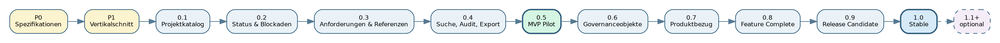
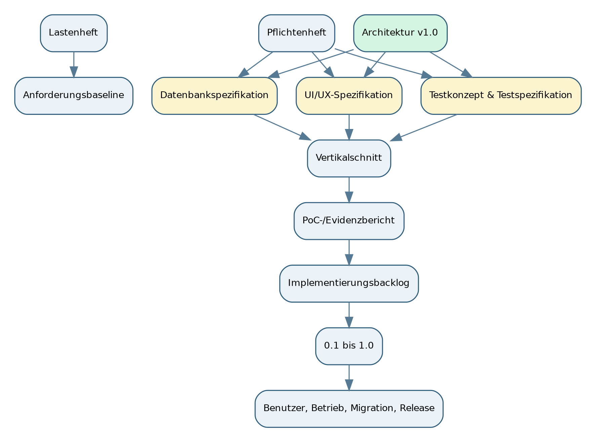
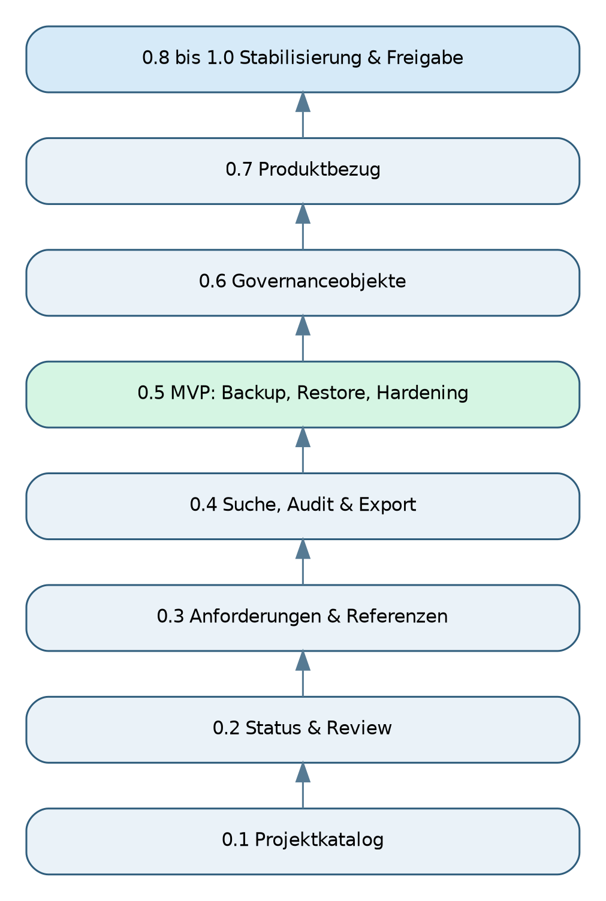
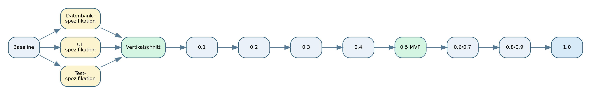
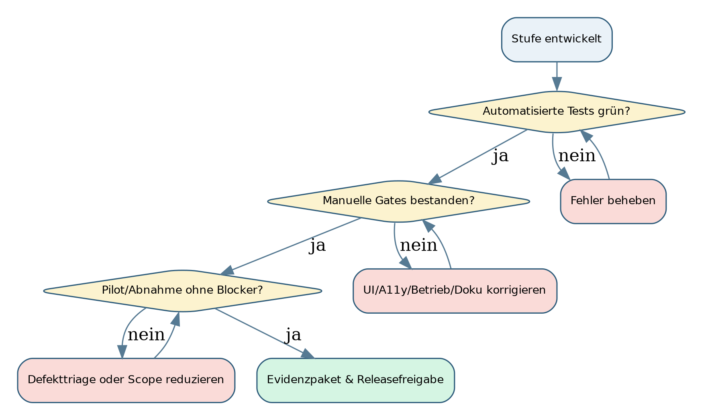

# SASD PIMS - Entwicklungsroadmap und Dokumentationsplan

## Von der freigegebenen Architektur zum vertikalen MVP-Schnitt und zur stabilen Version 1.0

**Dokumentversion:** 0.1  
**Status:** Planungsfassung zur fachlichen und technischen Freigabe  
**Stand:** 4. August 2026  
**Projekt:** SASD Project Information Management System  
**Grundlagen:** Lastenheft v0.1, Pflichtenheft v0.1, Software Architecture Documentation v1.0  

> Die Roadmap ist eine stufenweise Umsetzungs- und Dokumentationsplanung. Sie verändert keine fachliche Muss-/Soll-/Kann-Priorität des Lastenhefts. Wo sie Anforderungen auf mehrere Vorabversionen verteilt, bleibt der vollständige MVP erst mit Version 0.5.0 erreicht.

# 1. Dokumentenlenkung und Status

| Merkmal | Wert |
| --- | --- |
| Dokument | SASD PIMS - Entwicklungsroadmap und Dokumentationsplan |
| Version | 0.1 |
| Status | Planungsfassung zur Freigabe |
| Stand | 4. August 2026 |
| Geltungsbereich | Vorbereitung, PoC, Vorabversionen 0.1 bis 0.9, MVP 0.5, Version 1.0 und optionale Erweiterungen |
| Normative Grundlagen | Lastenheft v0.1; Pflichtenheft v0.1; Architekturdokumentation v1.0 |
| Aufwandseinheit | Netto-Personenwochen eines primären Entwicklers; keine Kalenderzusage |
| Freigabeempfehlung | Freigabe nach Entscheidung über Anforderungsbaseline, Lizenz und P0-Blocker |

## 1.1 Zweck

Dieses Dokument beantwortet zwei Fragen: Welche Dokumente fehlen zwischen der freigegebenen Architektur und einer kontrollierten Umsetzung? Und in welchen kleinen, jeweils baubaren und prüfbaren Stufen soll PIMS entstehen? Es ersetzt weder Lastenheft, Pflichtenheft noch Architektur, sondern ordnet deren Anforderungen zeitlich und liefert Gates für die Umsetzung.

## 1.2 Quellenhierarchie

Bei fachlichen Anforderungen bleibt das Lastenheft führend. Das Pflichtenheft konkretisiert die technische Umsetzung und die AT-IDs. Die Architektur v1.0 legt Systemgrenzen, Abhängigkeiten und Qualitätsgates fest. Diese Roadmap darf keine dieser Quellen stillschweigend verändern. Abweichungen benötigen ein Change-Control-Protokoll und gegebenenfalls ein ADR.

# 2. Management-Zusammenfassung

Die Architektur ist inhaltlich abgeschlossen. Der Engpass ist nicht mehr ein fehlender Architekturband, sondern die Überführung in spezifizierte Daten-, UI- und Testartefakte sowie der praktische Nachweis durch einen vertikalen Referenzschnitt. Lastenheft und Pflichtenheft liegen weiterhin als Entwurfsfassungen v0.1 vor und sollten vor dem ersten produktiven Commit formal baselined werden.

Die empfohlene Reihenfolge lautet: erst Datenbankspezifikation, UI-/UX-Spezifikation, Testspezifikation und priorisiertes Backlog; danach ein kleiner Vertikalschnitt; anschließend mehrere bewusst begrenzte Vorabversionen. Version 0.1 ist nur ein lokaler Projektkatalog. Status, Anforderungen, Referenzen, Suche, Audit, Export sowie Backup/Restore werden nacheinander ergänzt. Der vollständige Muss-Umfang und damit der MVP wird erst mit Version 0.5.0 erreicht.

Die Soll-Funktionen für 1.0 - Meilensteine, Entscheidungen, Risiken, minimaler Produktbezug und kontextbezogene Schnellanlage - folgen in 0.6 und 0.7. Version 0.8 friert die Funktionen ein, 0.9 ist der Release Candidate, 1.0 veröffentlicht denselben freigegebenen Stand. Release-1.1-Funktionen bleiben nach einer 1.0-Retrospektive neu zu priorisieren.

Die realistische Basisschätzung beträgt 35 bis 58 Netto-Personenwochen. Mit 20 bis 25 Prozent Risikoreserve ergibt sich ein Planungsrahmen von etwa 42 bis 73 Personenwochen. Bei Vollzeitfokus entspricht dies grob 10 bis 17 Kalendermonaten; bei Teilzeit und parallelen SASD-Projekten kann sich der Zeitraum deutlich verlängern. Die Bandbreite ist Absicht: Datenmigration, Restore, Barrierefreiheit und Pilotkorrekturen sind erfahrungsgemäß nicht seriös auf den Tag planbar.

# 3. Gesicherte Grundlagen, Annahmen und Grenzen

## 3.1 Gesicherte Grundlagen

- PIMS ist eine lokale, offline-fähige Windows-Forms-Anwendung mit .NET 10, EF Core und SQLite.
- Der MVP umfasst die Muss-Anforderungen des Lastenhefts: Projektstamm, Status/Review, Anforderungen, Blockaden, Referenzen, Suche/Filter, Audit, Logging, Backup/Restore, JSON-/Markdown-Export, Validierung, sichere externe Ziele und definierte Datenpfade.
- PIMS ersetzt weder GitHub noch Task-, Notiz-, Prompt-, Dokumenten- oder Chat-Systeme.
- Die Architektur v1.0 ist freigegeben, aber ihre Implementierungsevidenz steht noch aus.
- Das Pflichtenheft empfiehlt ausdrücklich M0/Spike, danach Projektkern, Anforderungen/Blockaden, Suche/Audit/Export und Backup/Hardening.

## 3.2 Annahmenregister

| ID | Annahme | Begründung | Auswirkung bei Abweichung | Klärung |
| --- | --- | --- | --- | --- |
| A-RM-001 | Ein primärer Entwickler trägt Architektur, Implementierung, Test und Dokumentation. | SASD-Rahmenbedingung mit begrenzten personellen Ressourcen. | Mit zusätzlicher Entwicklungskapazität können Stufen parallelisiert, aber Review- und Integrationsaufwand steigt. | Fortlaufend |
| A-RM-002 | Aufwand wird in Netto-Personenwochen geschätzt, nicht als Kalenderzusage. | Unterbrechungen, Weiterbildung und andere SASD-Projekte sind nicht planbar. | Kalendertermine können deutlich variieren. | Bei Terminplanung |
| A-RM-003 | Windows 11 x64, .NET 10, WinForms, EF Core und SQLite bleiben die technische Baseline. | Pflichtenheft und Architektur v1.0. | Daten-, UI-, Build- und Testplanung muss neu bewertet werden. | Vor Repository-Initialisierung |
| A-RM-004 | Der erste produktive Einsatz ist lokal und im Wesentlichen Einzelplatzbetrieb. | Projektgrundlage und Architektur. | Mehrbenutzerbetrieb erfordert neue Persistenz-, Konflikt-, Sicherheits- und Betriebsarchitektur. | Vor MVP-Freigabe |
| A-RM-005 | Vorhandener SASD-Code wird nur nach Einzelprüfung übernommen. | Pflichtenheft fordert Codequellenreview und warnt vor Blindkopien. | Altlasten, Lizenz- und Wartungsrisiken können in PIMS gelangen. | P0 / PoC |
| A-RM-006 | Lastenheft und Pflichtenheft bleiben fachlich führend, müssen aber vor Entwicklungsbeginn formal baselined werden. | Beide Dokumente liegen als Entwurfsfassungen v0.1 vor; Architektur v1.0 ist freigegeben. | Implementierung startet auf nicht eindeutig freigegebener Anforderungsbasis. | P0 |
| A-RM-007 | PIMS wird ab v0.1 intern mit realen SASD-Projekten erprobt, ist aber erst ab MVP als führender Bestand freigabefähig. | Frühes Dogfooding liefert Nutzen und Feedback; Backup/Restore und Vollständigkeit fehlen vorher. | Ohne reale Nutzung werden Bedien- und Datenmodellfehler spät erkannt. | v0.1-Freigabe |

## 3.3 Bewusste Roadmapgrenzen

- Keine verbindlichen Kalendertermine ohne geklärte verfügbare Wochenkapazität.
- Keine Mehrbenutzer-, Cloud- oder Synchronisationsplanung in 1.0.
- Keine automatische GitHub- oder Chat-Integration vor einem späteren PoC.
- Keine vollständige physische Modellierung von Release-1.1-/2.x-Funktionen in P0.
- Keine Annahme, dass vorhandene SASD-Repositories direkt wiederverwendbar sind.

# 4. Bewertung des Planungsstands und fehlende Dokumente

## 4.1 Gesamtbewertung

Projektsteckbrief, Recherche, Lastenheft, Pflichtenheft und Architektur bilden eine ungewöhnlich starke Planungsbasis. Für eine kontrollierte Implementierung fehlen jedoch operative Spezifikationen und releasebegleitende Nachweise. Besonders kritisch sind Datenbankspezifikation, UI-/UX-Spezifikation, Testkonzept/Testspezifikation, Implementierungsbacklog und PoC-Evidenz. Ohne diese Artefakte müsste der Code Details entscheiden, die später nur teuer korrigierbar wären.

## 4.2 Abgeleitete Dokumente

| ID | Dokument | Priorität | Benötigt ab | Zweck | Status | Pflege |
| --- | --- | --- | --- | --- | --- | --- |
| DOC-001 | Anforderungsbaseline und Change-Control-Protokoll | Blocker | P0 | Lastenheft/Pflichtenheft freigeben, Änderungen versionieren, Widerspruchsregel festlegen. | fehlt / Entwurfsstatus der Quellen klären | bei jeder fachlichen Scopeänderung |
| DOC-002 | Datenbankspezifikation | Blocker | P0 | Logisches und physisches Modell, Tabellen, Schlüssel, Constraints, Indizes, Seed-Daten, Migrationen, Datenpfade und Backupformat. | fehlt; Architektur enthält nur Rahmen | jede Schemaänderung |
| DOC-003 | UI-/UX-Spezifikation und Navigationskonzept | Blocker | P0 | Fenster, Navigation, Zustände, Formulare, Dialoge, Tastatur, DPI, A11y, Fehlermeldungen und Komponentenstrategie. | fehlt; Architektur enthält Prinzipien | pro UI-Release |
| DOC-004 | Testkonzept und Testspezifikation | Blocker | P0/PoC | AT-IDs in konkrete automatisierte/manuelle Tests, Testdaten, Umgebungen, Evidenzen und Abnahmeprotokolle übersetzen. | fehlt; Pflichtenheft enthält AT-Basis | pro Stufe |
| DOC-005 | Implementierungsplan und priorisiertes Backlog | Blocker | P0 | Epics, vertikale Stories, technische Tasks, Abhängigkeiten, Releasezuordnung und Definition of Ready. | fehlt; diese Roadmap liefert die Makrostufen | laufend |
| DOC-006 | Repository-, Build- und Entwicklungsleitfaden | hoch | P0 | Solutionstruktur, lokale Befehle, Branch-/Commitregeln, Codequalität, Paketversionen und Reproduzierbarkeit. | teilweise durch Architektur/SASD Development Standard abgedeckt | bei Toolchainänderungen |
| DOC-007 | Drittanbieter-, Lizenz- und SBOM-Register | hoch | PoC | Paket, Version, Lizenz, Zweck, Quelle, Maintainerstatus, Update- und Exitentscheidung. | fehlt als PIMS-spezifisches Register | jeder Paketwechsel |
| DOC-008 | Vertikalschnitt-/PoC-Bericht und Evidenzmanifest | Blocker | PoC-Exit | Architekturentscheidungen praktisch bestätigen, Messergebnisse und Abweichungen dokumentieren. | fehlt; Band 7 definiert Inhalt | einmalig plus Wiederholung bei kritischer Architekturänderung |
| DOC-009 | Fachlicher Datenkatalog und Glossar | hoch | v0.1 | Felder, Semantik, zulässige Werte, Herkunft, Pflichtstatus, Aufbewahrung und führendes System. | teilweise in Lastenheft/Architektur | jede Domänenerweiterung |
| DOC-010 | Fehlercode-, Logging- und Diagnosekatalog | hoch | v0.1-v0.4 | Stabile Fehlercodes, Benutzertexte, technische Ereignisse, Redaktionsregeln und Supportpaket. | teilweise in Architektur | pro Fehlerklasse |
| DOC-011 | Austauschformat-Spezifikation | hoch | v0.3-v0.4 | JSON-Schema, Formatversion, IDs, Kompatibilität, Markdown-Ausgabe, spätere Importregeln. | Architekturrahmen vorhanden; konkreter Vertrag fehlt | versioniert |
| DOC-012 | Security- und Datenschutz-Verifikationsplan | hoch | v0.3 | Threats, sichere URI-/Pfadbehandlung, Secret-Erkennung, Logredaktion, Abhängigkeiten und Negativtests. | Architektur-Threat-Model vorhanden; Testplan fehlt | pro Release |
| DOC-013 | Backup-/Restore-Spezifikation und Recovery-Runbook | Blocker für MVP | v0.4-v0.5 | Paketformat, Manifest, Hashes, Staging, Integritätsprüfung, Rückfallsicherung und Notfallablauf. | Architekturrahmen vorhanden | bei Format-/Schemaänderung |
| DOC-014 | Benutzerhandbuch und Quick Start | hoch | v0.1, vollständig ab MVP | Kernabläufe, Begriffe, Einschränkungen, Backup/Restore und Exporte. | fehlt | pro Release |
| DOC-015 | Installations-, Update- und Betriebshandbuch | Blocker für 0.9/1.0 | v0.5-v0.9 | Systemvoraussetzungen, Pfade, Installation, Update, Migration, Logs, Deinstallation und Recovery. | fehlt | pro Release |
| DOC-016 | Wartungs- und Migrationshandbuch | Blocker für 1.0 | v0.8 | Schema- und Formatmigration, unterstützte Upgradepfade, Downgradegrenzen, Datenreparatur und Abkündigungen. | fehlt | pro Migration |
| DOC-017 | Release-, Abnahme- und Evidenzpaket | Blocker je Release | v0.1 | Changelog, bekannte Einschränkungen, Testbericht, SBOM, Prüfsummen, Migrationshinweis und Freigabe. | fehlt als wiederverwendbare Vorlage | jedes Release |
| DOC-018 | Pilot- und Usability-Auswertungen | hoch | v0.1-MVP | Reale Nutzung, Pflegeaufwand, Fehler, Suchverhalten, Verständlichkeit und A11y-Probleme auswerten. | fehlt | nach jedem Pilotzyklus |

## 4.3 Dokumente, die nicht separat neu erfunden werden sollten

- Ein weiterer allgemeiner Architekturband ist nicht erforderlich. Neue Architekturfragen werden als ADR behandelt.
- Ein separates allgemeines Domänenhandbuch ist nur nötig, wenn Datenkatalog und Glossar nicht ausreichen.
- Ein eigenständiges Security-Handbuch soll die Architektur nicht duplizieren; benötigt wird ein konkreter Verifikationsplan und später ein Betriebsabschnitt.
- Ein vollständiger Projektmanagementplan mit Termin- und Ressourcenverwaltung wäre für die Einpersonenentwicklung unnötig schwer. Roadmap, Backlog, Risiken und Releasegates genügen.

# 5. Roadmapprinzipien, Releaseverständnis und Aufwand

## 5.1 Releaseverständnis

Version 0.1 ist nicht der MVP. Sie ist die erste praktisch nutzbare Alpha mit begrenztem Datenbestand. Der MVP ist erreicht, sobald alle Muss-Anforderungen und die nichtfunktionalen Mindestgates bestanden sind; in dieser Roadmap ist das Version 0.5.0. Dadurch bleibt jede Stufe klein, testbar und nützlich, ohne den Begriff MVP zu verwässern.

## 5.2 Planungsregeln

- Jede Stufe besitzt einen vertikalen Nutzen und ein installierbares Artefakt.
- Neue Domänenobjekte werden erst in ihrer Stufe physisch modelliert.
- Vorversionen dürfen pilotiert werden, sind aber bis 0.5 nicht alleinige führende Quelle.
- Jede Stufe aktualisiert Dokumentation, Migrationen, Tests und Changelog.
- Ein Release wird nicht durch Funktionsmenge, sondern durch bestandene Gates freigegeben.
- Scope wird reduziert, wenn eine Stufe ihren Aufwandskorridor deutlich überschreitet; Qualität wird nicht reduziert.

## 5.3 Aufwandsschätzung

| Stufe | Version | Bezeichnung | Nettoaufwand | Maturity |
| --- | --- | --- | --- | --- |
| P0 | kein Produktrelease | Vorbereitung und Spezifikationsabschluss | 3-5 PW | Vorbereitung |
| P1 | 0.0.1-internal | Vertikaler Referenzschnitt / Proof of Concept | 2-4 PW | PoC |
| R0.1 | 0.1.0 | Projektkatalog Alpha | 3-5 PW | Release |
| R0.2 | 0.2.0 | Status, Review und Blockaden | 3-4 PW | Release |
| R0.3 | 0.3.0 | Anforderungen und externe Referenzen | 4-6 PW | Release |
| R0.4 | 0.4.0 | Suche, Nachvollziehbarkeit und portable Exporte | 4-6 PW | Release |
| MVP | 0.5.0 | MVP-Pilot und Zuverlässigkeitsfreigabe | 4-6 PW | MVP |
| R0.6 | 0.6.0 | Meilensteine, Entscheidungen und Risiken | 3-5 PW | Release |
| R0.7 | 0.7.0 | Produktbezug und integrierte 1.0-Nutzung | 3-5 PW | Release |
| R0.8 | 0.8.0 | Feature-Complete Beta für 1.0 | 3-5 PW | Release |
| R0.9 | 0.9.0 | Release Candidate | 2-4 PW | Release |
| R1.0 | 1.0.0 | Stabile Erstversion | 1-2 PW | Release |

**Summenbewertung:** 35 bis 58 Netto-Personenwochen ohne Reserve. Mit 20 bis 25 Prozent Reserve: ungefähr 42 bis 73 Personenwochen. Die Reserve deckt Lernaufwand, Defektbehebung, Migration, Accessibility, Dokumentationskorrektur und Pilotfeedback ab - nicht zusätzliche Funktionen.

# 6. Gesamtroadmap und kritischer Pfad

Der kritische Pfad verläuft von der formalen Baseline über Datenbank-, UI- und Testspezifikation zum Vertikalschnitt. Erst danach ist eine belastbare Implementierung des Projektkatalogs sinnvoll. Die Muss-Funktionen werden in vier fachliche Vorabversionen verteilt; die Zuverlässigkeits- und Recoveryfreigabe schließt den MVP ab. Die Soll-Funktionen für 1.0 werden anschließend ergänzt und getrennt stabilisiert.

| Code | Version | Stufe | Aufwand | Sicherheit | Ziel |
| --- | --- | --- | --- | --- | --- |
| P0 | kein Produktrelease | Vorbereitung und Spezifikationsabschluss | 3-5 PW | mittel | Eine widerspruchsarme, implementierbare Ausgangsbasis schaffen und die drei unmittelbar fehlenden Arbeitsgrundlagen - Datenbankspezifikation, UI-/UX-Spezifikation und Testspezifikation - fertigstellen. |
| P1 | 0.0.1-internal | Vertikaler Referenzschnitt / Proof of Concept | 2-4 PW | mittel | Die Architekturbaseline durch einen durchgängigen, kleinen Pfad praktisch bestätigen: Starten, Projekt anlegen, validieren, speichern, neu laden, exportieren, sichern und wiederherstellen. |
| R0.1 | 0.1.0 | Projektkatalog Alpha | 3-5 PW | mittel | Eine kleine, praktisch nutzbare lokale Anwendung für die Erfassung und das Wiederfinden von SASD-Projekten bereitstellen. |
| R0.2 | 0.2.0 | Status, Review und Blockaden | 3-4 PW | mittel | Aus dem Projektkatalog ein verlässliches Statusinstrument machen. |
| R0.3 | 0.3.0 | Anforderungen und externe Referenzen | 4-6 PW | mittel bis niedrig | Anforderungen aus Chats und Dokumenten mit Herkunft und Akzeptanzkriterien strukturiert dem richtigen Projekt zuordnen. |
| R0.4 | 0.4.0 | Suche, Nachvollziehbarkeit und portable Exporte | 4-6 PW | mittel | Den wachsenden Informationsbestand schnell auffindbar und außerhalb von PIMS lesbar machen. |
| MVP | 0.5.0 | MVP-Pilot und Zuverlässigkeitsfreigabe | 4-6 PW | mittel bis niedrig | Alle Muss-Anforderungen des Lastenhefts zu einem belastbaren, intern produktiv nutzbaren MVP zusammenführen. |
| R0.6 | 0.6.0 | Meilensteine, Entscheidungen und Risiken | 3-5 PW | mittel | Die projektbezogene Governance über Status und Anforderungen hinaus erweitern. |
| R0.7 | 0.7.0 | Produktbezug und integrierte 1.0-Nutzung | 3-5 PW | mittel bis niedrig | Projekt und Produkt fachlich verbinden und die 1.0-Kernabläufe zu einem konsistenten Arbeitsbereich integrieren. |
| R0.8 | 0.8.0 | Feature-Complete Beta für 1.0 | 3-5 PW | mittel | Den geplanten 1.0-Funktionsumfang einfrieren und Stabilisierung, Dokumentation und Upgradefähigkeit in den Mittelpunkt stellen. |
| R0.9 | 0.9.0 | Release Candidate | 2-4 PW | mittel | Ein installierbares, upgradefähiges und abnahmebereites Kandidatenpaket ohne neue Fachfunktionen erzeugen. |
| R1.0 | 1.0.0 | Stabile Erstversion | 1-2 PW | hoch nach 0.9 | Den freigegebenen 1.0-Umfang als stabile, dokumentierte und wartbare Produktversion veröffentlichen. |

# 7. P0 - Vorbereitung und Spezifikationsabschluss (kein Produktrelease)

| Merkmal | Wert |
| --- | --- |
| Ziel | Eine widerspruchsarme, implementierbare Ausgangsbasis schaffen und die drei unmittelbar fehlenden Arbeitsgrundlagen - Datenbankspezifikation, UI-/UX-Spezifikation und Testspezifikation - fertigstellen. |
| Nutzen | Verhindert, dass der erste Code implizite Fach- und Datenentscheidungen festschreibt. Danach kann der Vertikalschnitt ohne erneuten Architekturentwurf beginnen. |
| Nettoaufwand | 3-5 PW |
| Schätzsicherheit | mittel |
| Anforderungsbezug | Architektur-/Vorbereitungsstufe |

## Ziel und Nutzen

Eine widerspruchsarme, implementierbare Ausgangsbasis schaffen und die drei unmittelbar fehlenden Arbeitsgrundlagen - Datenbankspezifikation, UI-/UX-Spezifikation und Testspezifikation - fertigstellen. Verhindert, dass der erste Code implizite Fach- und Datenentscheidungen festschreibt. Danach kann der Vertikalschnitt ohne erneuten Architekturentwurf beginnen.

## Enthaltene Funktionen und Ergebnisse

- Lastenheft und Pflichtenheft formal baselinen oder Abweichungen dokumentieren
- Datenbankspezifikation v0.1 für Project, Klassifikation, Statusbasis und technische Metadaten
- UI-/UX-Spezifikation v0.1 für Shell, Projektliste, Projekteditor, Validierung und Zustände
- Testkonzept v0.1 mit PoC- und v0.1-Testfällen
- priorisiertes Backlog mit vertikalen Stories
- Repository-, Lizenz-, Paket- und Buildbaseline
- Review vorhandener SASD-Codequellen auf konkrete wiederverwendbare Teile

## Bewusst nicht enthalten

- vollständiges Endschema aller Release-1.1-Objekte
- pixelgenaue Spezifikation sämtlicher späterer Dialoge
- aktive externe Integrationen
- Installerentscheidung für 1.0

## Technische Arbeiten

- Solution- und Repositorystruktur festlegen
- lokale Build-/Test-/Publishskripte vorbereiten
- Directory.Packages.props und Paketbudget einrichten
- Codeanalyse, Warnungen und Formatierung konfigurieren
- Testverzeichnisse und synthetische Datenkonvention definieren

## Dokumentation

- DOC-001 bis DOC-007 als erste Baseline
- Roadmap v0.1 freigeben
- ADR-/Entscheidungsregister aktualisieren

## Tests und Abnahmekriterien

**Testschwerpunkte**

- Dokumentenreview auf Widersprüche
- Traceability-Stichprobe von Muss-Anforderung zu geplantem Test
- leerer Build der Solution und reproduzierbarer Publish
- Lizenz- und Abhängigkeitsprüfung aller Startpakete

**Abnahmekriterien**

- Keine ungelöste Blockerentscheidung für Project-Schema, Datenpfade, UI-Shell oder Testaufbau
- lokaler Build/Test/Publish läuft auf sauberem Checkout
- PoC-Backlog ist klein genug für maximal vier Netto-Personenwochen

## Abhängigkeiten

- Architektur v1.0
- Lastenheft v0.1
- Pflichtenheft v0.1
- SASD Development Standard als normative Entwicklungsbasis

## Stufenspezifische Risiken

- Überplanung statt Umsetzung
- widersprüchlicher Entwurfsstatus von Lasten-/Pflichtenheft
- zu breite Datenbankspezifikation

## Definition of Done

- Datenbank-, UI- und Testspezifikation v0.1 reviewfähig
- Backlog und Releasezuordnung vorhanden
- Buildbaseline nachgewiesen
- alle P0-Blocker entschieden oder ausdrücklich als PoC-Frage terminiert

# 8. P1 - Vertikaler Referenzschnitt / Proof of Concept (0.0.1-internal)

| Merkmal | Wert |
| --- | --- |
| Ziel | Die Architekturbaseline durch einen durchgängigen, kleinen Pfad praktisch bestätigen: Starten, Projekt anlegen, validieren, speichern, neu laden, exportieren, sichern und wiederherstellen. |
| Nutzen | Liefert frühe Evidenz für Schichten, EF Core/SQLite, DI, Logging, Datenpfade, Backup/Restore und Releaseprozess, bevor breite Funktionalität entsteht. |
| Nettoaufwand | 2-4 PW |
| Schätzsicherheit | mittel |
| Anforderungsbezug | Architektur-/Vorbereitungsstufe |

## Ziel und Nutzen

Die Architekturbaseline durch einen durchgängigen, kleinen Pfad praktisch bestätigen: Starten, Projekt anlegen, validieren, speichern, neu laden, exportieren, sichern und wiederherstellen. Liefert frühe Evidenz für Schichten, EF Core/SQLite, DI, Logging, Datenpfade, Backup/Restore und Releaseprozess, bevor breite Funktionalität entsteht.

## Enthaltene Funktionen und Ergebnisse

- WinForms-Shell mit einem Projekteditor
- Project-Aggregat mit minimalen Pflichtfeldern
- Application Use Case und typisiertes Result
- SQLite-Persistenz und erste Migration
- strukturierter technischer Fehlerpfad
- minimaler JSON-Round-trip
- Backup-/Restore-Spike im temporären Testprofil
- lokaler Release-Publish als ZIP

## Bewusst nicht enthalten

- Projektlistenkomfort und vollständige Klassifikation
- Anforderungen, Blockaden und Referenzen als Produktfunktion
- produktionsreifer Restore-Assistent
- vollständige A11y- und Performanceabnahme

## Technische Arbeiten

- vier Projekte gemäß Architekturbaseline anlegen
- DbContext pro Use Case
- Migration mit Vorab-Sicherung im Spike
- CorrelationId und mindestens ein stabiler Fehlercode
- Integrationstest mit realer SQLite-Datei
- Fault Injection für abgebrochenes Speichern oder beschädigtes Backup

## Dokumentation

- DOC-008 PoC-Bericht und Evidenzmanifest
- Datenbank-/UI-/Testspezifikation anhand der Ergebnisse korrigieren
- ADRs auf Accepted/Rejected/Changed aktualisieren

## Tests und Abnahmekriterien

**Testschwerpunkte**

- Domain-Validierung
- SQLite-Save-Load-Round-trip
- Migration auf leerer Datenbank
- Export syntaktisch prüfen
- Backup-Hash und Restore im Staging
- Start/Shutdown ohne verwaiste Ressourcen

**Abnahmekriterien**

- Projekt wird nach Neustart identisch geladen
- Fehler führen nicht zu unkontrolliertem Absturz
- Restore verändert den aktiven Bestand erst nach erfolgreicher Prüfung
- Build/Test/Publish reproduzierbar
- keine direkte DbContext-Nutzung in Form-Eventhandlern

## Abhängigkeiten

- P0 abgeschlossen
- Startpakete lizenziert
- Datenpfade festgelegt

## Stufenspezifische Risiken

- PoC wird unreflektiert Produktionscode
- Backup-Spike wird zu oberflächlich
- zu viele Frameworks werden gleichzeitig getestet

## Definition of Done

- Evidenzpaket vollständig
- kritische Architekturabweichungen entschieden
- PoC-Code entweder produktionsreif refaktoriert oder klar verworfen
- Freigabe für v0.1 erteilt

# 9. R0.1 - Projektkatalog Alpha (0.1.0)

| Merkmal | Wert |
| --- | --- |
| Ziel | Eine kleine, praktisch nutzbare lokale Anwendung für die Erfassung und das Wiederfinden von SASD-Projekten bereitstellen. |
| Nutzen | Erstmals kann ein realer Projektbestand strukturiert angelegt werden. Die Version schafft sichtbaren Nutzen, ohne den vollständigen MVP vorzutäuschen. |
| Nettoaufwand | 3-5 PW |
| Schätzsicherheit | mittel |
| Anforderungsbezug | LF-PRO-001, LF-PRO-004, LF-UI-001, LF-VAL-001, LF-SEC-003 |

## Ziel und Nutzen

Eine kleine, praktisch nutzbare lokale Anwendung für die Erfassung und das Wiederfinden von SASD-Projekten bereitstellen. Erstmals kann ein realer Projektbestand strukturiert angelegt werden. Die Version schafft sichtbaren Nutzen, ohne den vollständigen MVP vorzutäuschen.

## Enthaltene Funktionen und Ergebnisse

- Projektstammsätze mit stabiler Kennung, Name, Kurzbeschreibung, Ziel und Nutzen
- Projektart, Projektbereich und einfache Tags
- Master-Detail-Navigation
- Anlegen, Bearbeiten, Archivieren und Wiederfinden
- zentrale Validierung der Projektfelder
- definierte lokale Daten- und Logpfade
- Basisfilter nach Art, Bereich und Archivstatus
- lesender Schnellüberblick über etwa 15 reale Projekte

## Bewusst nicht enthalten

- vollständige Status-/Reviewlogik
- Anforderungen, Blockaden und Referenzen
- globale Suche über mehrere Objekttypen
- produktiver Backup-/Restore-Assistent
- PIMS als alleinige führende Datenquelle

## Technische Arbeiten

- Project-Schema und Klassifikationen produktionsnah
- stabile IDs und eindeutige Project.Key-Constraint
- Master-/Detail-Read Models
- optimistische Konflikterkennung oder Versionsfeld vorbereiten
- Rotation technischer Logs
- DPI-fähige Layoutcontainer und Tastaturreihenfolge ab erstem UI

## Dokumentation

- Quick Start v0.1
- Fachlicher Datenkatalog für Project/Klassifikation
- Release Notes, bekannte Einschränkungen und Testbericht
- README und Entwicklerleitfaden aktualisieren

## Tests und Abnahmekriterien

**Testschwerpunkte**

- AT-F-PRO-001, AT-F-PRO-004, Kern von AT-F-UI-001 und AT-F-VAL-001
- Umbenennung bewahrt stabile Kennung
- Archivierte Projekte bleiben auffindbar
- 100/150/200-%-DPI-Smoke-Test
- Installieren/Entpacken und Erststart in leerem Benutzerprofil

**Abnahmekriterien**

- 15 reale Projekte können ohne Datenbankmanipulation angelegt werden
- Projektwechsel erfordert höchstens eine direkte Auswahl
- keine Daten gehen bei normalem Start/Beenden verloren
- Pilotanwender erkennt klar den Alpha- und Nicht-MVP-Status

## Abhängigkeiten

- PoC bestanden
- Project-Datenmodell und UI-Shell freigegeben

## Stufenspezifische Risiken

- Pilotdaten werden trotz fehlendem Restore als alleinige Wahrheit genutzt
- Klassifikationen werden zu früh zu komplex
- UI wird an EF-Entitäten gebunden

## Definition of Done

- signiertes oder prüfsummenbelegtes ZIP
- alle zugeordneten Tests grün
- bekannte Einschränkungen veröffentlicht
- Pilotbestand erfolgreich angelegt
- kein kritischer Defekt in Projekt-CRUD und Persistenz

# 10. R0.2 - Status, Review und Blockaden (0.2.0)

| Merkmal | Wert |
| --- | --- |
| Ziel | Aus dem Projektkatalog ein verlässliches Statusinstrument machen. |
| Nutzen | Aktive, pausierte, blockierte und veraltete Projekte werden unterscheidbar; nächste Maßnahmen und Reviewbedarf werden sichtbar. |
| Nettoaufwand | 3-4 PW |
| Schätzsicherheit | mittel |
| Anforderungsbezug | LF-PRO-003, LF-STA-001, LF-STA-002, LF-BLK-001, LF-AUD-001, LF-SRH-002 |

## Ziel und Nutzen

Aus dem Projektkatalog ein verlässliches Statusinstrument machen. Aktive, pausierte, blockierte und veraltete Projekte werden unterscheidbar; nächste Maßnahmen und Reviewbedarf werden sichtbar.

## Enthaltene Funktionen und Ergebnisse

- Lebenszyklusphase und Aktivitätszustand getrennt
- letzter Review, nächster Review und Aktualitätskennzeichnung
- Pause, Einstellung, Archivierung und Reaktivierung mit Historienerhalt
- Blockaden mit Ursache, Auswirkung, Beginn, Status und nächster Maßnahme
- kombinierbare Filter für Status, Phase, Aktualität und Blockade
- Audit für Status- und Kernfeldänderungen

## Bewusst nicht enthalten

- vollständige Anforderungen und Quellen
- globale Volltextsuche
- Portfolio-Dashboard mit Kennzahlen
- kontrollierte Statusübergangsmatrix aus Release 1.1

## Technische Arbeiten

- Status-Value-Objects und erlaubte Basiswerte
- Reviewprojektion ohne doppelte gespeicherte Aktualitätswahrheit
- Blockade-Entität mit ProjectId
- auditierte Feld-Whitelist und datensparsame Werte
- serverseitige Filter/Sortierung

## Dokumentation

- Datenbankspezifikation um Status, Review, Blockade und Audit erweitern
- UI-Spezifikation für Statusanzeige und Filter
- Pilotleitfaden für Reviewpflege
- Testspezifikation R0.2

## Tests und Abnahmekriterien

**Testschwerpunkte**

- AT-F-PRO-003, AT-F-STA-001, AT-F-STA-002, AT-F-BLK-001, Teil AT-F-AUD-001 und AT-F-SRH-002
- Pausierung löscht keine Historie
- überfällige Projekte sind reproduzierbar filterbar
- Status wird nicht nur farblich dargestellt

**Abnahmekriterien**

- Projektverantwortlicher kann aktive, pausierte, blockierte und überfällige Projekte in wenigen Schritten unterscheiden
- Statusänderungen erscheinen im Verlauf
- keine doppelte Aktualitätskennzeichnung wird manuell gepflegt

## Abhängigkeiten

- v0.1 Pilotfeedback
- stabile Project-IDs

## Stufenspezifische Risiken

- Statusbegriffe werden uneinheitlich
- abgeleitete Aktualität wird zusätzlich gespeichert und driftet
- Audit speichert zu viele Fachtexte

## Definition of Done

- Status-/Reviewpflege an realem Bestand erfolgreich
- alle Negativtests grün
- Audit- und Filterperformance am Pilotbestand ausreichend
- Dokumente und Changelog aktualisiert

# 11. R0.3 - Anforderungen und externe Referenzen (0.3.0)

| Merkmal | Wert |
| --- | --- |
| Ziel | Anforderungen aus Chats und Dokumenten mit Herkunft und Akzeptanzkriterien strukturiert dem richtigen Projekt zuordnen. |
| Nutzen | Verlorene oder unklare Anforderungen werden nachvollziehbar; PIMS verbindet Projektkontext mit externen Quellen, ohne diese zu kopieren. |
| Nettoaufwand | 4-6 PW |
| Schätzsicherheit | mittel bis niedrig |
| Anforderungsbezug | LF-PRO-002, LF-REQ-001, LF-REQ-002, LF-REQ-003, LF-REQ-004, LF-REF-001, LF-SEC-001, LF-SEC-002 |

## Ziel und Nutzen

Anforderungen aus Chats und Dokumenten mit Herkunft und Akzeptanzkriterien strukturiert dem richtigen Projekt zuordnen. Verlorene oder unklare Anforderungen werden nachvollziehbar; PIMS verbindet Projektkontext mit externen Quellen, ohne diese zu kopieren.

## Enthaltene Funktionen und Ergebnisse

- Anforderungen mit stabiler Kennung, Titel, Beschreibung, Begründung, Priorität und Entscheidungsstatus
- ein oder mehrere Akzeptanzkriterien
- Quelltyp, Datum, Kurzbeschreibung und optionale Referenz
- typisierte Referenzen auf HTTPS, lokale Dateien, Ordner, Repositories, Chats, Dokumente, Aufgaben und SASD-Anwendungen
- sicheres, zentral validiertes Öffnen externer Ziele
- Warnung/Blockierung offensichtlicher Secrets
- kontextbezogene Anlage innerhalb des geöffneten Projekts für Anforderungen und Referenzen

## Bewusst nicht enthalten

- Anforderungsbeziehungen
- Import von Anforderungen
- automatische Linkprüfung
- GitHub-API und Tokenverwaltung
- Speicherung von Anhängen oder Chat-Inhalten

## Technische Arbeiten

- Requirement- und AcceptanceCriterion-Aggregate
- Referenzmodell und URI-/Pfadnormalisierung
- Allowlist für erlaubte Schemata
- Secret-Pattern-Regeln mit dokumentierten Grenzen
- Projektzuordnung als nicht-nullbare Invariante
- Master-Detail-Unteransichten ohne direkte EF-Bindung

## Dokumentation

- Datenbankspezifikation und Datenkatalog erweitern
- UI-/UX-Spezifikation für Requirement-/Reference-Editor
- Security-Verifikationsplan
- Referenztypenkatalog und Umgang mit externen Quellen
- Testspezifikation R0.3

## Tests und Abnahmekriterien

**Testschwerpunkte**

- AT-F-PRO-002, AT-F-REQ-001 bis 004, AT-F-REF-001, AT-F-SEC-001 und 002, vollständige kontextbezogene Projektzuordnung
- ungültige Schemata werden abgewiesen
- Muss-Anforderung ohne Kriterium wird verhindert
- abgelehnte Anforderung bleibt mit Begründung erhalten
- fehlendes lokales Ziel verursacht keinen Absturz

**Abnahmekriterien**

- Eine reale Chat-Aussage kann als prüfbare Anforderung mit Herkunft gespeichert werden
- Referenzen öffnen nur über den zentralen Service
- keine Secrets werden als vorgesehener Fachdatentyp angeboten
- projektbezogene Objekte können nicht ohne ProjectId gespeichert werden

## Abhängigkeiten

- v0.2 stabil
- Referenztypen fachlich priorisiert
- Security-Regeln entschieden

## Stufenspezifische Risiken

- PIMS wird zum Dokumentenspeicher
- Freitext enthält dennoch vertrauliche Inhalte
- Referenznormalisierung verändert semantisch unterschiedliche Ziele

## Definition of Done

- mindestens zehn reale Anforderungen aus verschiedenen Quellen erfasst
- Security-Negativtests grün
- keine aktive Netzwerkabhängigkeit
- Datenmodell-/UI-/Testdokumente aktualisiert

# 12. R0.4 - Suche, Nachvollziehbarkeit und portable Exporte (0.4.0)

| Merkmal | Wert |
| --- | --- |
| Ziel | Den wachsenden Informationsbestand schnell auffindbar und außerhalb von PIMS lesbar machen. |
| Nutzen | PIMS wird im Alltag deutlich nützlicher, bleibt aber durch Exporte transparent und portabel. |
| Nettoaufwand | 4-6 PW |
| Schätzsicherheit | mittel |
| Anforderungsbezug | LF-SRH-001, LF-SRH-002, LF-AUD-001, LF-LOG-001, LF-EXP-001, LF-EXP-002 |

## Ziel und Nutzen

Den wachsenden Informationsbestand schnell auffindbar und außerhalb von PIMS lesbar machen. PIMS wird im Alltag deutlich nützlicher, bleibt aber durch Exporte transparent und portabel.

## Enthaltene Funktionen und Ergebnisse

- globale Suche über Projekte, Anforderungen, Blockaden und Referenzen
- kombinierbare Filter und Sortierung
- vollständiger fachlicher Änderungsverlauf für definierte Kernfelder
- strukturierte technische Protokollierung mit Fehlercodes und Korrelation
- vollständiger versionierter JSON-Export
- lesbarer Markdown-Projektsteckbrief
- Exportmanifest und atomisches Schreiben

## Bewusst nicht enthalten

- JSON-Re-Import
- FTS5 ohne Messnachweis
- Portfolio-Dashboard und Produktpipeline
- Report-Snapshot-Archiv
- automatische externe Metadaten

## Technische Arbeiten

- Suchprojektionen und Indizes
- LIKE-Suche als Baseline; FTS-PoC nur bei Bedarf
- versionierte Export-DTOs getrennt von EF-Entitäten
- JSON-Schema und deterministischer Markdown-Generator
- Fehlercodekatalog, Logredaktion und Diagnoseansicht
- Lasttests mit synthetischem Referenzbestand

## Dokumentation

- Austauschformat-Spezifikation v0.1
- Fehlercode-/Logging-/Diagnosekatalog
- Such- und Filterkonzept
- Test- und Performancebericht
- Benutzerhandbuch um Suche/Export ergänzen

## Tests und Abnahmekriterien

**Testschwerpunkte**

- AT-F-SRH-001, AT-F-SRH-002 vollständig, AT-F-AUD-001, AT-F-LOG-001, AT-F-EXP-001 und 002
- JSON gegen Schema validieren
- Export enthält stabile IDs und Formatversion
- Markdown ist ohne PIMS verständlich
- Logredaktion verhindert definierte Geheimnisse

**Abnahmekriterien**

- bekannte Objekte werden innerhalb des vorläufigen Performancebudgets gefunden
- Export ist reproduzierbar und syntaktisch gültig
- Pilotanwender kann einen Projektbericht weitergeben
- keine Fachtexte werden standardmäßig vollständig in technische Logs kopiert

## Abhängigkeiten

- v0.3 Datenmodell stabil genug für Format v1
- Loggingprovider entschieden

## Stufenspezifische Risiken

- Exportvertrag wird zu früh dauerhaft festgeschrieben
- Suche lädt komplette Aggregate
- Audit- und Logdaten wachsen unkontrolliert

## Definition of Done

- Such-/Export-/Audit-ATs bestanden
- Formatversion und Kompatibilitätsregel veröffentlicht
- Performancebericht vorhanden
- Pilotexporte erfolgreich geprüft

# 13. MVP - MVP-Pilot und Zuverlässigkeitsfreigabe (0.5.0)

| Merkmal | Wert |
| --- | --- |
| Ziel | Alle Muss-Anforderungen des Lastenhefts zu einem belastbaren, intern produktiv nutzbaren MVP zusammenführen. |
| Nutzen | PIMS kann ab dieser Stufe als führendes Informations- und Statuszentrum für den vereinbarten MVP-Umfang genutzt werden. |
| Nettoaufwand | 4-6 PW |
| Schätzsicherheit | mittel bis niedrig |
| Anforderungsbezug | LF-BAK-001, LF-BAK-002, alle Muss-Anforderungen und nichtfunktionalen MVP-Gates |

## Ziel und Nutzen

Alle Muss-Anforderungen des Lastenhefts zu einem belastbaren, intern produktiv nutzbaren MVP zusammenführen. PIMS kann ab dieser Stufe als führendes Informations- und Statuszentrum für den vereinbarten MVP-Umfang genutzt werden.

## Enthaltene Funktionen und Ergebnisse

- sämtliche Funktionen aus v0.1 bis v0.4
- versionierte vollständige Sicherung mit Manifest und SHA-256
- kontrollierte Wiederherstellung über Staging und Integritätsprüfung
- automatische Rückfallsicherung vor Restore und Migration
- definierte Daten-, Konfigurations-, Log-, Backup- und Exportpfade
- Offline-Betrieb ohne Datenbank- oder Webserver
- Security-Hardening für Import-/Pfad-/URI- und Loggrenzen
- DPI, Tastatur, Kontrast und Screenreader-Grundprüfung
- Diagnosebericht und betriebliche Fehlermeldungen
- Releasepaket für mindestens zwei Windows-11-Testkonfigurationen

## Bewusst nicht enthalten

- Produktobjekt, Meilensteine, Entscheidungen und Risiken als vollständige 1.0-Funktionen
- Releases, Roadmap, Portfolio-Dashboard und Produktpipeline
- JSON-Import
- GitHub-Metadaten und automatische Linkprüfung
- Mehrbenutzerbetrieb und Cloud-Synchronisation

## Technische Arbeiten

- Backupkatalog und Restore-Staging
- PRAGMA integrity_check und Format-/Schema-Prüfung
- Migrationstest von jeder veröffentlichten Vorversion
- Crash-/Recovery-Szenarien
- Self-contained versus framework-dependent final für MVP entscheiden
- A11y- und DPI-Korrekturen
- SBOM, Prüfsummen und Evidenzpaket

## Dokumentation

- Backup-/Restore-Spezifikation und Recovery-Runbook
- Benutzerhandbuch MVP
- Betriebshandbuch MVP
- Security-/Datenschutz-Testbericht
- A11y-/DPI-Testbericht
- MVP-Abnahmebericht und vollständige AT-Matrix

## Tests und Abnahmekriterien

**Testschwerpunkte**

- alle Muss-ATs aus Pflichtenheft
- Restore auf leerem Testprofil
- beschädigtes Backup, fehlender Speicherplatz, gesperrte Datei und Abbruch
- Offline-Start und Kernabläufe
- 200-%-DPI und vollständige Tastatur-Kernszenarien
- Performance mit vereinbartem Referenzbestand
- Upgrade von 0.1-0.4-Testdaten

**Abnahmekriterien**

- alle Muss-ATs bestanden oder freigegebene Abweichung
- bekannter Datenstand wird vollständig wiederhergestellt
- keine kritischen/hohen offenen Defekte
- PIMS kann mindestens vier Wochen intern als führender MVP-Bestand pilotiert werden
- Pflegeaufwand wird als vertretbar bewertet

## Abhängigkeiten

- v0.4 stabil
- Backup-/Restore-Spezifikation
- vollständige Testspezifikation
- Pilotdaten und Testumgebungen

## Stufenspezifische Risiken

- MVP-Hardening wird unterschätzt
- Restorefehler werden erst spät entdeckt
- vorherige Datenformate sind nicht migrierbar
- Usability verhindert tatsächliche Nutzung

## Definition of Done

- MVP-Abnahme unterschrieben
- Releasepaket, Handbücher, SBOM, Prüfsummen und Evidenz vollständig
- vierwöchiger Pilot ohne Datenverlust
- bekannte Einschränkungen transparent
- Freigabe für Soll-Funktionen Richtung 1.0

# 14. R0.6 - Meilensteine, Entscheidungen und Risiken (0.6.0)

| Merkmal | Wert |
| --- | --- |
| Ziel | Die projektbezogene Governance über Status und Anforderungen hinaus erweitern. |
| Nutzen | Wichtige Zielpunkte, Entscheidungen und Risiken werden im Projektkontext nachvollziehbar und filterbar. |
| Nettoaufwand | 3-5 PW |
| Schätzsicherheit | mittel |
| Anforderungsbezug | LF-MIL-001, LF-DEC-001, LF-RSK-001, LF-UI-002 (teilweise) |

## Ziel und Nutzen

Die projektbezogene Governance über Status und Anforderungen hinaus erweitern. Wichtige Zielpunkte, Entscheidungen und Risiken werden im Projektkontext nachvollziehbar und filterbar.

## Enthaltene Funktionen und Ergebnisse

- Meilensteine mit Ziel, Kriterien, Plan-/Prognose-/Isttermin und Status
- Entscheidungen mit Kontext, Optionen, Ergebnis, Begründung und Konsequenzen
- Risiken mit Ursache, Ereignis, Auswirkung, Wahrscheinlichkeit, Schaden, Reaktion und Status
- kontextbezogene Schnellanlage dieser Objekte
- Filter und projektbezogene Übersichten

## Bewusst nicht enthalten

- Entscheidungen ersetzen/aufheben mit Beziehung
- Releases und Roadmap
- Portfolio-Dashboard
- vollständige Risikosimulation oder Projektcontrolling

## Technische Arbeiten

- drei kleine fachliche Module in derselben Solution
- fachliche Invarianten und stabile IDs
- Read Models und Audit-Whitelist
- Migration und Exportformat erweitern
- UI ohne neue externe Suite

## Dokumentation

- Datenbank-, UI-, Datenkatalog- und Testspezifikation aktualisieren
- Benutzerhandbuch für Governanceobjekte
- Exportformatversion und Migrationshinweis

## Tests und Abnahmekriterien

**Testschwerpunkte**

- AT-F-MIL-001, AT-F-DEC-001, AT-F-RSK-001 und relevanter Teil AT-F-UI-002
- Meilenstein erst nach bestätigten Kriterien erreicht
- Risikoscore nachvollziehbar
- Entscheidung enthält Kontext, Ergebnis und Begründung

**Abnahmekriterien**

- mindestens ein reales Projekt nutzt alle drei Objekttypen sinnvoll
- keine Gleichsetzung von Meilenstein und Release
- Daten bleiben im Export und nach Migration erhalten

## Abhängigkeiten

- MVP stabil
- Domänenbegriffe aus Architektur akzeptiert

## Stufenspezifische Risiken

- Governancepflege wird zu aufwendig
- Objekte werden als Aufgabenersatz missbraucht
- UI überfrachtet Projektarbeitsbereich

## Definition of Done

- Soll-ATs der Stufe bestanden
- Pilotnutzung bestätigt Nutzen
- Dokumente und Exportformat aktualisiert
- keine kritische UX-Überladung

# 15. R0.7 - Produktbezug und integrierte 1.0-Nutzung (0.7.0)

| Merkmal | Wert |
| --- | --- |
| Ziel | Projekt und Produkt fachlich verbinden und die 1.0-Kernabläufe zu einem konsistenten Arbeitsbereich integrieren. |
| Nutzen | Abgeschlossene Projekte können mit dauerhaft gepflegten Produkten verbunden bleiben; kontextbezogene Anlage reduziert Pflegeaufwand. |
| Nettoaufwand | 3-5 PW |
| Schätzsicherheit | mittel bis niedrig |
| Anforderungsbezug | LF-PRO-005, LF-UI-002 |

## Ziel und Nutzen

Projekt und Produkt fachlich verbinden und die 1.0-Kernabläufe zu einem konsistenten Arbeitsbereich integrieren. Abgeschlossene Projekte können mit dauerhaft gepflegten Produkten verbunden bleiben; kontextbezogene Anlage reduziert Pflegeaufwand.

## Enthaltene Funktionen und Ergebnisse

- minimales Produktobjekt mit stabiler Identität und Status
- fachlich festgelegte Projekt-Produkt-Beziehung
- Produktbezug in Projektübersicht und Export
- kontextbezogene Schnellanlage für Anforderungen, Blockaden, Meilensteine, Entscheidungen und Risiken
- überarbeitete Navigation und Leer-/Fehlerzustände
- erste verdichtete, aber noch nicht als 1.1-Portfolio-Dashboard bezeichnete Projektübersicht

## Bewusst nicht enthalten

- Releases als eigenes fachliches Objekt
- Roadmap
- Produktpipeline mit Boardinteraktion
- Vorlagen und Referenzdatenadministration
- automatische Synchronisation

## Technische Arbeiten

- Produkt-/Projekt-Kardinalität und Constraints umsetzen
- Migration bestehender Projekte ohne Produktzuordnung
- Projektarbeitsbereich refaktorieren
- UI-Performance und Fokusführung prüfen
- Exportformat kompatibel erweitern

## Dokumentation

- Produkt-/Projekt-Semantik im Glossar und Datenkatalog
- UI-Spezifikation finalisieren
- Migrationstestplan
- Benutzerhandbuch aktualisieren

## Tests und Abnahmekriterien

**Testschwerpunkte**

- AT-F-PRO-005 und AT-F-UI-002 vollständig
- abgeschlossenes Projekt bleibt mit aktivem Produkt verbunden
- Neuanlage übernimmt sichtbaren ProjectId-Kontext
- Bestandsdaten ohne Produkt bleiben gültig

**Abnahmekriterien**

- Produktbezug löst einen realen SASD-Anwendungsfall ohne doppelte Datenpflege
- Navigation bleibt trotz zusätzlicher Module verständlich
- Migrationspfad von MVP-Datenbestand erfolgreich

## Abhängigkeiten

- E-RM-006 entschieden
- v0.6 stabil

## Stufenspezifische Risiken

- Produkt wird zum zweiten Projektobjekt
- n:m-Beziehung erhöht unnötig Komplexität
- Übersicht wird zu frühem Portfolio-Dashboard

## Definition of Done

- Produktbezug fachlich abgenommen
- alle 1.0-Funktions-ATs implementiert oder für v0.8 terminiert
- Migrations-/Exporttests grün
- Pilotfeedback eingearbeitet

# 16. R0.8 - Feature-Complete Beta für 1.0 (0.8.0)

| Merkmal | Wert |
| --- | --- |
| Ziel | Den geplanten 1.0-Funktionsumfang einfrieren und Stabilisierung, Dokumentation und Upgradefähigkeit in den Mittelpunkt stellen. |
| Nutzen | Die fachliche Entwicklung wird beendet; verbleibende Arbeit ist messbar und konzentriert sich auf Qualität statt neue Features. |
| Nettoaufwand | 3-5 PW |
| Schätzsicherheit | mittel |
| Anforderungsbezug | vollständiger Release-1.0-Sollumfang, keine neuen IDs |

## Ziel und Nutzen

Den geplanten 1.0-Funktionsumfang einfrieren und Stabilisierung, Dokumentation und Upgradefähigkeit in den Mittelpunkt stellen. Die fachliche Entwicklung wird beendet; verbleibende Arbeit ist messbar und konzentriert sich auf Qualität statt neue Features.

## Enthaltene Funktionen und Ergebnisse

- alle Lastenheft-Sollfunktionen der Stufe Release 1.0
- vollständige Datenmigration von jeder veröffentlichten Vorversion
- überarbeitete Suche, Navigation, Validierung und Fehlermeldungen
- Installer-/Update-PoC und Rückfall auf ZIP
- vollständige Benutzer- und Betriebsdokumentation als Beta
- Performance-, A11y-, Security- und Recovery-Regressionssuite

## Bewusst nicht enthalten

- sämtliche Release-1.1- und 1.2-Funktionen
- neue UI-Suite oder Dark-Mode-Projekt
- GitHub-Adapter
- größere Datenmodellumbauten ohne Releaseblocker

## Technische Arbeiten

- Feature Freeze
- Defekttriage und Architekturkonformitätsreview
- Publish-/Installervergleich
- vollständige Upgrade-Matrix
- Paket- und Lizenzreview
- Testdaten anonymisieren/synthetisieren

## Dokumentation

- Dokumente auf Release-Candidate-Stand
- Wartungs- und Migrationshandbuch erster Entwurf
- Installations-/Updatehandbuch Beta
- vollständige Traceability und Known-Issues-Liste

## Tests und Abnahmekriterien

**Testschwerpunkte**

- Regression aller Muss- und Release-1.0-Soll-ATs
- Upgrade 0.1 bis 0.7 auf 0.8
- Neuinstallation und Deinstallation
- A11y/DPI auf zwei Testkonfigurationen
- Performance mit Referenzbestand

**Abnahmekriterien**

- keine nicht geplanten 1.0-Features mehr offen
- keine kritischen oder hohen Architekturverstöße
- Upgradepfade dokumentiert und getestet
- Beta kann mit Kopie realer Daten mehrere Wochen genutzt werden

## Abhängigkeiten

- v0.7 fachlich vollständig
- Installer-/Deploymententscheidung vorbereitbar

## Stufenspezifische Risiken

- Feature Freeze wird durch Wünsche aufgeweicht
- Migrationen älterer Alphas kosten unverhältnismäßig viel
- Dokumentation driftet vom Produkt

## Definition of Done

- Feature-Complete bestätigt
- Backlog enthält nur Defekte, Qualität und Releasearbeiten
- Dokumentationssatz RC-fähig
- 0.9-Gates definiert

# 17. R0.9 - Release Candidate (0.9.0)

| Merkmal | Wert |
| --- | --- |
| Ziel | Ein installierbares, upgradefähiges und abnahmebereites Kandidatenpaket ohne neue Fachfunktionen erzeugen. |
| Nutzen | Minimiert das Risiko, dass Verpackung, Migration, Dokumentation oder Betrieb erst nach der 1.0-Freigabe scheitern. |
| Nettoaufwand | 2-4 PW |
| Schätzsicherheit | mittel |
| Anforderungsbezug | keine neuen Anforderungen; Abnahme und Stabilisierung |

## Ziel und Nutzen

Ein installierbares, upgradefähiges und abnahmebereites Kandidatenpaket ohne neue Fachfunktionen erzeugen. Minimiert das Risiko, dass Verpackung, Migration, Dokumentation oder Betrieb erst nach der 1.0-Freigabe scheitern.

## Enthaltene Funktionen und Ergebnisse

- finaler Installations-/ZIP-Weg
- Releasekonfiguration, Versionierung, Signatur oder Prüfsummen
- vollständige Regression und Pilotabnahme
- SBOM und Drittanbieterhinweise
- Support-, Diagnose- und Recovery-Abläufe
- Release Notes, Known Issues und Upgradehinweise

## Bewusst nicht enthalten

- neue Fachfunktionen
- Schemaänderungen ohne Releaseblocker
- kosmetische Großumbauten
- Release-1.1-Vorarbeiten im Produktionsbranch

## Technische Arbeiten

- Releasebranch und reproduzierbarer Build
- finale Paketprüfung auf sauberem System
- Migration aus MVP/Betas
- Rollback des Programms und dokumentierte Datengrenze
- Crash-/Recovery- und Speicherplatztests

## Dokumentation

- alle Benutzer-, Betriebs-, Installations-, Wartungs- und Migrationsdokumente als RC
- Abnahmeprotokoll
- Releaseevidenz und Prüfsummen

## Tests und Abnahmekriterien

**Testschwerpunkte**

- vollständige Testmatrix
- mindestens zwei Windows-11-Konfigurationen
- Neuinstallation, Update, Deinstallation, Backup, Restore
- vierwöchiger RC-Pilot oder risikobasierte Mindestdauer
- keine offenen kritischen/hohen Defekte

**Abnahmekriterien**

- RC wird ohne Datenverlust oder Releaseblocker betrieben
- alle Dokumentlinks und Versionen stimmen
- Build kann aus Tag reproduziert werden
- Go/No-Go-Entscheidung dokumentiert

## Abhängigkeiten

- v0.8 Feature Freeze
- E-RM-007 entschieden

## Stufenspezifische Risiken

- RC-Dauer zu kurz
- letzte Änderungen destabilisieren Paket
- Upgradepfad wird nur auf Entwicklerrechner getestet

## Definition of Done

- Go für 1.0
- nur akzeptierte Restfehler
- finale Artefakte reproduzierbar
- Abnahme- und Evidenzpaket vollständig

# 18. R1.0 - Stabile Erstversion (1.0.0)

| Merkmal | Wert |
| --- | --- |
| Ziel | Den freigegebenen 1.0-Umfang als stabile, dokumentierte und wartbare Produktversion veröffentlichen. |
| Nutzen | SASD besitzt ein belastbares lokales Project Information Management System mit verlässlichem MVP-Kern und den vereinbarten 1.0-Governancefunktionen. |
| Nettoaufwand | 1-2 PW |
| Schätzsicherheit | hoch nach 0.9 |
| Anforderungsbezug | freigegebene Baseline aus R0.9 |

## Ziel und Nutzen

Den freigegebenen 1.0-Umfang als stabile, dokumentierte und wartbare Produktversion veröffentlichen. SASD besitzt ein belastbares lokales Project Information Management System mit verlässlichem MVP-Kern und den vereinbarten 1.0-Governancefunktionen.

## Enthaltene Funktionen und Ergebnisse

- freigegebener Funktionsstand aus 0.9
- Projekt, Status/Review, Anforderungen, Blockaden, Referenzen, Suche, Audit, Export, Backup/Restore
- Meilensteine, Entscheidungen, Risiken, minimaler Produktbezug und kontextbezogene Schnellanlage
- vollständige Dokumentation, Installation, Betrieb, Migration und Supportgrenzen

## Bewusst nicht enthalten

- Release-1.1-Funktionen
- Anforderungsimport
- aktive GitHub-Integration
- Cloud, Mehrbenutzer, Pluginarchitektur
- allgemeines Task-, Wiki- oder DMS-System

## Technische Arbeiten

- Tag und unveränderliche Releaseartefakte
- SBOM, Prüfsummen, Changelog und Release Notes
- Produktionsdatenmigration nur nach Sicherung
- Monitoring der ersten Nutzung über lokale, datensparsame Diagnose

## Dokumentation

- alle Pflichtdokumente Version 1.0
- Architekturabweichungen und technische Schulden aktualisiert
- Roadmap für 1.1 nur nach 1.0-Retrospektive

## Tests und Abnahmekriterien

**Testschwerpunkte**

- Identität mit freigegebenem RC
- Smoke-Test nach Installation
- Testrestore einer 1.0-Sicherung
- Upgradepfad aus unterstützten Vorversionen
- Dokumentations- und Lizenzprüfung

**Abnahmekriterien**

- Releaseartefakte stimmen mit RC-Freigabe überein
- keine kritischen oder hohen Defekte
- Sicherung und Wiederherstellung nach Release erneut bestätigt
- Support- und Rückfallweg dokumentiert

## Abhängigkeiten

- 0.9 Go-Entscheidung

## Stufenspezifische Risiken

- nachträgliche Funktionsänderung zwischen RC und 1.0
- unklare Pflegeverantwortung nach Veröffentlichung

## Definition of Done

- Version 1.0 veröffentlicht
- Tag, Binärpaket, Quellen, Dokumente, SBOM und Prüfsummen vollständig
- erste 1.0-Sicherung geprüft
- Retrospektive und Wartungsbacklog angelegt

# 19. Optionale spätere Erweiterungen

Die folgenden Stufen sind keine automatische Fortsetzung. Sie werden erst nach einer 1.0-Retrospektive, realer Nutzung und erneuter Priorisierung freigegeben. Ein in Lastenheft v0.1 genannter Release-1.1-Kandidat ist damit noch keine Termin- oder Umfangszusage.

| Version | Ziel | Kandidaten | Voraussetzung | Bewusst offen |
| --- | --- | --- | --- | --- |
| 1.1 | Planungs- und Portfoliosicht ausbauen | Projektvorlagen; kontrollierte Statusübergänge; Anforderungsbeziehungen; Releases; Roadmap; Entscheidungen ersetzen; Referenzprüfung; Abhängigkeiten; Portfolio-Dashboard; Produktpipeline; JSON-Import; Referenzdatenpflege. | 1.0-Retrospektive, reale Nutzung und erneute Priorisierung | Nicht alle Lastenheft-Sollfunktionen müssen gleichzeitig in 1.1; ggf. in 1.1/1.2 teilen. |
| 1.2 | Austausch und Massenpflege erweitern | Anforderungsimport; optional CSV mit Vorschau, Mapping und Formula-Injection-Schutz; erweiterte Berichte. | Stabiler versionierter JSON-Vertrag und realer Importbedarf | Kein generisches ETL-System. |
| 2.x | Optionale externe Metadaten und organisatorische Erweiterung | Lesender GitHub-Metadatenadapter; kontrollierte Linkprüfung; eventuell mehrere Oberflächen oder Mehrbenutzeranalyse. | separater PoC, Secret Store, Rate-Limit-, Lizenz-, Security- und Exit-Konzept | Keine bidirektionale Synchronisation ohne neue Architekturfreigabe. |
| später / optional | Nur bei nachgewiesenem Nutzen | ScottPlot-Diagramme; Markdownvorschau; Dark Mode; erweiterte Dashboards; weitere Provideradapter. | messbarer Nutzen, Accessibility/DPI-PoC und Wartungsbudget | Kein Fork großer UI-Frameworks. |

## Neubewertungskriterien

- nachweisbarer wiederkehrender Nutzungsschmerz
- keine bessere Lösung durch verbesserte bestehende Ansicht oder Export
- klarer fachlicher Eigentümer der Daten
- tragbarer Entwicklungs- und Wartungsaufwand
- Datenmigration, Security, Offline- und Exit-Strategie geklärt
- kein Rückfall in Task-Manager-, DMS-, Wiki- oder Synchronisationsscope

# 20. Querschnittliche Qualitäts-, Test- und Abnahmestrategie

Jede Stufe verwendet dieselbe Freigabelogik. Der Umfang der einzelnen Gates wächst mit dem Release. Das verhindert, dass Backup, Migration, A11y oder Dokumentation nur einmal kurz vor 1.0 betrachtet werden.

| Gate | Kriterium | Blockiert |
| --- | --- | --- |
| G0 Ready | Anforderung, Akzeptanzkriterien, Daten-/UI-Auswirkung, Abhängigkeiten und Nichtziele sind geklärt. | Implementierungsstart |
| G1 Build | Restore, Build, Tests und Publish reproduzierbar; Warnungen des eigenen Codes behandelt. | Merge/Release |
| G2 Architektur | keine verbotenen Abhängigkeiten; Forms ohne direkte Persistenz-/Dateilogik. | Merge |
| G3 Fachlogik | Domain/Application-Tests, Invarianten und Negativfälle grün. | Release |
| G4 Persistenz | reale SQLite-, Migrations-, Round-trip- und Upgradepfadtests grün. | Release |
| G5 Recovery | Backup, Restore-Staging, Integrität und Fault Injection bestanden. | MVP und spätere Releases |
| G6 UX/A11y | Kernszenarien per Tastatur; 100-200 % DPI; Fokus, Kontrast und AccessibleName geprüft. | MVP/RC |
| G7 Security/Supply Chain | URI-/Pfad-/Secret-Negativtests, Lizenzregister, SBOM und Prüfsummen vollständig. | Release |
| G8 Pilot | reale Nutzung ohne kritischen Defekt; Pflegeaufwand und Verständlichkeit akzeptiert. | MVP/1.0 |
| G9 Dokumentation | Benutzer-, Betriebs-, Migrations- und Releaseunterlagen entsprechen dem Build. | Release |

## Mindesttestarten

- Domain- und Application-Unit-Tests für fachliche Regeln und Use Cases
- Integrationstests mit realen temporären SQLite-Dateien
- Migrations- und Upgradepfadtests für jede veröffentlichte Vorversion
- Export-, Schema- und später Importvertragstests
- Backup-/Restore- und Fault-Injection-Tests
- wenige stabile UI-Automationstests nach stabiler Shell
- manuelle Tastatur-, DPI-, Kontrast- und Screenreader-Prüfung
- Installations-, Update-, Deinstallations- und Offline-Systemtests
- Pilot- und Usabilitytests mit realen SASD-Projekten

## Abnahmeprinzip

Eine Stufe darf bei nicht bestandenen Gates nicht durch Umbenennung des Releaseziels freigegeben werden. Zulässig sind nur Fehlerbehebung, begründete Scope-Reduktion auf nicht verpflichtende Funktionen oder eine dokumentierte Abweichungsfreigabe mit Risiko, Frist und Rückfallweg.

# 21. Dokumentationsplan nach Stufe

Dokumentation entsteht nicht vollständig vor dem Code und auch nicht erst nach ihm. Blockerdokumente werden vor der betreffenden Stufe baselined; Benutzer-, Betriebs- und Releasedokumente wachsen mit jeder Version. Änderungen an Datenmodell, UI, Tests oder Austauschformaten werden im selben Release dokumentiert.

| Dokument-ID | Dokument | Erstbaseline | 1.0-Status | Pflegeauslöser |
| --- | --- | --- | --- | --- |
| DOC-001 | Anforderungsbaseline und Change-Control-Protokoll | P0 | final oder bewusst nicht erforderlich | bei jeder fachlichen Scopeänderung |
| DOC-002 | Datenbankspezifikation | P0 | final oder bewusst nicht erforderlich | jede Schemaänderung |
| DOC-003 | UI-/UX-Spezifikation und Navigationskonzept | P0 | final oder bewusst nicht erforderlich | pro UI-Release |
| DOC-004 | Testkonzept und Testspezifikation | P0/PoC | final oder bewusst nicht erforderlich | pro Stufe |
| DOC-005 | Implementierungsplan und priorisiertes Backlog | P0 | final oder bewusst nicht erforderlich | laufend |
| DOC-006 | Repository-, Build- und Entwicklungsleitfaden | P0 | final oder bewusst nicht erforderlich | bei Toolchainänderungen |
| DOC-007 | Drittanbieter-, Lizenz- und SBOM-Register | PoC | final oder bewusst nicht erforderlich | jeder Paketwechsel |
| DOC-008 | Vertikalschnitt-/PoC-Bericht und Evidenzmanifest | PoC-Exit | final oder bewusst nicht erforderlich | einmalig plus Wiederholung bei kritischer Architekturänderung |
| DOC-009 | Fachlicher Datenkatalog und Glossar | v0.1 | final oder bewusst nicht erforderlich | jede Domänenerweiterung |
| DOC-010 | Fehlercode-, Logging- und Diagnosekatalog | v0.1-v0.4 | final oder bewusst nicht erforderlich | pro Fehlerklasse |
| DOC-011 | Austauschformat-Spezifikation | v0.3-v0.4 | final oder bewusst nicht erforderlich | versioniert |
| DOC-012 | Security- und Datenschutz-Verifikationsplan | v0.3 | final oder bewusst nicht erforderlich | pro Release |
| DOC-013 | Backup-/Restore-Spezifikation und Recovery-Runbook | v0.4-v0.5 | final oder bewusst nicht erforderlich | bei Format-/Schemaänderung |
| DOC-014 | Benutzerhandbuch und Quick Start | v0.1, vollständig ab MVP | final oder bewusst nicht erforderlich | pro Release |
| DOC-015 | Installations-, Update- und Betriebshandbuch | v0.5-v0.9 | final oder bewusst nicht erforderlich | pro Release |
| DOC-016 | Wartungs- und Migrationshandbuch | v0.8 | final oder bewusst nicht erforderlich | pro Migration |
| DOC-017 | Release-, Abnahme- und Evidenzpaket | v0.1 | final oder bewusst nicht erforderlich | jedes Release |
| DOC-018 | Pilot- und Usability-Auswertungen | v0.1-MVP | final oder bewusst nicht erforderlich | nach jedem Pilotzyklus |

## Empfohlene unmittelbare Dokumentenreihenfolge

1. Anforderungsbaseline/Change Control.
2. Datenbankspezifikation v0.1.
3. UI-/UX-Spezifikation v0.1.
4. Testkonzept und Testspezifikation für PoC/v0.1.
5. priorisiertes Implementierungsbacklog.
6. Vertikalschnitt mit PoC-/Evidenzbericht.
7. stufengerechte Benutzer-, Betriebs-, Austausch-, Recovery- und Releasedokumente.

# 22. Abhängigkeiten und kritischer Pfad

## Kritische Abhängigkeiten

- Datenbankspezifikation, UI-Spezifikation und Testspezifikation müssen den Vertikalschnitt gemeinsam tragen.
- v0.2 setzt stabile Projektidentitäten und den v0.1-Pilotbestand voraus.
- v0.3 setzt klare ProjectId-Invarianten und Security-Regeln für Referenzen voraus.
- v0.4 setzt ausreichend stabiles Datenmodell für Exportformat v1 voraus.
- MVP setzt vollständige Backup-/Restore- und Upgradepfade aus allen Vorversionen voraus.
- v0.7 setzt eine fachlich entschiedene Produkt-/Projektbeziehung voraus.
- v0.9 setzt Feature Freeze, vollständige Dokumente und Deploymententscheidung voraus.

## Parallelisierbare Arbeit

- Datenbank- und UI-Spezifikation können nach gemeinsamem Domänenmodell teilweise parallel entstehen.
- Testspezifikation wächst parallel zur jeweiligen Fachspezifikation.
- Benutzerhandbuch kann ab v0.1 aus realen Screens und Abläufen inkrementell gepflegt werden.
- Lizenz-/SBOM-Register und Buildautomatisierung laufen querschnittlich.

## Nicht sinnvoll parallelisieren

- mehrere Domänenmodule gleichzeitig vor stabiler Project-/Statusbasis
- Installer und aktive Integrationen vor MVP-Nachweis
- 1.1-Features während 0.8/0.9-Feature-Freeze
- große UI-Modernisierung parallel zu A11y- und Releasehärtung

# 23. Risiken und Gegenmaßnahmen

| ID | Risiko | Wahrscheinlichkeit | Schaden | Gegenmaßnahme | Frühindikator |
| --- | --- | --- | --- | --- | --- |
| R-RM-001 | Scope wächst vom Informationssystem zum Universalwerkzeug. | hoch | hoch | Release-Scope einfrieren; ausgeschlossene Funktionen pro Stufe dokumentieren; neue Funktionen nur über Change Request. | Task-, Wiki-, DMS- oder Synchronisationsfunktionen werden in Vorabversionen gezogen. |
| R-RM-002 | Zu viel Dokumentation vor belastbarer Implementierung. | mittel | hoch | Nach Datenbank-, UI- und Testspezifikation sofort Vertikalschnitt; neue Dokumente nur stufenbezogen. | Weitere Architektur- oder Konzeptbände ohne Codeevidenz. |
| R-RM-003 | Datenmodell wird zu früh zu vollständig und migrationsschwer. | mittel | hoch | Schema inkrementell; nur aktuelle Stufe physisch modellieren; Migrationen und Seed-Daten testen. | Tabellen für Release-2.x-Funktionen im ersten Schema. |
| R-RM-004 | WinForms-Logik wächst in Eventhandlern. | mittel | hoch | Application Use Cases, Presenter/Controller, Architekturtests und Review je Release. | Forms greifen direkt auf DbContext, Dateien oder Geschäftsregeln zu. |
| R-RM-005 | Backup existiert formal, Restore funktioniert im Ernstfall nicht. | mittel | sehr hoch | Restore auf leerem Testprofil und Fault Injection als MVP-Gate; automatische Vorab-Sicherung. | Backuptests prüfen nur Dateierzeugung. |
| R-RM-006 | Frühe interne Nutzung macht unvollständige Version zur einzigen Datenquelle. | mittel | hoch | v0.1-v0.4 nur Pilot; paralleler lesbarer Export; klare Warnung bis MVP. | Originalquellen werden vor MVP gelöscht. |
| R-RM-007 | Vorhandener SASD-Code bringt Altlasten oder unklare Lizenzen. | mittel | mittel bis hoch | Codequellenreview, gezielte Portierung, Tests, Lizenzinventar; keine pauschale Projektabhängigkeit. | Komplette Projekte werden kopiert, um Zeit zu sparen. |
| R-RM-008 | Lange Vorabphase senkt Motivation und erhöht Abbruchrisiko. | mittel | hoch | Jede Version praktisch nutzbar; Dogfooding; kleine Releases; sichtbare Changelogs. | Mehr als sechs Wochen ohne ausführbares Ergebnis. |
| R-RM-009 | Barrierefreiheit und DPI werden erst spät geprüft. | mittel | mittel bis hoch | DPI- und Tastaturtests ab v0.1; 200-%-Gate im MVP. | Pixelbasierte Layouts und selbst gezeichnete Controls ohne Alternative. |
| R-RM-010 | Release 1.0 wird durch optionale Integrationen blockiert. | mittel | hoch | GitHub-API, automatische Linkprüfung, Cloud und Plugins ausdrücklich nach 1.0 verschieben. | Tokens oder Netzwerkadapter werden vor v0.9 zur Pflicht. |

## Risikosteuerung

Das Risikoregister wird mindestens an jedem Stufenstart und vor jeder Releasefreigabe geprüft. Risiken mit hohem oder sehr hohem Schaden benötigen einen benannten Gegenmaßnahmen-Task und einen Rückfallweg. Scope-Risiken werden nicht allein durch mehr Zeit behandelt, sondern durch explizite Nichtziele und Verschiebung optionaler Funktionen.

# 24. Offene Entscheidungen

| ID | Entscheidung | Optionen | Empfehlung | Spätester Zeitpunkt |
| --- | --- | --- | --- | --- |
| E-RM-001 | Formale Freigabe und Versionsanhebung von Lastenheft und Pflichtenheft | v0.1 freigeben / bereinigen und als 1.0 baselinen | Vor P0 die inhaltlich gültige Fassung als Baseline kennzeichnen; keine stillschweigende Freigabe. | Vor erstem produktivem Commit |
| E-RM-002 | Lizenz des PIMS-Repositorys | proprietär intern / MIT / Apache-2.0 / andere | Zunächst intern; vor öffentlicher Veröffentlichung Lizenz- und Drittanbieterprüfung abschließen. | Vor öffentlichem Repository oder Binary |
| E-RM-003 | Loggingprovider | kleiner eigener Provider / Serilog hinter Abstraktion | Kurzer PoC; Entscheidung vor v0.1, damit Fehlercodes und Rotation stabil entstehen. | PoC-Exit |
| E-RM-004 | Deploymentform | framework-dependent ZIP / self-contained ZIP / Installer | PoC misst beide ZIP-Varianten; Installer erst vor 0.9 verbindlich auswählen. | ZIP: PoC; Installer: v0.8 |
| E-RM-005 | UI-Automation | nur manuell / FlaUI oder vergleichbar für wenige Kernpfade | Domain/Application automatisieren; UI-Automation erst nach stabiler Shell in v0.4 prüfen. | v0.4 |
| E-RM-006 | Produktobjekt und Projekt-Produkt-Kardinalität | minimal 1:n / n:m / zunächst nur Referenz | In der Datenbankspezifikation fachlich festlegen; Implementierung erst v0.7. | Vor v0.6-Abschluss |
| E-RM-007 | Installer- und Updatewerkzeug | MSI/MSIX / Velopack / anderes / ZIP bleibt 1.0 | Nur nach Pilotmessung; ZIP bleibt zulässiger Rückfallweg. | v0.8 |
| E-RM-008 | FTS5 | indexgestützte LIKE-Suche / SQLite FTS5 | LIKE und Indizes bis v0.4; FTS5 nur nach Performance- und Suchqualitätsnachweis. | Nach v0.4-Messung |

## Entscheidungsregel

Eine offene Entscheidung darf nicht stillschweigend durch eine NuGet-Abhängigkeit, ein Datenbankschema oder ein UI-Control vorweggenommen werden. Entscheidungen mit Auswirkungen auf mehrere Schichten, Datenformate, Security, Deployment oder Austauschbarkeit benötigen ein ADR.

# 25. Gesamt-Definition-of-Done und Freigabelogik

- Der freigegebene Scope der Stufe ist umgesetzt; nicht enthaltene Funktionen sind weiterhin ausgeschlossen.
- Alle zugeordneten Lastenheft-/Pflichtenheft-Tests sind bestanden oder mit freigegebener Abweichung dokumentiert.
- Build, Tests und Publish sind reproduzierbar und an einen Commit/Tag gebunden.
- Datenmigrationen, Exportformate und gegebenenfalls Backup/Restore sind gegen die unterstützten Vorversionen geprüft.
- Keine kritischen oder hohen offenen Defekte; mittlere Restfehler besitzen Workaround und Termin.
- Security-, Lizenz-, Paket- und SBOM-Prüfung ist aktuell.
- Benutzer-, Betriebs- und Releaseinformationen entsprechen exakt dem ausgelieferten Build.
- Pilot-/Abnahmeergebnis, Evidenz, Prüfsummen und Known Issues liegen vor.
- Architekturabweichungen, ADRs und technische Schulden sind aktualisiert.
- Ein Rückfallweg ist für Programm und Daten getrennt beschrieben.

## Definition of Ready für eine Entwicklungsstory

- fachliches Ziel und Nichtziel sind verständlich
- Akzeptanzkriterien und betroffene Anforderungs-IDs sind bekannt
- Datenmodell-, UI-, Security- und Migrationsauswirkung wurden geprüft
- Abhängigkeiten und benötigte Testdaten liegen vor
- die Story ist innerhalb einer kurzen Iteration vertikal abschließbar
- keine offene Blockerentscheidung wird im Code versteckt

## Freigabestufen

| Freigabe | Bedeutung |
| --- | --- |
| Internal Build | nur Entwickler; Daten nicht dauerhaft führen |
| Alpha | kontrolliertes Dogfooding; bekannte Lücken; Rückfall über Export/Quellen |
| MVP Pilot | alle Muss-Gates; intern führender Bestand zulässig |
| Beta | 1.0-Featureumfang vollständig; Fokus auf Qualität |
| Release Candidate | keine neuen Funktionen; vollständiges Releasepaket |
| Stable 1.0 | abgenommener RC, dokumentierter Support- und Upgradepfad |

# 26. Empfohlene unmittelbare nächste Schritte

Die sinnvollste Fortsetzung ist nicht ein weiterer allgemeiner Planungsband, sondern die folgende Arbeitsfolge:

1. **Lastenheft/Pflichtenheft baselinen:** Status, offene Entscheidungen und Änderungsverfahren formell klären.
2. **Datenbankspezifikation erstellen:** zunächst Project, Klassifikation, technische Metadaten, Migration und Datenpfade; spätere Objekte nur logisch vormerken.
3. **UI-/UX-Spezifikation erstellen:** Shell, Projektliste, Projekteditor, Validierung, Leer-/Fehlerzustände, Tastatur und DPI.
4. **Testkonzept/Testspezifikation erstellen:** PoC- und v0.1-Fälle mit realer SQLite-Datei und Evidenzformat.
5. **Backlog schneiden:** P0 und P1 in kleine vertikale Stories zerlegen.
6. **Vertikalen Referenzschnitt implementieren und auswerten.**
7. **Erst danach v0.1 Projektkatalog entwickeln.**

## Konkrete nächste Dokumente

| Reihenfolge | Dokument | Warum jetzt |
| --- | --- | --- |
| 1 | Datenbankspezifikation v0.1 | Schema und Migration beeinflussen jede weitere Stufe. |
| 2 | UI-/UX-Spezifikation v0.1 | Der Vertikalschnitt benötigt konkrete Bedienabläufe und Zustände. |
| 3 | Testkonzept und Testspezifikation v0.1 | Architektur darf nur evidenzbasiert bestätigt werden. |
| 4 | Vertikalschnitt-Backlog und PoC-Bericht | Überführt Dokumente unmittelbar in überprüfbaren Code. |

# 27. Änderungsprotokoll

| Version | Datum | Status | Änderung |
| --- | --- | --- | --- |
| 0.1 | 4. August 2026 | Planungsfassung zur Freigabe | Erstfassung aus Lastenheft v0.1, Pflichtenheft v0.1 und Architekturdokumentation v1.0; stufenweise Roadmap bis 1.0 und Dokumentenbedarfsanalyse. |

# Anhang A - Quellen und Ableitungsregeln

- SASD PIMS - Lastenheft v0.1, insbesondere Kapitel 10, 21, 22, 23, 27 und 28.
- SASD PIMS - Pflichtenheft v0.1, insbesondere Kapitel 24 bis 31 und die AT-Matrix.
- SASD PIMS - Software Architecture Documentation v1.0, insbesondere Kapitel 12, 15, 16, 18 und 19.
- Die Zuordnung der Muss-Anforderungen auf 0.1 bis 0.5 verändert deren Priorität nicht. 0.1 bis 0.4 sind unvollständige Pilotstufen; 0.5 schließt den MVP ab.
- Aufwandsschätzungen sind Empfehlungen des Roadmapdokuments und keine aus den Quelldokumenten gesicherten Fakten.

# Anhang B - Paketinhalt

Das Dokumentpaket enthält Markdown, Word und PDF, Mermaid- und Graphviz-Quellen, SVG-/PNG-Grafiken, maschinenlesbare CSV-Register, Quellenkopien, Manifest, Dateiverzeichnis, Prüfsummen und QA-Berichte.
