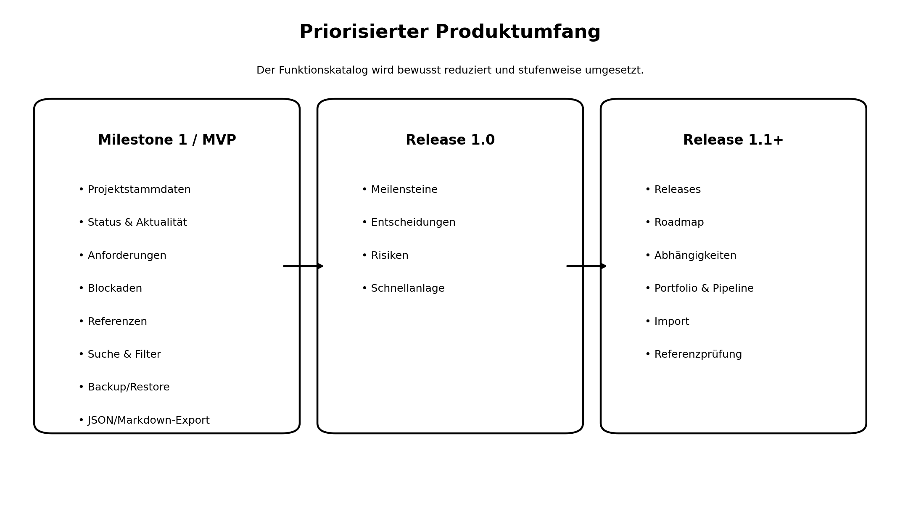
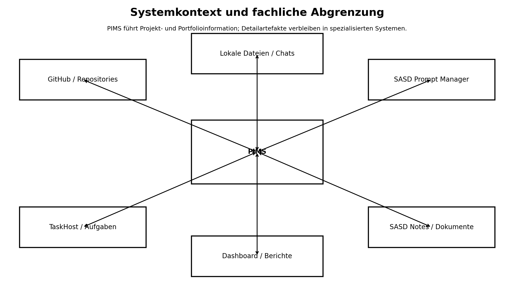
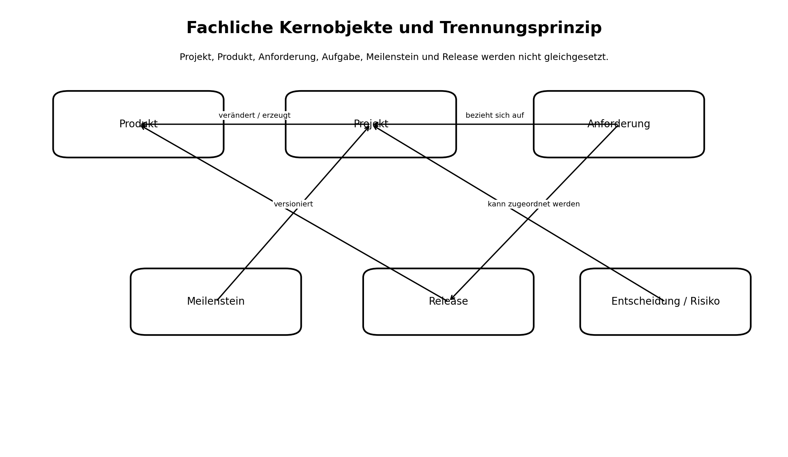

# SASD PIMS – Lastenheft

**Dokumentversion:** 0.1  
**Status:** Entwurfsfassung zur fachlichen Prüfung  
**Stand:** 28. Juli 2026  
**Auftraggeber:** SASD GmbH  
**Dokumentart:** Fachliches Lastenheft  

> Dieses Lastenheft beschreibt, was SASD PIMS leisten soll und warum. Technische Detailentscheidungen zu Klassen, Projekten und Datenbanktabellen sind nicht Gegenstand dieses Dokuments.

---

# Dokumentenstatus

| Merkmal | Inhalt |
| --- | --- |
| Dokument | SASD PIMS – Lastenheft |
| Version | 0.1 |
| Status | Entwurfsfassung zur fachlichen Prüfung |
| Verantwortlich | SASD GmbH |
| Bezugsgrundlagen | Projektsteckbrief; Markt-/OSS-Recherche v0.2; Funktionskatalog v0.1; fachliches Domänenmodell v0.1; bekannte SASD-Rahmenbedingungen |
| Freigabeempfehlung | Freigabe für fachliche Prüfung und Ableitung des Pflichtenhefts nach Klärung der markierten offenen Entscheidungen |

# Inhaltsverzeichnis

1. Dokumentzweck und Dokumentenlenkung  
2. Management-Zusammenfassung  
3. Ausgangssituation und Problemstellung  
4. Ziele und erwarteter Nutzen  
5. Stakeholder und Benutzergruppen  
6. Systemkontext  
7. Systemgrenzen  
8. Typische Nutzungsszenarien  
9. Fachliche Prozesse  
10. Funktionale Anforderungen  
11. Nichtfunktionale Anforderungen  
12. Daten und fachliche Informationsobjekte  
13. Fachliche Schnittstellen  
14. Benutzeroberfläche und Bedienbarkeit  
15. Barrierefreiheit  
16. Datenschutz und Informationssicherheit  
17. Datenverlustschutz, Backup und Wiederherstellung  
18. Installation, Betrieb und unterstützte Plattformen  
19. Lokalisierung und Sprache  
20. Leistungs- und Mengengerüste  
21. Muss-, Soll- und Kann-Priorisierung  
22. Erster Produktumfang und spätere Ausbaustufen  
23. Bewusst ausgeschlossene Funktionen  
24. Annahmen und Abhängigkeiten  
25. Risiken  
26. Offene Entscheidungen  
27. Abnahmekriterien  
28. Rückverfolgbarkeit zum Funktionskatalog  
29. Änderungsprotokoll

# 1. Dokumentzweck und Dokumentenlenkung

Dieses Lastenheft überführt die bestätigten fachlichen Grundlagen in prüfbare Anforderungen an SASD PIMS. Es dient als verbindliche Auftraggeberperspektive für Pflichtenheft, Architektur, UI-Konzept, Umsetzung, Test und Abnahme.

Änderungen an Muss-Anforderungen, Systemgrenzen, Domänenbegriffen oder Abnahmekriterien sind versioniert zu dokumentieren und fachlich freizugeben. Empfehlungen aus der Markt- und Komponentenrecherche werden nur dort zu Anforderungen, wo sie durch den SASD-Anwendungsfall begründet sind.

# 2. Management-Zusammenfassung

SASD verwaltet zahlreiche Software-, Infrastruktur-, Dokumentations-, Forschungs- und Prompt-Projekte. Projektinformationen sind auf Chats, Repositories, README-Dateien, lokale Dokumente, Aufgabenwerkzeuge und persönliches Wissen verteilt. Dadurch fehlen ein verlässlicher Gesamtüberblick, einheitliche Statusaussagen, nachvollziehbare Entscheidungen und belastbare Verknüpfungen zwischen Projekten, Produkten und Quellen.

SASD PIMS soll als lokales, offline nutzbares Informations- und Statuszentrum die fachlich maßgeblichen Projekt- und Portfolioinformationen führen. Es ersetzt weder GitHub noch Aufgaben-, Notiz-, Prompt- oder Dokumentensysteme. Der erste Produktumfang konzentriert sich auf getrennte Projektstammsätze, Status und Aktualität, projektbezogene Anforderungen, Blockaden, Referenzen, Suche, nachvollziehbare Änderungen, Backup, Restore und portable Exporte.

Die Recherche ergab keine vorhandene Anwendung, die den lokalen, schlanken und fachlich spezifischen Bedarf ohne erheblichen Anpassungs- oder Betriebsaufwand erfüllt. Daher wird ein eigener, begrenzter MVP empfohlen. Die größte Gefahr ist eine Scope-Ausweitung zu einem Universalwerkzeug mit doppelter Datenpflege.

# 3. Ausgangssituation und Problemstellung

Projektinformationen liegen heute verteilt vor. Die Verteilung ist nicht grundsätzlich falsch, weil Quellcode, Aufgaben, Prompts, Notizen und Dokumente spezialisierte Systeme benötigen. Problematisch ist jedoch, dass kein führendes System den fachlichen Zusammenhang, den Projektstatus und die Verknüpfungen zuverlässig zusammenführt.

Folgen sind unter anderem: unvollständige Projektlisten, schwer erkennbare Prioritäten, veraltete Statusangaben, verlorene Anforderungen aus Chats, unklare Projekt-/Produktgrenzen, mehrfach gepflegte Informationen, nicht nachvollziehbare Entscheidungen und ein hoher Suchaufwand.

# 4. Ziele und erwarteter Nutzen

| Ziel-ID | Ziel | Erwarteter Nutzen |
| --- | --- | --- |
| LZ-001 | Vollständiger Projektüberblick | Alle relevanten SASD-Projekte sind strukturiert auffindbar. |
| LZ-002 | Verlässlicher Status | Phase, Aktivitätszustand, Aktualität, Blockaden und nächste Maßnahme sind schnell erkennbar. |
| LZ-003 | Saubere Domänentrennung | Projekt, Produkt, Anforderung, Aufgabe, Meilenstein und Release werden nicht verwechselt. |
| LZ-004 | Nachvollziehbarkeit | Anforderungen, Entscheidungen und wesentliche Änderungen behalten Herkunft und Begründung. |
| LZ-005 | Eine führende Quelle je Information | PIMS vermeidet konkurrierende Wahrheiten und verweist auf Detailquellen. |
| LZ-006 | Datenhoheit | Kernfunktionen bleiben lokal, offline und exportierbar. |
| LZ-007 | Begrenzter Pflegeaufwand | Das System liefert mehr Überblick, als es zusätzliche Pflege verursacht. |

# 5. Stakeholder und Benutzergruppen

| Gruppe | Interesse | Berechtigter Bedarf |
| --- | --- | --- |
| Projektverantwortlicher | Vollständiger Überblick und Pflege | Alle MVP-Funktionen, Backup, Restore und Export |
| Entwickler | Kontext, Anforderungen, Entscheidungen und Referenzen | Lesen und fachliche Pflege nach organisatorischer Regel |
| Tester/Pilotanwender | Akzeptanzkriterien, Status und Rückmeldungsquelle | Anforderungen prüfen und Befunde referenzieren |
| SASD-Geschäftsführung/Stakeholder | Verdichtete Portfolio- und Statussicht | Lesbare, reduzierte Berichte ohne operative Detailarbeit |
| Spätere Administratorrolle | Referenzdaten und Betriebsparameter | Erst bei Mehrbenutzer- oder Organisationsbedarf |

# 6. Systemkontext

PIMS führt Projektstammdaten, fachlichen Status, Anforderungen auf Überblicksebene, Entscheidungen, Risiken, Blockaden, Meilensteine und Referenzen. Repositories, Aufgaben, Prompts, Notizen, Testfälle, vollständige Dokumente und Chatverläufe bleiben in ihren jeweiligen führenden Systemen.

# 7. Systemgrenzen

| Bereich | Einordnung |
| --- | --- |
| Im System | Projekt- und Produktbezug, Status, Aktualität, Anforderungen, Blockaden, Referenzen, Suche, Historie, Backup und Export |
| Nach MVP | Meilensteine, Entscheidungen, Risiken, Releases, Roadmap, Abhängigkeiten, Portfolio und Pipeline |
| Extern | GitHub, lokale Repositories, TaskHost, SASD Notes, Prompt Manager, Dokumente, Chats, Testdokumentation |
| Ausdrücklich ausgeschlossen | Vollständige Aufgabenverwaltung, Issue-Tracker, DMS/Wiki, CI/CD, Cloudzwang, bidirektionale Synchronisation |

# 8. Typische Nutzungsszenarien

| ID | Szenario | Kurzbeschreibung |
| --- | --- | --- |
| UC-001 | Projektüberblick gewinnen | Projektverantwortlicher öffnet PIMS, filtert aktive und veraltete Projekte und erkennt innerhalb kurzer Zeit Phase, Aktivitätszustand, letzten Stand, nächste Maßnahme und Blockaden. |
| UC-002 | Neues Projekt erfassen | Ein neues SASD-Vorhaben wird mit Ziel, Nutzen, Klassifikation, Verantwortlichkeit, Status und Referenzen als eigenständiges Projekt angelegt. |
| UC-003 | Anforderung aus Chat übernehmen | Eine fachlich relevante Aussage aus einem Chat wird als Anforderung mit Herkunftsnachweis, Priorität und Akzeptanzkriterien erfasst; der Chat bleibt externe Quelle. |
| UC-004 | Projekt pausieren | Ein Projekt wird mit Begründung pausiert, ohne dass Produkt, Anforderungen oder Historie gelöscht werden. |
| UC-005 | Blockade melden und auflösen | Eine Blockade wird mit Ursache, Auswirkung und nächster Maßnahme erfasst, in der Portfolioansicht sichtbar gemacht und später als gelöst gekennzeichnet. |
| UC-006 | Projektstatus berichten | Ein Markdown-Steckbrief wird erzeugt und kann unabhängig von PIMS weitergegeben oder versioniert werden. |
| UC-007 | Daten sichern und wiederherstellen | Vor einer größeren Änderung wird eine Sicherung erstellt und auf einem Testsystem erfolgreich wiederhergestellt. |
| UC-008 | Entscheidung nachvollziehen | Eine frühere Architekturentscheidung wird mit Begründung gefunden; eine neue Entscheidung ersetzt sie nachvollziehbar. |
| UC-009 | Meilenstein bewerten | Ein Meilenstein wird anhand seiner Erreichungskriterien bestätigt, obwohl ein zugehöriges Release später erfolgt. |
| UC-010 | Portfolio prüfen | Stakeholder sehen eine reduzierte Übersicht über aktive, blockierte und nächste Vorhaben, ohne operative Aufgabenlisten einzusehen. |

# 9. Fachliche Prozesse

## 9.1 Projektaufnahme
Projekt identifizieren, Ziel und Nutzen prüfen, Projektart und Bereich wählen, Status setzen, Verantwortlichkeit und Referenzen ergänzen, ersten Reviewtermin festlegen.

## 9.2 Anforderungstriage
Quelle dokumentieren, Aussage fachlich formulieren, Projekt zuordnen, Priorität und Entscheidungsstatus setzen, Akzeptanzkriterien ergänzen und externe Quelle referenzieren.

## 9.3 Status- und Reviewpflege
Projekt regelmäßig prüfen, letzten Stand und nächste Maßnahme aktualisieren, Blockaden dokumentieren, Aktualitätsstatus ableiten und Änderungen nachvollziehbar halten.

## 9.4 Sicherung und Wiederherstellung
Sicherung erstellen, Manifest und Formatversion prüfen, Sicherung getrennt aufbewahren, Wiederherstellung zunächst validieren und anschließend ausdrücklich bestätigen.

# 10. Funktionale Anforderungen

| ID | Titel | Priorität | Stufe | Anforderung | Abnahmekriterium | Quelle |
| --- | --- | --- | --- | --- | --- | --- |
| LF-PRO-001 | Projektstammsatz anlegen | Muss | MVP | Das System muss eigenständige Projektstammsätze mit stabiler Kennung, Name, Kurzbeschreibung, Ziel, Nutzen, Projektart, Projektbereich, Verantwortlichkeit und Statusinformationen erfassen können. | Ein Benutzer kann einen vollständigen Projektstammsatz speichern; die stabile Kennung bleibt bei Umbenennung unverändert. | PRO-001 |
| LF-PRO-002 | Projektzuordnung erzwingen | Muss | MVP | Jedes projektbezogene Fachobjekt muss eindeutig mindestens einem Projekt zugeordnet sein; unzugeordnete Fachobjekte dürfen nicht dauerhaft gespeichert werden. | Versuch, ein projektbezogenes Objekt ohne Projektbezug zu speichern, wird verständlich abgewiesen. | PRO-002 |
| LF-PRO-003 | Projektstatus verwalten | Muss | MVP | Projekte müssen pausiert, eingestellt, archiviert und reaktiviert werden können, ohne historische Informationen zu löschen. | Jeder Statuswechsel ist sichtbar und archivierte Projekte bleiben auffindbar. | PRO-004 |
| LF-PRO-004 | Projekt klassifizieren | Muss | MVP | Projekte müssen nach Projektart, Projektbereich und Tags klassifiziert werden können. | Filter nach Art, Bereich und Tag liefern die erwarteten Projekte. | CLS-001 |
| LF-PRO-005 | Produktbezug dokumentieren | Soll | Release 1.0 | Ein Projekt soll einem oder mehreren Produkten zugeordnet werden können; Produkt und Projekt bleiben fachlich getrennte Objekte. | Ein abgeschlossenes Projekt kann mit einem weiterhin aktiven Produkt verknüpft bleiben. | Domänenmodell D-002/D-003 |
| LF-PRO-006 | Projekt aus Vorlage anlegen | Soll | Release 1.1 | Wiederkehrende Projektarten sollen über kontrollierte Vorlagen mit vorbelegten Feldern angelegt werden können. | Vorlagenanlage erzeugt einen neuen unabhängigen Datensatz; Vorlagenänderung verändert bestehende Projekte nicht. | PRO-003 |
| LF-STA-001 | Lebenszyklusphase und Aktivitätszustand trennen | Muss | MVP | Das System muss Lebenszyklusphase und Aktivitätszustand getrennt führen, damit beispielsweise ein Projekt in der Entwicklungsphase gleichzeitig pausiert oder blockiert sein kann. | Kombinationen sind unabhängig auswählbar und in Listen getrennt sichtbar. | STA-001 |
| LF-STA-002 | Aktualitäts- und Reviewstatus | Muss | MVP | Das System muss letzten fachlichen Review, nächsten Reviewtermin und daraus abgeleitete Aktualitätskennzeichnung führen. | Überfällige beziehungsweise ungeprüfte Projekte sind filterbar. | STA-003 |
| LF-STA-003 | Kontrollierte Statusübergänge | Soll | Release 1.1 | Für besonders relevante Statuswechsel sollen zulässige Übergänge und erforderliche Begründungen geprüft werden. | Unzulässiger Übergang wird verhindert; erforderliche Begründung wird gespeichert. | STA-002 |
| LF-REQ-001 | Anforderung erfassen | Muss | MVP | Das System muss fachliche Anforderungen mit stabiler Kennung, Titel, Beschreibung, Begründung, Priorität, Status und Akzeptanzkriterien erfassen können. | Anforderung ist im zugeordneten Projekt eindeutig auffindbar und vollständig prüfbar. | REQ-001 |
| LF-REQ-002 | Anforderungsquelle dokumentieren | Muss | MVP | Zu jeder Anforderung muss die Herkunft als Quelltyp, Datum, Kurzbeschreibung und optionale Referenz dokumentierbar sein. | Quelle wird in der Detailansicht angezeigt; Quelle und Freigabestatus bleiben getrennt. | REQ-002 |
| LF-REQ-003 | Priorität und Entscheidungsstatus | Muss | MVP | Anforderungen müssen nach Muss, Soll, Kann oder nicht vorgesehen priorisiert und mit einem Entscheidungsstatus geführt werden. | Abgelehnte oder zurückgestellte Anforderungen bleiben mit Begründung erhalten. | REQ-003 |
| LF-REQ-004 | Akzeptanzkriterien führen | Muss | MVP | Für wesentliche Anforderungen müssen ein oder mehrere prüfbare Akzeptanzkriterien erfasst werden können. | Mindestens ein Akzeptanzkriterium kann pro Muss-Anforderung gespeichert und einzeln angezeigt werden. | REQ-004 |
| LF-REQ-005 | Anforderungsbeziehungen | Soll | Release 1.1 | Anforderungen sollen als benötigt, ersetzt, widerspricht, konkretisiert oder dupliziert miteinander verknüpft werden können. | Beziehungstyp und Begründung sind sichtbar; offensichtliche Selbstbezüge werden verhindert. | REQ-005 |
| LF-REQ-006 | Anforderungen importieren | Kann | Release 1.2 | Anforderungen können aus versionierten JSON- und optional CSV-Dateien mit Vorschau und Validierungsbericht importiert werden. | Import zeigt Vorschau, Fehler und Dubletten vor endgültiger Übernahme. | REQ-006 |
| LF-MIL-001 | Meilensteine verwalten | Soll | Release 1.0 | Projektbezogene Meilensteine sollen mit Ziel, Kriterien, Plantermin, Prognosetermin, Isttermin und Status geführt werden. | Ein Meilenstein gilt erst nach bestätigten Erreichungskriterien als erreicht. | MIL-001 |
| LF-REL-001 | Releases fachlich planen | Soll | Release 1.1 | Für veröffentlichbare Produkte sollen geplante und veröffentlichte Releases mit Ziel, Umfang, Status und Referenz auf technische Artefakte geführt werden. | Ein Release kann ohne automatische Gleichsetzung mit einem Projektmeilenstein gespeichert werden. | REL-001 |
| LF-RDM-001 | Roadmap ableiten | Soll | Release 1.1 | Roadmapansichten sollen aus Projekten, Meilensteinen, Releases und Roadmap-Einträgen abgeleitet werden, ohne parallele Terminwahrheit. | Änderungen an zugrunde liegenden Objekten erscheinen in der Roadmap. | RDM-001 |
| LF-DEC-001 | Entscheidungsregister | Soll | Release 1.0 | Projektbezogene Entscheidungen sollen mit Kontext, Optionen, Entscheidung, Begründung, Konsequenzen, Status und Datum dokumentiert werden. | Eine Entscheidung ist über Projekt und Kennung auffindbar und enthält mindestens Kontext, Ergebnis und Begründung. | DEC-001 |
| LF-DEC-002 | Entscheidungen ersetzen | Soll | Release 1.1 | Entscheidungen sollen aufgehoben oder durch eine neue Entscheidung ersetzt werden können, ohne den ursprünglichen Nachweis zu überschreiben. | Alte und neue Entscheidung sind wechselseitig verknüpft. | DEC-002 |
| LF-RSK-001 | Risikoregister | Soll | Release 1.0 | Risiken sollen mit Ursache, Ereignis, Auswirkung, Wahrscheinlichkeit, Schadensausmaß, Reaktion, Verantwortlichkeit und Status dokumentiert werden. | Risikostufe und offene Gegenmaßnahmen sind sichtbar und filterbar. | RSK-001 |
| LF-BLK-001 | Blockaden dokumentieren | Muss | MVP | Aktuelle Blockaden müssen mit Ursache, Auswirkung, betroffenem Objekt, Beginn, Status, nächster Maßnahme und optionaler Aufgabenreferenz dokumentiert werden können. | Blockierte Projekte sind aus der Portfolioübersicht direkt auffindbar. | BLK-001 |
| LF-REF-001 | Typisierte Referenzen | Muss | MVP | Das System muss typisierte Referenzen auf HTTPS-Ziele, lokale Dateien, Verzeichnisse, Repositories, Chats, Dokumente, Aufgaben und SASD-Anwendungen speichern können. | Referenztyp, Titel und Ziel werden angezeigt; Referenz gehört eindeutig zu einem Fachobjekt. | REF-001 |
| LF-REF-002 | Referenzen prüfen | Soll | Release 1.1 | Referenzen sollen manuell oder kontrolliert auf Erreichbarkeit geprüft und mit Prüfdatum sowie Ergebnis gekennzeichnet werden können. | Fehlende Ziele werden gemeldet, aber nicht automatisch gelöscht. | REF-002 |
| LF-DEP-001 | Abhängigkeiten darstellen | Soll | Release 1.1 | Fachliche Abhängigkeiten zwischen Projekten, Produkten, Meilensteinen oder Releases sollen mit Typ und Kritikalität erfasst werden können. | Abhängigkeit ist von beiden beteiligten Objekten aus sichtbar. | DEP-001 |
| LF-GIT-001 | GitHub-Metadaten lesen | Kann | Release 2.x | Das System kann später ausgewählte öffentliche oder autorisierte GitHub-Metadaten lesend übernehmen, ohne technische Artefakte oder Issues zum führenden PIMS-Bestand zu machen. | Import ist abschaltbar und verändert keine GitHub-Daten. | GIT-001 |
| LF-SRH-001 | Globale Suche | Muss | MVP | Benutzer müssen Projekte, Anforderungen, Blockaden und Referenzen über eine globale Suche anhand wesentlicher Textfelder und Kennungen finden können. | Ein bekannter Suchbegriff liefert das erwartete Objekt innerhalb der festgelegten Antwortzeit. | SRH-001 |
| LF-SRH-002 | Filterbare Übersicht | Muss | MVP | Projekt- und Portfolioübersichten müssen nach Status, Phase, Aktualität, Projektart, Bereich und Tags filter- und sortierbar sein. | Mehrere Filter können kombiniert und wieder zurückgesetzt werden. | SRH-002 |
| LF-PRT-001 | Portfolio-Dashboard | Soll | Release 1.1 | Das System soll eine verdichtete Portfolioansicht mit aktiven, blockierten, veralteten und anstehenden Projekten bereitstellen. | Kennzahlen sind aus Fachdaten abgeleitet und führen per Drill-down zu den zugrunde liegenden Objekten. | PRT-001 |
| LF-PIP-001 | Produktpipeline als Ansicht | Soll | Release 1.1 | Die SASD-Produktpipeline soll als aus PIMS-Daten abgeleitete Ansicht bereitgestellt werden; eine parallele Pipeline-Datenbank ist ausgeschlossen. | Statusänderung im Projekt erscheint ohne doppelte Pflege in der Pipelineansicht. | PIP-001 |
| LF-AUD-001 | Fachlicher Änderungsverlauf | Muss | MVP | Änderungen an Status und wesentlichen Kernfeldern müssen mit Zeitpunkt, Objekt, Feld sowie altem und neuem Wert nachvollziehbar sein. | Eine Änderung an einem Kernfeld erscheint im Verlauf; gelöschte Historie ist im Normalbetrieb nicht vorgesehen. | AUD-001 |
| LF-LOG-001 | Technische Protokollierung | Muss | MVP | Technisch relevante Vorgänge und Fehler müssen diagnostizierbar protokolliert werden, ohne unnötige Inhalte oder Geheimnisse zu erfassen. | Ein provozierter technischer Fehler erzeugt einen verständlichen, datensparsamen Protokolleintrag. | LOG-001 |
| LF-BAK-001 | Versionierte Sicherung | Muss | MVP | Benutzer müssen eine vollständige versionierte Datensicherung erstellen können; vor risikoreichen Datenänderungen soll eine Sicherung angeboten oder automatisch erstellt werden. | Sicherung enthält Daten und Manifest und kann eindeutig einer Formatversion zugeordnet werden. | BAK-001 |
| LF-BAK-002 | Kontrollierte Wiederherstellung | Muss | MVP | Eine Sicherung muss nach Prüfung und ausdrücklicher Bestätigung wiederhergestellt werden können. | Testwiederherstellung stellt einen bekannten Datenstand vollständig wieder her. | BAK-002 |
| LF-EXP-001 | Vollständiger JSON-Export | Muss | MVP | Der vollständige fachliche Datenbestand muss in einem dokumentierten, versionierten JSON-Format exportiert werden können. | Export kann syntaktisch geprüft werden und enthält Formatversion sowie stabile Kennungen. | EXP-001 |
| LF-EXP-002 | Markdown-Projektsteckbrief | Muss | MVP | Für ein Projekt muss ein lesbarer Markdown-Steckbrief mit Kernstatus, Ziel, Anforderungen, Blockaden und Referenzen erzeugt werden können. | Exportdatei ist ohne PIMS lesbar und enthält die ausgewählten Projektinformationen. | EXP-002 |
| LF-IMP-001 | Versionierter JSON-Import | Soll | Release 1.1 | Versionierte PIMS-Exporte sollen mit Vorschau, Validierung und Konfliktbericht wieder importiert werden können. | Ungültige oder inkompatible Daten werden vor Übernahme gemeldet. | IMP-001 |
| LF-UI-001 | Master-Detail-Navigation | Muss | MVP | Die Benutzeroberfläche muss eine übersichtliche Master-Detail-Navigation für Projektliste und Projektinformationen bereitstellen. | Projektwechsel erfordert höchstens eine direkte Auswahl; Kontext und aktuelles Projekt bleiben erkennbar. | UI-001 |
| LF-UI-002 | Kontextbezogene Schnellanlage | Soll | Release 1.0 | Aus einem geöffneten Projekt sollen zugehörige Anforderungen, Blockaden, Meilensteine, Entscheidungen und Risiken ohne erneute Projektwahl angelegt werden können. | Neues Objekt erhält automatisch den sichtbaren Projektkontext. | UI-002 |
| LF-ADM-001 | Referenzdaten pflegen | Soll | Release 1.1 | Projektarten, Bereiche, Tags, Phasen und ausgewählte Statuswerte sollen kontrolliert gepflegt, sortiert und deaktiviert werden können; verwendete Werte dürfen nicht ohne Prüfung gelöscht werden. | Deaktivierter Wert bleibt in historischen Datensätzen sichtbar und steht nicht mehr für Neuanlage bereit. | ADM-001 |
| LF-VAL-001 | Zentrale Fachvalidierung | Muss | MVP | Alle wesentlichen Eingaben müssen vor Speicherung anhand konsistenter fachlicher Regeln geprüft und mit verständlichen Hinweisen zurückgewiesen werden. | Gleiche fehlerhafte Eingabe wird in allen relevanten Masken gleich bewertet. | VAL-001 |
| LF-SEC-001 | Externe Ziele sicher öffnen | Muss | MVP | Externe Referenzen dürfen nur nach Typprüfung und sicherer Übergabe an das Betriebssystem geöffnet werden; potenziell gefährliche oder unbekannte Ziele müssen bestätigt oder abgewiesen werden. | Unzulässiges Schema wird nicht direkt ausgeführt. | SEC-001 |
| LF-SEC-002 | Keine Secrets speichern | Muss | MVP | PIMS darf keine Passwörter, API-Token, private Schlüssel oder vergleichbare Zugangsdaten als fachliche Inhalte verwalten. | Benutzerhinweis und Validierung verhindern offensichtliche Secret-Felder; Dokumentation benennt Ausschluss. | SEC-002 |
| LF-SEC-003 | Definierte Datenpfade | Muss | MVP | Anwendungsdaten, Sicherungen, Exporte und Protokolle müssen in nachvollziehbaren, dokumentierten lokalen Pfaden abgelegt werden. | Benutzer kann die Pfade einsehen und Sicherungsziel wählen. | SEC-003 |

# 11. Nichtfunktionale Anforderungen

| ID | Titel | Priorität | Anforderung | Mess-/Abnahmekriterium |
| --- | --- | --- | --- | --- |
| LN-BED-001 | Erlernbarkeit | Muss | Ein fachlich versierter Benutzer muss die Kernfunktionen ohne Schulungsprojekt nach kurzer Einführung bedienen können. | Mindestens 80 % der definierten MVP-Szenarien werden nach höchstens 30 Minuten Einführung ohne Hilfestellung abgeschlossen. |
| LN-BED-002 | Konsistenz | Muss | Begriffe, Statusdarstellungen, Speichern, Abbrechen, Suchen und Filtern müssen in allen Dialogen konsistent sein. | Usability-Prüfung findet keine widersprüchliche Bedeutung identischer Bezeichnungen. |
| LN-BED-003 | Fehlertoleranz | Muss | Fehleingaben dürfen weder Datenverlust noch Programmabsturz verursachen und müssen verständlich erklärt werden. | Negativtests für Pflichtfelder, ungültige Pfade und beschädigte Importdateien werden bestanden. |
| LN-A11Y-001 | Tastaturbedienung | Muss | Alle MVP-Kernfunktionen müssen vollständig per Tastatur erreichbar und bedienbar sein. | Definierte Kernabläufe sind ohne Maus durchführbar. |
| LN-A11Y-002 | Skalierung und Kontrast | Muss | Die Oberfläche muss bei Windows-Anzeigeskalierung von 100 bis mindestens 200 Prozent lesbar bleiben und ausreichende Kontraste verwenden. | Keine abgeschnittenen Pflichtinformationen bei 200 %; Kontrastprüfung der Standardansicht. |
| LN-A11Y-003 | Screenreader-Grundlagen | Soll | Wichtige Eingabefelder und Steuerelemente sollen sinnvolle zugängliche Namen, Reihenfolgen und Statusinformationen besitzen. | Stichprobentest mit Windows-Screenreader liefert verständliche Feldbezeichnungen. |
| LN-SEC-001 | Datenminimierung | Muss | Es dürfen nur personenbezogene Daten gespeichert werden, die zur Projektverantwortung oder Quellenzuordnung erforderlich sind. | Dateninventar und Eingabemasken enthalten keine unnötigen personenbezogenen Pflichtfelder. |
| LN-SEC-002 | Lokale Datenhoheit | Muss | Der MVP muss ohne Cloudkonto und ohne dauerhafte Internetverbindung nutzbar sein. | Kernabnahme wird auf einem vom Internet getrennten System durchgeführt. |
| LN-SEC-003 | Integrität | Muss | Speicher-, Import-, Restore- und Migrationsvorgänge müssen unvollständige oder widersprüchliche Datenbestände vermeiden. | Abbruchtests und Integritätsprüfung hinterlassen einen konsistenten Bestand. |
| LN-SEC-004 | Abhängigkeitsschutz | Soll | Externe Bibliotheken und Komponenten sollen nachvollziehbar lizenziert, gepflegt und austauschbar sein. | Abhängigkeitsliste enthält Version, Lizenz und Verwendungszweck; keine unbekannte Lizenz. |
| LN-REL-001 | Zuverlässigkeit | Muss | Die Anwendung muss typische Benutzerfehler und einzelne defekte Referenzen ohne Absturz verarbeiten. | Ein vierstündiger Nutzungstest mit Negativfällen verläuft ohne nicht behandelten Absturz. |
| LN-REL-002 | Wiederherstellbarkeit | Muss | Nach einem Datenverlust muss der letzte geprüfte Sicherungsstand durch einen dokumentierten Ablauf wiederherstellbar sein. | Wiederherstellungstest auf leerer Installation erfolgreich. |
| LN-PERF-001 | Antwortzeit | Muss | Listen, Filter, Suche und Projektwechsel müssen bei der vorgesehenen Datenmenge interaktiv reagieren. | 95 % der Listen- und Suchaktionen unter 2 Sekunden bei Referenzdatenbestand. |
| LN-PERF-002 | Startzeit | Soll | Die Anwendung soll auf unterstützter Standardhardware in angemessener Zeit startbereit sein. | Kaltstart unter 10 Sekunden auf Referenzsystem. |
| LN-MNT-001 | Wartbarkeit | Muss | Fachregeln, Bedienoberfläche, Datenzugriff und externe Integrationen müssen so getrennt sein, dass Änderungen lokal begrenzt und testbar bleiben. | Architekturprüfung und automatisierte Tests zeigen keine direkte Vermischung zentraler Verantwortlichkeiten. |
| LN-MNT-002 | Testbarkeit | Muss | Muss-Anforderungen und zentrale Fachregeln müssen durch wiederholbare Tests überprüfbar sein. | Abnahmematrix verweist auf Testfälle; kritische Regeln besitzen automatisierte Tests. |
| LN-PORT-001 | Datenportabilität | Muss | Benutzerdaten müssen über dokumentierte Exportformate aus dem Produkt herausgeführt werden können. | Vollständiger JSON-Export und lesbarer Markdown-Export bestanden. |
| LN-LOC-001 | Sprache | Muss | Die erste Produktfassung muss eine vollständige deutschsprachige Benutzeroberfläche und deutschsprachige Fehlermeldungen bereitstellen. | Sprachprüfung findet keine unbeabsichtigten englischen UI-Fragmente in Kernabläufen. |
| LN-LOC-002 | Internationalisierbarkeit | Soll | Fachtexte und UI-Beschriftungen sollen so verwaltet werden, dass eine spätere englische Fassung ohne grundlegende Umgestaltung möglich bleibt. | Textressourcen sind zentralisierbar; Fachkennungen bleiben sprachneutral. |
| LN-OPS-001 | Installation | Muss | Die Anwendung muss auf unterstützten Windows-Systemen mit überschaubarem, dokumentiertem Installations- oder portablem Bereitstellungsablauf nutzbar sein. | Installation beziehungsweise Entpacken, Erststart und Deinstallation werden auf sauberem Testsystem erfolgreich durchgeführt. |
| LN-OPS-002 | Offline-Betrieb | Muss | Für alle MVP-Kernfunktionen darf kein Serverdienst vorausgesetzt werden. | MVP funktioniert ohne separat installierten Datenbank- oder Webserver. |
| LN-COMP-001 | Kompatibilität | Muss | Die Anwendung muss mindestens auf aktuell unterstützten 64-Bit-Ausgaben von Windows 11 funktionieren. | Abnahme auf mindestens zwei unterstützten Windows-11-Konfigurationen. |

# 12. Daten und fachliche Informationsobjekte

| Objekt | Fachliche Bedeutung | Führendes System im Zielbild |
| --- | --- | --- |
| Projekt | Zeitlich begrenztes Vorhaben mit Ziel und Abschlusskriterium | PIMS |
| Produkt | Dauerhaft identifizierbares Ergebnis über Projekte hinaus | PIMS fachlich; Repository technisch |
| Anforderung | Benötigter Zustand, Nutzen oder einzuhaltende Eigenschaft | PIMS auf fachlicher Ebene |
| Aufgabe | Konkrete ausführbare Tätigkeit | TaskHost/GitHub Issues; PIMS referenziert |
| Meilenstein | Bedeutsamer Ziel-, Freigabe- oder Entscheidungspunkt | PIMS |
| Release | Bereitstellung einer bezeichneten Produktversion | PIMS fachlich; Repository für Artefakte |
| Entscheidung | Begründete Festlegung mit Konsequenzen | PIMS |
| Risiko | Unsicheres Ereignis mit möglicher Auswirkung | PIMS |
| Blockade | Tatsächlich verhindernder Umstand | PIMS auf Überblicksebene |
| Referenz | Verknüpfung zu externer Quelle | Quelle extern; PIMS referenziert |
| Änderungsereignis | Nachweis wesentlicher fachlicher Änderung | PIMS |

# 13. Fachliche Schnittstellen

| Schnittstelle | Richtung | MVP | Zweck |
| --- | --- | --- | --- |
| Lokale Dateien und Verzeichnisse | PIMS -> Betriebssystem | Muss | Referenz speichern und sicher öffnen |
| HTTPS-Links | PIMS -> Browser | Muss | Repositories, Dokumente, Chats und Aufgaben öffnen |
| JSON-Export | PIMS -> Datei | Muss | Portabilität und vollständige Sicherung auf Fachebene |
| Markdown-Export | PIMS -> Datei | Muss | Lesbarer Projektsteckbrief |
| JSON-Import | Datei -> PIMS | Soll 1.1 | Wiederübernahme/Migration mit Vorschau |
| GitHub API | GitHub -> PIMS | Kann 2.x | Nur lesende Metadaten, keine führende Statusquelle |
| SASD Dashboard | PIMS -> Dashboard | Später | Lesende verdichtete Darstellung |

# 14. Benutzeroberfläche und Bedienbarkeit

Die Oberfläche muss den Projektkontext jederzeit sichtbar halten, häufige Informationen ohne tiefe Navigation anbieten und seltene Details schrittweise einblenden. Master-Detail-Navigation, globale Suche, kombinierbare Filter, verständliche leere Zustände, konsistente Dialoge und eindeutige Bestätigungen sind verbindliche Qualitätsmerkmale.

Status darf nicht ausschließlich durch Farbe vermittelt werden. Kritische Vorgänge wie Restore, Import und Statuswechsel benötigen verständliche Vorschau beziehungsweise Bestätigung.

# 15. Barrierefreiheit

Die Anwendung muss per Tastatur bedienbar sein, sinnvolle Fokusreihenfolgen, gut lesbare Schriftgrößen, Windows-Skalierung und ausreichende Kontraste unterstützen. Zugängliche Namen und Statusinformationen für zentrale Steuerelemente sind mindestens als Soll-Anforderung vorzusehen. Barrierefreiheit wird nicht als spätere kosmetische Nacharbeit behandelt.

# 16. Datenschutz und Informationssicherheit

PIMS verarbeitet grundsätzlich projektbezogene Geschäftsinformationen. Personenbezüge sind auf Verantwortlichkeit und Herkunftsnachweis zu begrenzen. Geheimnisse und Zugangsdaten sind ausgeschlossen. Protokolle müssen datensparsam sein. Externe Ziele werden typgeprüft geöffnet. Exporte und Sicherungen können strategische oder personenbezogene Inhalte enthalten und sind entsprechend geschützt aufzubewahren.

# 17. Datenverlustschutz, Backup und Wiederherstellung

Der Datenbestand muss versioniert sicherbar, prüfbar und wiederherstellbar sein. Eine Sicherung enthält mindestens Formatversion, Erstellungszeitpunkt, Anwendungsstand und Integritätsinformationen. Restore darf den aktuellen Bestand erst nach erfolgreicher Vorprüfung und ausdrücklicher Bestätigung ersetzen. Vor Migrationen oder Importen mit hohem Änderungsumfang ist eine Sicherung erforderlich.

# 18. Installation, Betrieb und unterstützte Plattformen

Der erste Produktumfang ist als lokale 64-Bit-Windows-Anwendung für aktuell unterstützte Windows-11-Ausgaben vorgesehen. Kernfunktionen benötigen keinen separaten Datenbank-, Web- oder Cloudserver. Installations- beziehungsweise portable Bereitstellung, Datenpfade, Sicherungsorte, Update- und Deinstallationsablauf sind zu dokumentieren. Die konkrete technische Implementierung wird im Pflichtenheft festgelegt.

# 19. Lokalisierung und Sprache

Die Erstsprache ist Deutsch. Fachbegriffe, Hilfetexte und Fehlermeldungen müssen konsistent deutsch sein. Stabile fachliche Kennungen sollen sprachneutral bleiben. Eine spätere englische Oberfläche ist vorzubereiten, aber nicht Bestandteil des MVP.

# 20. Leistungs- und Mengengerüste

| Größe | Planwert für Abnahme |
| --- | --- |
| Projekte | mindestens 250, Testbestand 500 |
| Produkte | mindestens 200 |
| Anforderungen | mindestens 10.000 gesamt |
| Referenzen | mindestens 20.000 gesamt |
| Änderungsereignisse | mindestens 100.000 |
| Gleichzeitige Benutzer im MVP | 1 |
| Typische Sicherungsgröße | bis 2 GB einschließlich Metadaten und Exporte; keine eingebetteten Dokumentarchive |
| Antwortzeit | 95 % typischer Suchen/Filter unter 2 Sekunden |

Die Werte sind Plan- und Testgrößen, keine Aussage über ein technisch maximales Limit.

# 21. Muss-, Soll- und Kann-Priorisierung

| Priorität | Bedeutung | Freigaberegel |
| --- | --- | --- |
| Muss | Für nutzbaren MVP, Datenintegrität oder zentrale Systemgrenze erforderlich | Fehlt eine Muss-Anforderung, ist die MVP-Abnahme grundsätzlich nicht bestanden. |
| Soll | Hoher Nutzen für Release 1.0/1.1, aber MVP kann ohne sie pilotiert werden | Verschiebung muss begründet und dokumentiert werden. |
| Kann | Optionale oder spätere Erweiterung | Umsetzung nur nach nachgewiesenem Bedarf und erneuter Scopeprüfung. |
| Ausgeschlossen | Widerspricht Zielbild oder erzeugt unverhältnismäßigen Umfang | Nur durch formale Änderung des Lastenhefts wieder aufnehmbar. |

# 22. Erster Produktumfang und spätere Ausbaustufen

## 22.1 Milestone 1 / MVP
Projektstammdaten, zwingende Projektzuordnung, Klassifikation, getrennte Statusdimensionen, Aktualitätsstatus, Anforderungen mit Quelle/Priorität/Akzeptanzkriterien, Blockaden, typisierte Referenzen, globale Suche, Filter, Änderungsverlauf, Logging, Backup, Restore, JSON- und Markdown-Export, Validierung, sichere externe Ziele und Master-Detail-Navigation.

## 22.2 Release 1.0
Meilensteine, Entscheidungen, Risiken und kontextbezogene Schnellanlage.

## 22.3 Release 1.1
Projektvorlagen, kontrollierte Statusübergänge, Anforderungsbeziehungen, Releaseplanung, Roadmap, ersetzte Entscheidungen, Referenzprüfung, Abhängigkeiten, Portfolio, Produktpipeline, JSON-Import und Referenzdatenadministration.

## 22.4 Spätere Ausbaustufen
Massenimport, lesende GitHub-Metadaten, mögliche Mehrbenutzerfunktionen und erst nach gesonderter Bewertung KI-gestützte Auswertung.

# 23. Bewusst ausgeschlossene Funktionen

| ID | Funktion | Begründung |
| --- | --- | --- |
| AX-001 | Vollständige Aufgabenverwaltung | Aufgaben, Unteraufgaben, Erinnerungen, Sprints, Zeiterfassung und persönliche Tagesplanung verbleiben in führenden Aufgabensystemen. |
| AX-002 | Vollständiger Issue-Tracker | Technische Fehlerbearbeitung bleibt in GitHub Issues oder einem spezialisierten System. |
| AX-003 | Dokumentenmanagement/Wiki | PIMS speichert Kurzfassungen und Referenzen, nicht vollständige Dokumentarchive oder Chatverläufe. |
| AX-004 | Quellcode- und CI/CD-Verwaltung | Repositories und Build-Pipelines bleiben in GitHub oder lokalen Entwicklungssystemen. |
| AX-005 | Bidirektionale Synchronisation | Im MVP und in Release 1.x keine konkurrierende Synchronisation von Status-, Task-, Prompt- oder Notizdaten. |
| AX-006 | Mehrbenutzer- und Rechteverwaltung | Für den lokalen Einpersonenbetrieb vorerst ausgeschlossen; spätere Neubewertung bei realem Bedarf. |
| AX-007 | Cloudzwang | Kernfunktionen dürfen weder Cloudkonto noch dauerhafte Netzwerkverbindung verlangen. |
| AX-008 | KI-gestützte automatische Auswertung | Frühestens nach stabiler Domäne und gesonderter Datenschutz-, Kosten- und Qualitätsbewertung. |
| AX-009 | Revisionssicheres Archiv | Der MVP bietet nachvollziehbare Historie, aber keine rechtlich revisionssichere, unveränderbare Archivierung. |
| AX-010 | Ressourcen-, Budget- und Zeiterfassung | Keine vollständige Personal-, Kosten- oder Kapazitätsplanung im ersten Produktumfang. |

# 24. Annahmen und Abhängigkeiten

| ID | Annahme/Abhängigkeit | Auswirkung bei Abweichung |
| --- | --- | --- |
| LA-001 | MVP wird überwiegend von einer Person lokal genutzt. | Benutzer-, Rechte- und Konfliktmodell müsste erweitert werden. |
| LA-002 | Lokale relationale Datenhaltung ist für die vorgesehene Menge ausreichend. | Betriebs- und Datenarchitektur müssten neu bewertet werden. |
| LA-003 | Aufgaben bleiben in spezialisierten Systemen. | Scope und Domänenmodell würden erheblich wachsen. |
| LA-004 | GitHub beziehungsweise Repository bleibt technische Quelle für Code und Releaseartefakte. | PIMS müsste Artefaktverwaltung übernehmen. |
| LA-005 | Eine pragmatische Änderungshistorie genügt. | Für regulierte Nutzung wäre revisionssichere Auditarchitektur erforderlich. |
| LA-006 | Externe Systeme werden im MVP manuell referenziert. | Frühe API-Integrationen würden Aufwand und Betriebsrisiko erhöhen. |
| LA-007 | PIMS verwaltet keine Geheimnisse. | Secret-Management und Verschlüsselung wären gesondert zu planen. |
| LA-008 | Projektsteckbrief, Domänenmodell und Funktionskatalog sind fachliche Basis. | Widersprüche müssen vor Pflichtenheft aufgelöst werden. |

# 25. Risiken

| ID | Risiko | Wahrscheinlichkeit | Auswirkung | Stufe | Gegenmaßnahme |
| --- | --- | --- | --- | --- | --- |
| LR-001 | Scope-Ausweitung zum Universalwerkzeug | hoch | hoch | sehr hoch | Systemgrenzen und Ausschlussregister verbindlich prüfen; Erweiterungen nur nach Nutzen- und Dublettenanalyse. |
| LR-002 | Doppelte Datenpflege | hoch | hoch | sehr hoch | Für jede Informationsart führendes System definieren; PIMS referenziert Detailquellen. |
| LR-003 | Unklare Trennung von Projekt und Produkt | mittel | hoch | hoch | Domänendefinitionen im Lastenheft bestätigen und in Akzeptanztests verwenden. |
| LR-004 | Pflegeaufwand übersteigt Nutzen | mittel | hoch | hoch | Pflichtfelder begrenzen, Schnellanlage, Reviewstatus und Pilot mit realen Projekten. |
| LR-005 | Datenverlust bei Migration oder Restore | niedrig-mittel | sehr hoch | Versionierte Sicherung, Vorschau, Integritätsprüfung und regelmäßige Restore-Tests. |
| LR-006 | Abhängigkeit von ungepflegten Komponenten | mittel | mittel | mittel | Permissive, aktive Komponenten bevorzugen; Abhängigkeitsregister und Austauschbarkeit. |
| LR-007 | Unlesbare oder überladene WinForms-Oberfläche | mittel | hoch | hoch | Master-Detail-Konzept, Skalierungstests, progressive Offenlegung und Usability-Pilot. |
| LR-008 | Unbeabsichtigte Speicherung sensibler Daten | niedrig-mittel | hoch | hoch | Datenminimierung, Secrets-Ausschluss, Log-Hygiene und Sicherheitsprüfung. |
| LR-009 | Zu frühe Integrationen | mittel | mittel | mittel | MVP nur manuelle Referenzen; APIs erst nach beobachtetem Pflegeproblem. |
| LR-010 | Funktionskatalog wird ungeprüft vollständig umgesetzt | mittel | hoch | hoch | Muss/Soll/Kann und Releasegrenzen als Freigabekriterium verwenden. |

# 26. Offene Entscheidungen

| ID | Entscheidungsfrage | Vorläufige Empfehlung | Spätester Zeitpunkt |
| --- | --- | --- | --- |
| LE-001 | Produktname und Abkürzung | PIMS zunächst beibehalten; Schreibweise und öffentliche Eindeutigkeit vor Repositoryfreigabe prüfen. | Vor öffentlichem Release |
| LE-002 | Führendes Aufgabensystem je Projekt | Je Projekt dokumentieren; GitHub Issues, TaskHost oder SASD-Aufgabenanwendung zulassen. | Vor Pilot |
| LE-003 | Projektideen im ersten Produktumfang | Nicht im MVP; nach Pilot als eigene Intake-Funktion bewerten. | Vor Release 1.1 |
| LE-004 | Produktobjekt im MVP | Mindestens einfacher Produktbezug; vollständige Produktverwaltung kann nach Milestone 1 ergänzt werden. | Vor Pflichtenheft |
| LE-005 | Beteiligte und Rollen | Im MVP einfache Verantwortungsfelder; eigenes Rollenmodell später. | Vor UI-Konzept |
| LE-006 | Anforderungen primär projekt- oder produktbezogen | MVP projektbezogen; Produktbezug optional ergänzen, sobald Produktobjekt stabil ist. | Vor Datenmodell |
| LE-007 | Portable Bereitstellung oder Installer | Beide prototypisch prüfen; Entscheidung nach Betriebserprobung. | Vor Pilotverteilung |
| LE-008 | SQLite-Volltextsuche bereits im MVP | Zunächst einfache indexgestützte Suche; FTS bei nachgewiesenem Bedarf. | Nach Pilotimport |
| LE-009 | Automatische Sicherungsstrategie | Mindestens manuelle Sicherung plus Sicherung vor Migration; Intervall nach Pilot festlegen. | Vor Release 1.0 |
| LE-010 | Lizenz des SASD-PIMS-Produkts | MIT als Ausgangspunkt prüfen, sobald Abhängigkeiten und Veröffentlichungsmodell feststehen. | Vor Veröffentlichung |

# 27. Abnahmekriterien

## 27.1 Produktweite Abnahmeregeln

1. Alle Muss-Anforderungen besitzen einen nachvollziehbaren Testnachweis.
2. Keine Muss-Anforderung ist ohne genehmigte Abweichung offen.
3. Mindestens 15 reale, unterschiedliche SASD-Projekte wurden im Pilotbestand erfasst.
4. Projektname, Phase, Aktivitätszustand, Aktualität, nächste Maßnahme und Blockaden sind innerhalb von 30 Sekunden auffindbar.
5. Anforderungen verschiedener Projekte erscheinen nicht im falschen Projektkontext.
6. Lokale Datei-, Verzeichnis- und HTTPS-Referenzen werden sicher behandelt.
7. Kernfeld- und Statusänderungen erscheinen im fachlichen Verlauf.
8. Backup und Wiederherstellung werden auf einem leeren Testsystem erfolgreich durchgeführt.
9. Vollständiger JSON-Export und lesbarer Markdown-Steckbrief werden erzeugt.
10. Fehlerhafte Eingaben, beschädigte Importdaten und fehlende Referenzziele führen nicht zu einem unbehandelten Absturz.
11. Kernfunktionen sind offline und ohne separaten Server nutzbar.
12. Tastaturbedienung und 200-%-Skalierung bestehen die definierten Prüfszenarien.

# 28. Rückverfolgbarkeit zum Funktionskatalog

| Lastenheft-ID | Funktionskatalog-ID |
| --- | --- |
| LF-PRO-001 | PRO-001 |
| LF-PRO-002 | PRO-002 |
| LF-PRO-003 | PRO-004 |
| LF-PRO-004 | CLS-001 |
| LF-PRO-005 | Domänenmodell D-002/D-003 |
| LF-PRO-006 | PRO-003 |
| LF-STA-001 | STA-001 |
| LF-STA-002 | STA-003 |
| LF-STA-003 | STA-002 |
| LF-REQ-001 | REQ-001 |
| LF-REQ-002 | REQ-002 |
| LF-REQ-003 | REQ-003 |
| LF-REQ-004 | REQ-004 |
| LF-REQ-005 | REQ-005 |
| LF-REQ-006 | REQ-006 |
| LF-MIL-001 | MIL-001 |
| LF-REL-001 | REL-001 |
| LF-RDM-001 | RDM-001 |
| LF-DEC-001 | DEC-001 |
| LF-DEC-002 | DEC-002 |
| LF-RSK-001 | RSK-001 |
| LF-BLK-001 | BLK-001 |
| LF-REF-001 | REF-001 |
| LF-REF-002 | REF-002 |
| LF-DEP-001 | DEP-001 |
| LF-GIT-001 | GIT-001 |
| LF-SRH-001 | SRH-001 |
| LF-SRH-002 | SRH-002 |
| LF-PRT-001 | PRT-001 |
| LF-PIP-001 | PIP-001 |
| LF-AUD-001 | AUD-001 |
| LF-LOG-001 | LOG-001 |
| LF-BAK-001 | BAK-001 |
| LF-BAK-002 | BAK-002 |
| LF-EXP-001 | EXP-001 |
| LF-EXP-002 | EXP-002 |
| LF-IMP-001 | IMP-001 |
| LF-UI-001 | UI-001 |
| LF-UI-002 | UI-002 |
| LF-ADM-001 | ADM-001 |
| LF-VAL-001 | VAL-001 |
| LF-SEC-001 | SEC-001 |
| LF-SEC-002 | SEC-002 |
| LF-SEC-003 | SEC-003 |

# 29. Änderungsprotokoll

| Version | Datum | Status | Änderung |
| --- | --- | --- | --- |
| 0.1 | 28. Juli 2026 | Entwurfsfassung zur fachlichen Prüfung | Erstfassung aus Projektsteckbrief, Recherche, Funktionskatalog, Domänenmodell und SASD-Rahmenbedingungen. |

---

**Ende des Lastenhefts – Version 0.1**