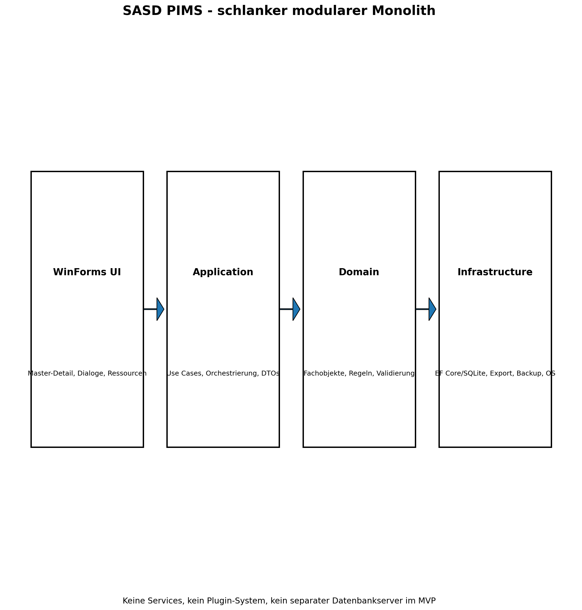
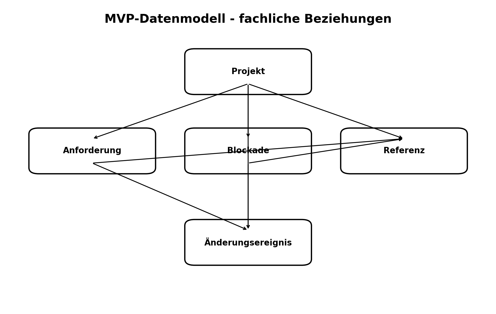
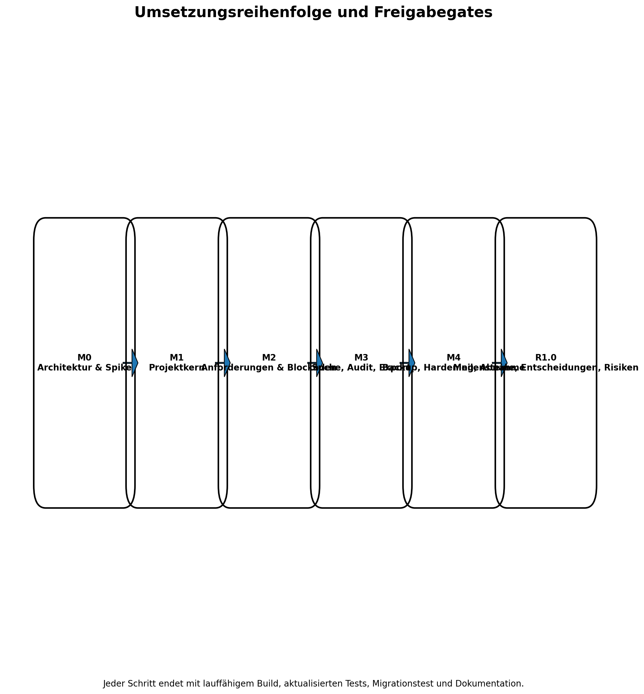

# SASD PIMS - Pflichtenheft
**Dokumentversion:** 0.1  
**Status:** Technische Entwurfsfassung zur Prüfung  
**Stand:** 29. Juli 2026  
**Bezugsdokument:** SASD PIMS - Lastenheft Version 0.1  
**Zielplattform:** C# / .NET 10 / Windows Forms / Windows 11 x64  
> Dieses Pflichtenheft beschreibt, wie die Anforderungen des freigegebenen Lastenhefts technisch umgesetzt, geprüft, ausgeliefert und betrieben werden sollen. Nicht entschiedene Punkte sind ausdrücklich als Entscheidungskandidaten gekennzeichnet.
## Dokumentenstatus
| Merkmal | Inhalt |
| --- | --- |
| Dokument | SASD PIMS - Pflichtenheft |
| Version | 0.1 |
| Status | Technische Entwurfsfassung zur Architektur- und Umsetzungsprüfung |
| Auftraggeber | SASD GmbH |
| Geltungsbereich | MVP sowie geplante Erweiterungen bis Release 1.1; spätere Kandidaten nur als technische Anschlussfähigkeit |
| Verbindliche Grundlage | SASD PIMS Lastenheft v0.1 |
| Codequellenprüfung | Öffentliche Repositories des GitHub-Kontos Robin-Goerlach; Wiederverwendung nur nach Einzelprüfung |
| Freigabeempfehlung | Freigabe für Milestone 0 und technischen Vertikalschnitt nach Entscheidung über Installationsform und Lizenz |

## Inhaltsverzeichnis
1. Dokumentzweck, Status und Geltungsbereich  
2. Bezug zum Lastenheft  
3. Rückverfolgbarkeitsmatrix  
4. Technische Systemgrenzen  
5. Lösungsübersicht  
6. Technologien und Auswahl  
7. Solution-, Projekt- und Modulstruktur  
8. Verantwortlichkeiten der Komponenten  
9. Benutzeroberfläche und Bedienabläufe  
10. Fachliches und technisches Datenmodell  
11. Persistenz, Schemaentwicklung und Migration  
12. Import und Export  
13. Schnittstellen und externe Integrationen  
14. Konfiguration  
15. Logging und Diagnose  
16. Fehlerbehandlung  
17. Sicherheit und Datenschutz  
18. Secrets und Zugangsdaten  
19. Backup, Wiederherstellung und Datenintegrität  
20. Nebenläufigkeit und asynchrone Verarbeitung  
21. Performance und Ressourcen  
22. Installation und Aktualisierung  
23. Portabilität und Benutzerverzeichnisse  
24. Teststrategie  
25. Konkrete Abnahmetests  
26. Build, Paket und Release  
27. Dokumentationsanforderungen  
28. Umsetzungsreihenfolge und Milestones  
29. Technische Risiken und Gegenmaßnahmen  
30. Technische Nichtziele  
31. Offene Architekturentscheidungen  
32. Änderungsprotokoll  
## 1. Dokumentzweck, Status und Geltungsbereich
Das Dokument übersetzt jede Lastenheftanforderung in mindestens eine technische Maßnahme und einen überprüfbaren Test. Es ist verbindlich für Architektur, Entwicklung, Code Review, Test, Paketierung und Abnahme. Es beschreibt keine unnötige verteilte Architektur: Ziel ist ein lokaler modularer Monolith mit kleiner Solution.
## 2. Bezug zum Lastenheft
Das Lastenheft Version 0.1 bleibt fachlich führend. Dieses Pflichtenheft darf Anforderungen konkretisieren, aber nicht ihren Sinn, ihre Priorität oder die Systemgrenzen verändern. Abweichungen werden als Change Request dokumentiert. Die Muss-Anforderungen bilden den MVP; Soll-Anforderungen werden so vorbereitet, dass Erweiterungen ohne Plattformwechsel möglich bleiben.
Das Lastenheft fordert lokale Offline-Nutzung, getrennte Projekt- und Statusobjekte, projektgebundene Anforderungen, sichere Referenzen, Suche, Audit, Backup/Restore und portable Exporte. Diese Schwerpunkte bestimmen Architektur und Teststrategie.
## 3. Rückverfolgbarkeitsmatrix
Die vollständige Matrix enthält alle funktionalen und nichtfunktionalen Lastenheftanforderungen. Die technischen Maßnahmen sind in den folgenden Kapiteln präzisiert; die Test-IDs sind stabil und werden in der späteren Testspezifikation weiter verfeinert.
| Lastenheft-ID | Priorität/Stufe | Technische Maßnahme | Test-/Abnahme-ID | Lastenheft-Abnahme |
| --- | --- | --- | --- | --- |
| LF-PRO-001 | Muss / MVP | Domänenentität/Value Objects, Application Service, WinForms-Detailansicht und EF-Core-Persistenz; Statusänderungen werden auditierbar gespeichert. | AT-F-PRO-001 | Ein Benutzer kann einen vollständigen Projektstammsatz speichern; die stabile Kennung bleibt bei Umbenennung unverändert. |
| LF-PRO-002 | Muss / MVP | Domänenentität/Value Objects, Application Service, WinForms-Detailansicht und EF-Core-Persistenz; Statusänderungen werden auditierbar gespeichert. | AT-F-PRO-002 | Versuch, ein projektbezogenes Objekt ohne Projektbezug zu speichern, wird verständlich abgewiesen. |
| LF-PRO-003 | Muss / MVP | Domänenentität/Value Objects, Application Service, WinForms-Detailansicht und EF-Core-Persistenz; Statusänderungen werden auditierbar gespeichert. | AT-F-PRO-003 | Jeder Statuswechsel ist sichtbar und archivierte Projekte bleiben auffindbar. |
| LF-PRO-004 | Muss / MVP | Domänenentität/Value Objects, Application Service, WinForms-Detailansicht und EF-Core-Persistenz; Statusänderungen werden auditierbar gespeichert. | AT-F-PRO-004 | Filter nach Art, Bereich und Tag liefern die erwarteten Projekte. |
| LF-PRO-005 | Soll / Release 1.0 | Domänenentität/Value Objects, Application Service, WinForms-Detailansicht und EF-Core-Persistenz; Statusänderungen werden auditierbar gespeichert. | AT-F-PRO-005 | Ein abgeschlossenes Projekt kann mit einem weiterhin aktiven Produkt verknüpft bleiben. |
| LF-PRO-006 | Soll / Release 1.1 | Domänenentität/Value Objects, Application Service, WinForms-Detailansicht und EF-Core-Persistenz; Statusänderungen werden auditierbar gespeichert. | AT-F-PRO-006 | Vorlagenanlage erzeugt einen neuen unabhängigen Datensatz; Vorlagenänderung verändert bestehende Projekte nicht. |
| LF-STA-001 | Muss / MVP | Domänenentität/Value Objects, Application Service, WinForms-Detailansicht und EF-Core-Persistenz; Statusänderungen werden auditierbar gespeichert. | AT-F-STA-001 | Kombinationen sind unabhängig auswählbar und in Listen getrennt sichtbar. |
| LF-STA-002 | Muss / MVP | Domänenentität/Value Objects, Application Service, WinForms-Detailansicht und EF-Core-Persistenz; Statusänderungen werden auditierbar gespeichert. | AT-F-STA-002 | Überfällige beziehungsweise ungeprüfte Projekte sind filterbar. |
| LF-STA-003 | Soll / Release 1.1 | Domänenentität/Value Objects, Application Service, WinForms-Detailansicht und EF-Core-Persistenz; Statusänderungen werden auditierbar gespeichert. | AT-F-STA-003 | Unzulässiger Übergang wird verhindert; erforderliche Begründung wird gespeichert. |
| LF-REQ-001 | Muss / MVP | Requirement-Aggregat mit projektgebundener FK, Akzeptanzkriterien, Quellnachweis, Validierungsservice und kontextbezogener Editor. | AT-F-REQ-001 | Anforderung ist im zugeordneten Projekt eindeutig auffindbar und vollständig prüfbar. |
| LF-REQ-002 | Muss / MVP | Requirement-Aggregat mit projektgebundener FK, Akzeptanzkriterien, Quellnachweis, Validierungsservice und kontextbezogener Editor. | AT-F-REQ-002 | Quelle wird in der Detailansicht angezeigt; Quelle und Freigabestatus bleiben getrennt. |
| LF-REQ-003 | Muss / MVP | Requirement-Aggregat mit projektgebundener FK, Akzeptanzkriterien, Quellnachweis, Validierungsservice und kontextbezogener Editor. | AT-F-REQ-003 | Abgelehnte oder zurückgestellte Anforderungen bleiben mit Begründung erhalten. |
| LF-REQ-004 | Muss / MVP | Requirement-Aggregat mit projektgebundener FK, Akzeptanzkriterien, Quellnachweis, Validierungsservice und kontextbezogener Editor. | AT-F-REQ-004 | Mindestens ein Akzeptanzkriterium kann pro Muss-Anforderung gespeichert und einzeln angezeigt werden. |
| LF-REQ-005 | Soll / Release 1.1 | Requirement-Aggregat mit projektgebundener FK, Akzeptanzkriterien, Quellnachweis, Validierungsservice und kontextbezogener Editor. | AT-F-REQ-005 | Beziehungstyp und Begründung sind sichtbar; offensichtliche Selbstbezüge werden verhindert. |
| LF-REQ-006 | Kann / Release 1.2 | Requirement-Aggregat mit projektgebundener FK, Akzeptanzkriterien, Quellnachweis, Validierungsservice und kontextbezogener Editor. | AT-F-REQ-006 | Import zeigt Vorschau, Fehler und Dubletten vor endgültiger Übernahme. |
| LF-MIL-001 | Soll / Release 1.0 | Eigenes fachliches Modul innerhalb derselben Solution; keine zusätzliche Laufzeitkomponente, relationale Zuordnung zum Projekt. | AT-F-MIL-001 | Ein Meilenstein gilt erst nach bestätigten Erreichungskriterien als erreicht. |
| LF-REL-001 | Soll / Release 1.1 | Eigenes fachliches Modul innerhalb derselben Solution; keine zusätzliche Laufzeitkomponente, relationale Zuordnung zum Projekt. | AT-F-REL-001 | Ein Release kann ohne automatische Gleichsetzung mit einem Projektmeilenstein gespeichert werden. |
| LF-RDM-001 | Soll / Release 1.1 | Read-Model-Abfragen über EF Core, serverseitige Filter/Sortierung, pagingfähige BindingSource; Ansichten werden aus führenden Daten abgeleitet. | AT-F-RDM-001 | Änderungen an zugrunde liegenden Objekten erscheinen in der Roadmap. |
| LF-DEC-001 | Soll / Release 1.0 | Eigenes fachliches Modul innerhalb derselben Solution; keine zusätzliche Laufzeitkomponente, relationale Zuordnung zum Projekt. | AT-F-DEC-001 | Eine Entscheidung ist über Projekt und Kennung auffindbar und enthält mindestens Kontext, Ergebnis und Begründung. |
| LF-DEC-002 | Soll / Release 1.1 | Eigenes fachliches Modul innerhalb derselben Solution; keine zusätzliche Laufzeitkomponente, relationale Zuordnung zum Projekt. | AT-F-DEC-002 | Alte und neue Entscheidung sind wechselseitig verknüpft. |
| LF-RSK-001 | Soll / Release 1.0 | Eigenes fachliches Modul innerhalb derselben Solution; keine zusätzliche Laufzeitkomponente, relationale Zuordnung zum Projekt. | AT-F-RSK-001 | Risikostufe und offene Gegenmaßnahmen sind sichtbar und filterbar. |
| LF-BLK-001 | Muss / MVP | Blockade-Entität mit Projektbezug, Status, nächster Maßnahme und Referenz; Filterprojektion für Portfolioansicht. | AT-F-BLK-001 | Blockierte Projekte sind aus der Portfolioübersicht direkt auffindbar. |
| LF-REF-001 | Muss / MVP | Typisierte Referenz-/Integrationskomponente; OS-Öffnung nur über Allowlist und ProcessStartInfo.UseShellExecute; spätere Adapter isoliert. | AT-F-REF-001 | Referenztyp, Titel und Ziel werden angezeigt; Referenz gehört eindeutig zu einem Fachobjekt. |
| LF-REF-002 | Soll / Release 1.1 | Typisierte Referenz-/Integrationskomponente; OS-Öffnung nur über Allowlist und ProcessStartInfo.UseShellExecute; spätere Adapter isoliert. | AT-F-REF-002 | Fehlende Ziele werden gemeldet, aber nicht automatisch gelöscht. |
| LF-DEP-001 | Soll / Release 1.1 | Typisierte Referenz-/Integrationskomponente; OS-Öffnung nur über Allowlist und ProcessStartInfo.UseShellExecute; spätere Adapter isoliert. | AT-F-DEP-001 | Abhängigkeit ist von beiden beteiligten Objekten aus sichtbar. |
| LF-GIT-001 | Kann / Release 2.x | Typisierte Referenz-/Integrationskomponente; OS-Öffnung nur über Allowlist und ProcessStartInfo.UseShellExecute; spätere Adapter isoliert. | AT-F-GIT-001 | Import ist abschaltbar und verändert keine GitHub-Daten. |
| LF-SRH-001 | Muss / MVP | Read-Model-Abfragen über EF Core, serverseitige Filter/Sortierung, pagingfähige BindingSource; Ansichten werden aus führenden Daten abgeleitet. | AT-F-SRH-001 | Ein bekannter Suchbegriff liefert das erwartete Objekt innerhalb der festgelegten Antwortzeit. |
| LF-SRH-002 | Muss / MVP | Read-Model-Abfragen über EF Core, serverseitige Filter/Sortierung, pagingfähige BindingSource; Ansichten werden aus führenden Daten abgeleitet. | AT-F-SRH-002 | Mehrere Filter können kombiniert und wieder zurückgesetzt werden. |
| LF-PRT-001 | Soll / Release 1.1 | Read-Model-Abfragen über EF Core, serverseitige Filter/Sortierung, pagingfähige BindingSource; Ansichten werden aus führenden Daten abgeleitet. | AT-F-PRT-001 | Kennzahlen sind aus Fachdaten abgeleitet und führen per Drill-down zu den zugrunde liegenden Objekten. |
| LF-PIP-001 | Soll / Release 1.1 | Read-Model-Abfragen über EF Core, serverseitige Filter/Sortierung, pagingfähige BindingSource; Ansichten werden aus führenden Daten abgeleitet. | AT-F-PIP-001 | Statusänderung im Projekt erscheint ohne doppelte Pflege in der Pipelineansicht. |
| LF-AUD-001 | Muss / MVP | AuditInterceptor/Application-Service schreibt unveränderliche Änderungsereignisse für definierte Kernfelder innerhalb derselben Transaktion. | AT-F-AUD-001 | Eine Änderung an einem Kernfeld erscheint im Verlauf; gelöschte Historie ist im Normalbetrieb nicht vorgesehen. |
| LF-LOG-001 | Muss / MVP | Microsoft.Extensions.Logging mit Serilog-Dateisink als Entscheidung; strukturierte, rotierende und datensparsame Logs. | AT-F-LOG-001 | Ein provozierter technischer Fehler erzeugt einen verständlichen, datensparsamen Protokolleintrag. |
| LF-BAK-001 | Muss / MVP | BackupService erstellt konsistente Paketkopie mit Datenbank, Manifest, Prüfsumme und Formatversion; Restore in temporäres Verzeichnis mit Vorprüfung und atomarem Austausch. | AT-F-BAK-001 | Sicherung enthält Daten und Manifest und kann eindeutig einer Formatversion zugeordnet werden. |
| LF-BAK-002 | Muss / MVP | BackupService erstellt konsistente Paketkopie mit Datenbank, Manifest, Prüfsumme und Formatversion; Restore in temporäres Verzeichnis mit Vorprüfung und atomarem Austausch. | AT-F-BAK-002 | Testwiederherstellung stellt einen bekannten Datenstand vollständig wieder her. |
| LF-EXP-001 | Muss / MVP | Versionierte DTOs, System.Text.Json, schemaVersion, Validierung und Transaktionsgrenze; Markdown-Renderer ohne Datenbankabhängigkeit. | AT-F-EXP-001 | Export kann syntaktisch geprüft werden und enthält Formatversion sowie stabile Kennungen. |
| LF-EXP-002 | Muss / MVP | Versionierte DTOs, System.Text.Json, schemaVersion, Validierung und Transaktionsgrenze; Markdown-Renderer ohne Datenbankabhängigkeit. | AT-F-EXP-002 | Exportdatei ist ohne PIMS lesbar und enthält die ausgewählten Projektinformationen. |
| LF-IMP-001 | Soll / Release 1.1 | Versionierte DTOs, System.Text.Json, schemaVersion, Validierung und Transaktionsgrenze; Markdown-Renderer ohne Datenbankabhängigkeit. | AT-F-IMP-001 | Ungültige oder inkompatible Daten werden vor Übernahme gemeldet. |
| LF-UI-001 | Muss / MVP | WinForms-Shell mit Navigation, BindingSource, zentralen Commands und kontrollierten Dialogen; Referenzdaten historienverträglich deaktivieren. | AT-F-UI-001 | Projektwechsel erfordert höchstens eine direkte Auswahl; Kontext und aktuelles Projekt bleiben erkennbar. |
| LF-UI-002 | Soll / Release 1.0 | WinForms-Shell mit Navigation, BindingSource, zentralen Commands und kontrollierten Dialogen; Referenzdaten historienverträglich deaktivieren. | AT-F-UI-002 | Neues Objekt erhält automatisch den sichtbaren Projektkontext. |
| LF-ADM-001 | Soll / Release 1.1 | WinForms-Shell mit Navigation, BindingSource, zentralen Commands und kontrollierten Dialogen; Referenzdaten historienverträglich deaktivieren. | AT-F-ADM-001 | Deaktivierter Wert bleibt in historischen Datensätzen sichtbar und steht nicht mehr für Neuanlage bereit. |
| LF-VAL-001 | Muss / MVP | Zentrale Validatoren in Domain/Application; UI zeigt aggregierte Fehler, Persistenz prüft Invarianten erneut. | AT-F-VAL-001 | Gleiche fehlerhafte Eingabe wird in allen relevanten Masken gleich bewertet. |
| LF-SEC-001 | Muss / MVP | SecurityPolicy-Service, Eingabe- und Schema-Allowlist, dokumentierte Datenpfade und Secret-Erkennung als Warn-/Blockierregel. | AT-F-SEC-001 | Unzulässiges Schema wird nicht direkt ausgeführt. |
| LF-SEC-002 | Muss / MVP | SecurityPolicy-Service, Eingabe- und Schema-Allowlist, dokumentierte Datenpfade und Secret-Erkennung als Warn-/Blockierregel. | AT-F-SEC-002 | Benutzerhinweis und Validierung verhindern offensichtliche Secret-Felder; Dokumentation benennt Ausschluss. |
| LF-SEC-003 | Muss / MVP | SecurityPolicy-Service, Eingabe- und Schema-Allowlist, dokumentierte Datenpfade und Secret-Erkennung als Warn-/Blockierregel. | AT-F-SEC-003 | Benutzer kann die Pfade einsehen und Sicherungsziel wählen. |
| LN-BED-001 | Muss / querschnittlich | UI-Styleguide, Tab-Reihenfolge, AccessibleName/Description, AutoScaleMode=Dpi, PerMonitorV2, skalierbare LayoutContainer und manueller Usability-/A11y-Test. | AT-N-BED-001 | Mindestens 80 % der definierten MVP-Szenarien werden nach höchstens 30 Minuten Einführung ohne Hilfestellung abgeschlossen. |
| LN-BED-002 | Muss / querschnittlich | UI-Styleguide, Tab-Reihenfolge, AccessibleName/Description, AutoScaleMode=Dpi, PerMonitorV2, skalierbare LayoutContainer und manueller Usability-/A11y-Test. | AT-N-BED-002 | Usability-Prüfung findet keine widersprüchliche Bedeutung identischer Bezeichnungen. |
| LN-BED-003 | Muss / querschnittlich | UI-Styleguide, Tab-Reihenfolge, AccessibleName/Description, AutoScaleMode=Dpi, PerMonitorV2, skalierbare LayoutContainer und manueller Usability-/A11y-Test. | AT-N-BED-003 | Negativtests für Pflichtfelder, ungültige Pfade und beschädigte Importdateien werden bestanden. |
| LN-A11Y-001 | Muss / querschnittlich | UI-Styleguide, Tab-Reihenfolge, AccessibleName/Description, AutoScaleMode=Dpi, PerMonitorV2, skalierbare LayoutContainer und manueller Usability-/A11y-Test. | AT-N-A11Y-001 | Definierte Kernabläufe sind ohne Maus durchführbar. |
| LN-A11Y-002 | Muss / querschnittlich | UI-Styleguide, Tab-Reihenfolge, AccessibleName/Description, AutoScaleMode=Dpi, PerMonitorV2, skalierbare LayoutContainer und manueller Usability-/A11y-Test. | AT-N-A11Y-002 | Keine abgeschnittenen Pflichtinformationen bei 200 %; Kontrastprüfung der Standardansicht. |
| LN-A11Y-003 | Soll / querschnittlich | UI-Styleguide, Tab-Reihenfolge, AccessibleName/Description, AutoScaleMode=Dpi, PerMonitorV2, skalierbare LayoutContainer und manueller Usability-/A11y-Test. | AT-N-A11Y-003 | Stichprobentest mit Windows-Screenreader liefert verständliche Feldbezeichnungen. |
| LN-SEC-001 | Muss / querschnittlich | Lokale Datenhaltung, minimale personenbezogene Felder, Transaktionen, FK/Checks, Abhängigkeitsinventar und Offline-Abnahme. | AT-N-SEC-001 | Dateninventar und Eingabemasken enthalten keine unnötigen personenbezogenen Pflichtfelder. |
| LN-SEC-002 | Muss / querschnittlich | Lokale Datenhaltung, minimale personenbezogene Felder, Transaktionen, FK/Checks, Abhängigkeitsinventar und Offline-Abnahme. | AT-N-SEC-002 | Kernabnahme wird auf einem vom Internet getrennten System durchgeführt. |
| LN-SEC-003 | Muss / querschnittlich | Lokale Datenhaltung, minimale personenbezogene Felder, Transaktionen, FK/Checks, Abhängigkeitsinventar und Offline-Abnahme. | AT-N-SEC-003 | Abbruchtests und Integritätsprüfung hinterlassen einen konsistenten Bestand. |
| LN-SEC-004 | Soll / querschnittlich | Lokale Datenhaltung, minimale personenbezogene Felder, Transaktionen, FK/Checks, Abhängigkeitsinventar und Offline-Abnahme. | AT-N-SEC-004 | Abhängigkeitsliste enthält Version, Lizenz und Verwendungszweck; keine unbekannte Lizenz. |
| LN-REL-001 | Muss / querschnittlich | Defensive Fehlergrenzen, globale Exception-Handler nur als letzte Sicherung, kontrolliertes Recovery und Langzeittest. | AT-N-REL-001 | Ein vierstündiger Nutzungstest mit Negativfällen verläuft ohne nicht behandelten Absturz. |
| LN-REL-002 | Muss / querschnittlich | Defensive Fehlergrenzen, globale Exception-Handler nur als letzte Sicherung, kontrolliertes Recovery und Langzeittest. | AT-N-REL-002 | Wiederherstellungstest auf leerer Installation erfolgreich. |
| LN-PERF-001 | Muss / querschnittlich | Indexe, Projektionen, asynchrone I/O-Operationen, Messdatensatz und Stopwatch-basierte Performance-Akzeptanztests. | AT-N-PERF-001 | 95 % der Listen- und Suchaktionen unter 2 Sekunden bei Referenzdatenbestand. |
| LN-PERF-002 | Soll / querschnittlich | Indexe, Projektionen, asynchrone I/O-Operationen, Messdatensatz und Stopwatch-basierte Performance-Akzeptanztests. | AT-N-PERF-002 | Kaltstart unter 10 Sekunden auf Referenzsystem. |
| LN-MNT-001 | Muss / querschnittlich | Kleine Schichtenstruktur, automatisierte Tests, versionierte Exportverträge, ADRs und Architekturprüfungen. | AT-N-MNT-001 | Architekturprüfung und automatisierte Tests zeigen keine direkte Vermischung zentraler Verantwortlichkeiten. |
| LN-MNT-002 | Muss / querschnittlich | Kleine Schichtenstruktur, automatisierte Tests, versionierte Exportverträge, ADRs und Architekturprüfungen. | AT-N-MNT-002 | Abnahmematrix verweist auf Testfälle; kritische Regeln besitzen automatisierte Tests. |
| LN-PORT-001 | Muss / querschnittlich | Kleine Schichtenstruktur, automatisierte Tests, versionierte Exportverträge, ADRs und Architekturprüfungen. | AT-N-PORT-001 | Vollständiger JSON-Export und lesbarer Markdown-Export bestanden. |
| LN-LOC-001 | Muss / querschnittlich | Deutsch als Standard; UI-Texte über .resx, sprachneutrale IDs und keine lokalisierten Persistenzwerte. | AT-N-LOC-001 | Sprachprüfung findet keine unbeabsichtigten englischen UI-Fragmente in Kernabläufen. |
| LN-LOC-002 | Soll / querschnittlich | Deutsch als Standard; UI-Texte über .resx, sprachneutrale IDs und keine lokalisierten Persistenzwerte. | AT-N-LOC-002 | Textressourcen sind zentralisierbar; Fachkennungen bleiben sprachneutral. |
| LN-OPS-001 | Muss / querschnittlich | Self-contained oder framework-dependent x64 Publish als Entscheidungskandidat; portable ZIP zuerst, Installer nach Pilot; Windows-11-Testmatrix. | AT-N-OPS-001 | Installation beziehungsweise Entpacken, Erststart und Deinstallation werden auf sauberem Testsystem erfolgreich durchgeführt. |
| LN-OPS-002 | Muss / querschnittlich | Self-contained oder framework-dependent x64 Publish als Entscheidungskandidat; portable ZIP zuerst, Installer nach Pilot; Windows-11-Testmatrix. | AT-N-OPS-002 | MVP funktioniert ohne separat installierten Datenbank- oder Webserver. |
| LN-COMP-001 | Muss / querschnittlich | Self-contained oder framework-dependent x64 Publish als Entscheidungskandidat; portable ZIP zuerst, Installer nach Pilot; Windows-11-Testmatrix. | AT-N-COMP-001 | Abnahme auf mindestens zwei unterstützten Windows-11-Konfigurationen. |

## 4. Technische Systemgrenzen
| Innerhalb der Anwendung | Außerhalb / führendes System |
| --- | --- |
| Projekt-, Produkt-, Anforderungs-, Meilenstein-, Release-, Entscheidungs-, Risiko-, Blockade- und Referenzinformationen | Quellcode und Artefakte in GitHub/lokalen Repositories |
| Lokale SQLite-Datenbank, Exporte, Backups und Diagnoseprotokolle | Operative Aufgaben in TaskHost/GitHub Issues |
| Sichere Öffnung und Prüfung externer Referenzen | Prompts im SASD Prompt Manager; freie Notizen in SASD Notes |
| Manuelle oder später lesende Integration | Keine bidirektionale Synchronisation, kein Cloudkonto, kein Serverzwang |

## 5. Lösungsübersicht
SASD PIMS wird als WinForms-Einzelplatzanwendung umgesetzt. Ein Prozess betreibt UI, Anwendungsschicht, Domänenlogik und lokale Infrastruktur. SQLite ist eingebettet. Externe Ziele werden ausschließlich referenziert. Lange Datei-, Backup-, Import- oder Prüfoperationen laufen asynchron und melden Fortschritt an die UI.

## 6. Geplante Technologien und begründete Auswahl
| Technologie | Status | Begründung / Einschränkung |
| --- | --- | --- |
| .NET 10 LTS / C# | fest vorgesehen | Aktuelle LTS-Basis; passt zur SASD-C#-Ausrichtung und zu WinForms. |
| Windows Forms | fest vorgegeben | Geringer Technologie- und Betriebsaufwand; vorhandene SASD-Erfahrung; gute Windows-Dateiintegration. |
| SQLite | fest vorgesehen | Lokale, serverlose relationale Persistenz; ausreichend für Einzelplatz und geplante Datenmengen. |
| Entity Framework Core 10 + Microsoft.EntityFrameworkCore.Sqlite | vorgesehen | Migrations-, LINQ- und Change-Tracking-Unterstützung. SQLite-Migrationsgrenzen werden durch Backup, Review und Migrationstests abgesichert. |
| Microsoft.Extensions.DependencyInjection/Configuration/Logging | vorgesehen | Offizielle, kleine .NET-Bausteine; vermeiden eigenes Service-Locator- oder Konfigurationsframework. |
| System.Text.Json | fest vorgesehen | Im Framework enthalten; versionierte Exportverträge ohne Zusatzabhängigkeit. |
| Serilog + File Sink | Entscheidungskandidat, empfohlen | Strukturierte rotierende Diagnoseprotokolle; Paket nur aufnehmen, wenn License-/Maintenance-Review bestanden. |
| FluentValidation | Entscheidungskandidat | Nur aufnehmen, wenn zentrale Validatoren gegenüber eigenem kleinen Validierungsmodell einen messbaren Vorteil bringen. MVP kann ohne dieses Paket starten. |
| Markdig | Entscheidungskandidat | Markdown-Rendering/Export; für reinen Textgenerator nicht zwingend. |
| xUnit | vorgesehen | Automatisierte Domain-, Application- und Integrationstests; bestehende SASD-Testmuster können geprüft werden. |
| Velopack / Installer-Framework | offen | Erst nach Pilot. Milestone 1 nutzt reproduzierbares dotnet publish und ZIP-Paket. |

Offizielle Microsoft-Dokumentation bestätigt Windows Forms auf .NET 10, EF-Core-SQLite und migrationsgestützte Schemaentwicklung. EF Core weist zugleich auf SQLite-spezifische Migrationsgrenzen hin; deshalb werden produktive Migrationen niemals ohne vorherige Sicherung ausgeführt.
## 7. Solution-, Projekt- und Modulstruktur
Empfohlen wird eine kleine Solution mit höchstens vier Produktivprojekten und zwei Testprojekten. Ein zusätzliches Projekt ist nur zulässig, wenn es eine klar testbare Verantwortungsgrenze besitzt.
```text
Sasd.Pims.sln
├─ src/
│  ├─ Sasd.Pims.WinForms          # Startprojekt, Forms, Presenter/Controller, UI-Ressourcen
│  ├─ Sasd.Pims.Application       # Use Cases, DTOs, Ports, Orchestrierung, Validierung
│  ├─ Sasd.Pims.Domain            # Fachobjekte, Value Objects, Regeln, Ereignisse
│  └─ Sasd.Pims.Infrastructure    # EF Core/SQLite, Backup, Export, Dateisystem, OS-Adapter
├─ tests/
│  ├─ Sasd.Pims.Domain.Tests
│  └─ Sasd.Pims.IntegrationTests
├─ docs/
├─ scripts/
└─ assets/
```
Eine noch kleinere Dreiprojektstruktur ist zulässig, wenn Application und Domain zunächst gemeinsam bleiben. Nicht zulässig ist ein einziges UI-Projekt, in dem Form-Eventhandler direkt SQL, Dateizugriff und Geschäftsregeln ausführen.
## 8. Verantwortlichkeiten der Komponenten
| Komponente | Verantwortung | Darf nicht |
| --- | --- | --- |
| WinForms | Darstellung, Tastaturabläufe, Bindung, Dialoge, Benutzerfeedback | Fachregeln oder direkte Datenbankmigrationen enthalten |
| Application | Use Cases, Transaktionsgrenzen, Berechtigungs-/Sicherheitsrichtlinien, DTO-Mapping | UI-Steuerelemente referenzieren |
| Domain | Invarianten, stabile IDs, Statusregeln, fachliche Ereignisse | EF-Core- oder Dateisystemtypen kennen |
| Infrastructure | EF Core, SQLite, Dateipfade, Export, Backup, OS-Öffnung | fachliche Entscheidungen verstecken |
| Tests | automatisierte Fach-, Persistenz-, Migrations- und Exportprüfungen | nur UI-Screenshots als Nachweis verwenden |

## 9. Benutzeroberfläche und Bedienabläufe
Die Hauptansicht nutzt eine Master-Detail-Struktur: links Navigation und Projektliste, oben globale Suche und Filter, rechts der Projektarbeitsbereich. Der Projektkontext bleibt in Überschrift und Statusleiste sichtbar. Detailbereiche werden als Tabs oder klar getrennte Sektionen geführt: Überblick, Anforderungen, Blockaden, Referenzen, Verlauf; spätere Module ergänzen Meilensteine, Entscheidungen und Risiken.
| Ablauf | Technischer Ablauf |
| --- | --- |
| Projekt anlegen | Befehl öffnet Editor; Application Validator prüft; SaveUseCase speichert Projekt und Auditereignis atomar; UI aktualisiert Liste. |
| Projekt wechseln | Auswahl lädt schlanke Projektion und anschließend kontextbezogene Daten; ungespeicherte Änderungen werden erkannt. |
| Anforderung anlegen | Kontextkommando übernimmt ProjectId unveränderbar; Editor erfasst Quelle und Kriterien; Speichern nur bei gültiger Invariante. |
| Referenz öffnen | ReferenceOpenService normalisiert und validiert Ziel; nur erlaubte Typen werden mit UseShellExecute geöffnet. |
| Backup/Restore | Assistent zeigt Ziel, Umfang und Ergebnis; Restore verlangt Vorprüfung, Bestätigung und Neustart. |

## 10. Fachliches und technisches Datenmodell
Fachliche IDs sind stabile GUIDs. Zusätzlich können lesbare, pro Projekt eindeutige Kennungen geführt werden. Löschung wird im MVP überwiegend durch Archivierung oder Deaktivierung ersetzt. Alle projektbezogenen Objekte besitzen eine nicht-nullbare ProjectId.

| Entität | Kernattribute / Regeln |
| --- | --- |
| Project | Id, Key, Name, Summary, Goal, Benefit, TypeId, AreaId, LifecyclePhase, ActivityState, LastReviewAt, NextReviewAt, NextAction, IsArchived; Key bleibt bei Umbenennung stabil. |
| Requirement | Id, ProjectId, Key, Title, Description, Rationale, Priority, DecisionStatus, SourceType, SourceDate; mindestens ein Kriterium bei Muss. |
| AcceptanceCriterion | Id, RequirementId, Sequence, Text, optional VerificationReference. |
| Blocker | Id, ProjectId, optional SubjectType/SubjectId, Cause, Impact, StartedAt, State, NextAction. |
| ExternalReference | Id, OwnerType, OwnerId, ReferenceType, Title, Target, LastCheckedAt, CheckResult. |
| AuditEntry | Id, OccurredAtUtc, EntityType, EntityId, FieldName/EventType, OldValue, NewValue, Reason; normal nicht löschbar. |
| ReferenceData | Id, Code, DisplayName, SortOrder, IsActive; verwendete Werte werden deaktiviert statt gelöscht. |

## 11. Persistenz, Schemaentwicklung und Migration
Die Datenbank liegt standardmäßig im Benutzerprofil unter LocalApplicationData/SASD/PIMS/data. Fremdschlüssel werden aktiviert. Schreiboperationen, die mehrere Datensätze betreffen, laufen in einer Transaktion. Die Anwendung verwendet EF-Core-Migrationen, keine EnsureCreated-Strategie für produktive Bestände.
Ablauf beim Start: Konfiguration laden, Pfade prüfen, exklusiven Migrationslock setzen, Datenbankintegrität prüfen, ausstehende Migrationen erkennen, Sicherung erstellen, Migration anwenden, Integrität erneut prüfen, Lock entfernen. Bei Fehler bleibt die Originalsicherung erhalten und der Start erfolgt im Diagnosemodus ohne weitere Schreibzugriffe.
## 12. Import und Export
JSON-Exporte erhalten envelope.schemaVersion, exportedAtUtc, applicationVersion und stabile IDs. Export-DTOs sind von EF-Entitäten getrennt. Markdown-Steckbriefe werden deterministisch aus einem Read Model erzeugt. Import wird erst Release 1.1 aktiv; bis dahin ist Export kein verdeckter Restoremechanismus.
## 13. Schnittstellen und externe Integrationen
Der MVP besitzt keine Netzwerk-API. Fachliche Schnittstellen sind Datei-, Verzeichnis- und HTTPS-Referenzen sowie JSON-/Markdown-Dateien. GitHub wird nur über gespeicherte URLs referenziert. Ein späterer GitHub-Adapter wird hinter IGitHubMetadataReader isoliert und standardmäßig deaktiviert.
### 13.1 Prüfung vorhandener SASD-Codequellen
| Repository | Mögliche Wiederverwendung | Pflichtprüfung vor Übernahme |
| --- | --- | --- |
| SASD-Prompt-Manager | Solution-Muster, Import/Export, Backup, Suche/Filter, Domain-Tests | Tatsächlichen Codebestand, Zielframework, Lizenzdatei und Testabdeckung prüfen; README-Zielbild nicht mit implementiertem Stand verwechseln. |
| SASD-TaskHost-Local | WinForms/SQLite, lokale Pfade, Listen- und Statusmuster | Datenzugriff, Migrationen, Fehlerbehandlung und Trennung UI/Fachlogik reviewen. |
| sasd-toolbox-dotnet | kleine technische Hilfsbibliotheken | Nur konkrete Pakete mit belegtem Nutzen; keine pauschale Toolbox-Abhängigkeit. |
| SASD-Workbench | Projekt-/Eintragsmodelle, Suche, Export, Backups | Domänenüberschneidung und Reifegrad prüfen; keine konkurrierende Produktarchitektur kopieren. |
| Reqloom | Anforderungsmodell, Projektvorlagen, externe Links, Markdown-Export | Repositorycode, Lizenz und technische Aktualität prüfen; nur kompatible Einzelbausteine übernehmen. |
| SASD-Development-Standard | Repo-, Dokumentations-, Quality-Gate- und ADR-Konventionen | Normative Version zum Implementierungsstart festschreiben. |

## 14. Konfiguration
Konfiguration wird in drei Ebenen gelesen: unveränderliche Defaults, benutzerspezifische appsettings.json im Konfigurationsverzeichnis und explizite Kommandozeilenparameter für Diagnose/Test. Pfade, Log-Level und UI-Einstellungen sind konfigurierbar. Fachliche Referenzdaten gehören in die Datenbank, nicht in appsettings. Unbekannte Konfigurationswerte werden ignoriert und protokolliert; sicherheitskritische ungültige Werte führen zu einem verständlichen Startfehler.
## 15. Logging und Diagnose
Logs enthalten Ereignisname, Zeit, Anwendungsversion, CorrelationId und technische Ausnahmeinformationen. Sie enthalten keine vollständigen Anforderungs- oder Projektexte, keine Tokens und keine ungekürzten sensiblen Pfade, sofern dies nicht für Diagnose erforderlich ist. Rotierende Dateien werden standardmäßig 14 Tage aufbewahrt; Wert bleibt konfigurierbar. Ein Diagnosebericht kann Version, Pfade, Datenbankschema, letzte Migrationen und Logauszug bündeln, jedoch keine Datenbank ungefragt mitsenden.
## 16. Fehlerbehandlung
Erwartbare Fachfehler werden als Ergebnisobjekte behandelt. Infrastrukturfehler werden in Application-Ausnahmen übersetzt. UI zeigt handlungsorientierte Meldungen mit Fehler-ID; technische Details bleiben im Log. Globale Handler für UI-Thread und unbeobachtete Tasks verhindern nur unkontrolliertes Beenden, ersetzen aber keine lokale Fehlerbehandlung. Nach einem unbekannten Schreibfehler wird der betroffene Editor in einen sicheren Zustand versetzt und ein Neustart empfohlen.
## 17. Sicherheit und Datenschutz
Die Anwendung folgt Datenminimierung und Local-first. Externe Ziele werden nicht durch Zeichenkettenverkettung in Shellbefehle eingebaut. Erlaubt sind im MVP HTTPS, vorhandene lokale Dateien/Verzeichnisse und explizit unterstützte Repositorypfade. javascript:, data:, powershell:, cmd: und unbekannte URI-Schemata werden abgewiesen. Importdateien gelten als nicht vertrauenswürdig und werden auf Größe, Formatversion, Struktur und Pfade geprüft.
## 18. Secrets und Zugangsdaten
PIMS besitzt keine Secret-Felder und speichert keine GitHub-Tokens im MVP. Erkennbare Schlüssel-/Tokenmuster in Freitext erzeugen mindestens eine deutliche Warnung; für besonders typische private Schlüsselblöcke wird Speichern blockiert. Eine spätere autorisierte GitHub-Integration müsste Windows Credential Manager oder einen getrennten Secret Manager verwenden; diese Entscheidung gehört nicht zum MVP.
## 19. Backup, Wiederherstellung und Datenintegrität
Ein Backup ist ein ZIP-Paket mit pims.db, manifest.json und SHA-256-Prüfsummen. Es wird aus einem konsistenten Datenbankzustand erstellt; bevorzugt über SQLite Online Backup API oder kontrollierte Kopie nach WAL-Checkpoint. Restore entpackt in ein temporäres Verzeichnis, prüft Manifest, Hashes, Schema und PRAGMA integrity_check und ersetzt den aktiven Bestand erst nach Bestätigung. Vor Restore wird die aktuelle Datenbank automatisch gesichert.
## 20. Nebenläufigkeit und asynchrone Verarbeitung
UI-Operationen bleiben kurz. Datei-, Export-, Backup-, Restore-, Referenzprüf- und spätere Netzwerkoperationen sind async, akzeptieren CancellationToken und melden Fortschritt. DbContext-Instanzen werden pro Use Case erzeugt und nie threadübergreifend geteilt. Parallele Schreibvorgänge werden im Einzelplatz-MVP durch einen anwendungsweiten Schreibkoordinator serialisiert. UI-Steuerelemente werden nur auf dem UI-Thread aktualisiert.
## 21. Performance- und Ressourcenanforderungen
Referenzbestand für Abnahme: 2.000 Projekte, 20.000 Anforderungen, 10.000 Referenzen, 5.000 Blockaden und 100.000 Auditereignisse. Diese Menge liegt deutlich über dem erwarteten Anfangsbestand und dient als Sicherheitsmarge. Listen laden Projektionen statt vollständiger Aggregate. Indizes sind mindestens für Project.Key, Namen, Statusfelder, Fremdschlüssel, Requirement.ProjectId/Key und Audit.EntityId/OccurredAt vorzusehen.
## 22. Installation und Aktualisierung
Milestone 1 wird als signiertes oder prüfsummenbelegtes x64-ZIP aus dotnet publish geliefert. Portable Nutzung bedeutet portable Programmdateien, nicht automatisch Datenhaltung neben der EXE. Ein Installer ist Entscheidungskandidat nach Pilot. Aktualisierung ersetzt nur Programmdateien; Datenmigrationen werden beim ersten Start kontrolliert durchgeführt. Downgrade mit neuerem Datenbankschema ist nicht garantiert und wird verhindert.
## 23. Portabilität und Benutzerverzeichnisse
| Kategorie | Standardpfad |
| --- | --- |
| Daten | %LOCALAPPDATA%\SASD\PIMS\data |
| Konfiguration | %APPDATA%\SASD\PIMS |
| Logs | %LOCALAPPDATA%\SASD\PIMS\logs |
| Backups | vom Benutzer wählbar; Vorschlag %USERPROFILE%\Documents\SASD-PIMS-Backups |
| Exporte | vom Benutzer wählbar; letzter gültiger Pfad wird gemerkt |

Pfade werden über Environment.SpecialFolder ermittelt. Keine Annahmen über Laufwerksbuchstaben oder Installationsrechte. Datenpfade neben der EXE sind nur in einem ausdrücklich aktivierten Portabelmodus zulässig.
## 24. Teststrategie
| Teststufe | Schwerpunkt |
| --- | --- |
| Domain-Unit-Tests | IDs, Statuskombinationen, Pflichtzuordnung, Prioritäten, Akzeptanzkriterien, Secret- und Referenzregeln. |
| Application-Tests | Use Cases, Transaktionsgrenzen, Audit, Validierungsfehler, Berechtigungs-/Security-Policies. |
| SQLite-Integrationstests | Mapping, FK/Unique/Check-Constraints, Migrationen, Indizes, Transaktionsabbruch, Backup/Restore. |
| Exportvertragstests | deterministisches JSON/Markdown, SchemaVersion, Roundtrip sobald Import vorhanden. |
| UI-Workflowtests | kritische Abläufe manuell mit Checklisten; optionale FlaUI-Automation erst bei stabilem UI. |
| A11y-/DPI-Tests | Tastatur, Tab-Reihenfolge, Narrator-Stichprobe, 100/150/200 %, zwei Monitor-DPI-Werte. |
| Performance-/Stabilitätstests | Referenzbestand, 95%-Antwortzeit, Kaltstart, vierstündiger Soak-Test. |
| Installations-/Upgrade-Tests | sauberes Windows 11, Upgrade mit alter DB, Deinstallation ohne Löschung von Benutzerdaten. |

## 25. Konkrete Abnahmetests
### AT-F-PRO-001 - Projektstammsatz anlegen
**Bezug:** LF-PRO-001 (Muss, MVP)
**Vorbedingung:** Definierter Testbestand; Anwendung in Release-Konfiguration; relevante externe Ziele beziehungsweise Fehlerfälle vorbereitet.
**Durchführung:** Die technische Maßnahme wird über den vorgesehenen Benutzerablauf und - soweit sinnvoll - zusätzlich automatisiert geprüft. Schwerpunkt: Domänenentität/Value Objects, Application Service, WinForms-Detailansicht und EF-Core-Persistenz; Statusänderungen werden auditierbar gespeichert.
**Erwartetes Ergebnis:** Ein Benutzer kann einen vollständigen Projektstammsatz speichern; die stabile Kennung bleibt bei Umbenennung unverändert.
**Nachweis:** Testprotokoll mit Version, Umgebung, Ergebnis, Abweichung und Verweis auf automatisierten Test beziehungsweise Screenshot/Logauszug.
### AT-F-PRO-002 - Projektzuordnung erzwingen
**Bezug:** LF-PRO-002 (Muss, MVP)
**Vorbedingung:** Definierter Testbestand; Anwendung in Release-Konfiguration; relevante externe Ziele beziehungsweise Fehlerfälle vorbereitet.
**Durchführung:** Die technische Maßnahme wird über den vorgesehenen Benutzerablauf und - soweit sinnvoll - zusätzlich automatisiert geprüft. Schwerpunkt: Domänenentität/Value Objects, Application Service, WinForms-Detailansicht und EF-Core-Persistenz; Statusänderungen werden auditierbar gespeichert.
**Erwartetes Ergebnis:** Versuch, ein projektbezogenes Objekt ohne Projektbezug zu speichern, wird verständlich abgewiesen.
**Nachweis:** Testprotokoll mit Version, Umgebung, Ergebnis, Abweichung und Verweis auf automatisierten Test beziehungsweise Screenshot/Logauszug.
### AT-F-PRO-003 - Projektstatus verwalten
**Bezug:** LF-PRO-003 (Muss, MVP)
**Vorbedingung:** Definierter Testbestand; Anwendung in Release-Konfiguration; relevante externe Ziele beziehungsweise Fehlerfälle vorbereitet.
**Durchführung:** Die technische Maßnahme wird über den vorgesehenen Benutzerablauf und - soweit sinnvoll - zusätzlich automatisiert geprüft. Schwerpunkt: Domänenentität/Value Objects, Application Service, WinForms-Detailansicht und EF-Core-Persistenz; Statusänderungen werden auditierbar gespeichert.
**Erwartetes Ergebnis:** Jeder Statuswechsel ist sichtbar und archivierte Projekte bleiben auffindbar.
**Nachweis:** Testprotokoll mit Version, Umgebung, Ergebnis, Abweichung und Verweis auf automatisierten Test beziehungsweise Screenshot/Logauszug.
### AT-F-PRO-004 - Projekt klassifizieren
**Bezug:** LF-PRO-004 (Muss, MVP)
**Vorbedingung:** Definierter Testbestand; Anwendung in Release-Konfiguration; relevante externe Ziele beziehungsweise Fehlerfälle vorbereitet.
**Durchführung:** Die technische Maßnahme wird über den vorgesehenen Benutzerablauf und - soweit sinnvoll - zusätzlich automatisiert geprüft. Schwerpunkt: Domänenentität/Value Objects, Application Service, WinForms-Detailansicht und EF-Core-Persistenz; Statusänderungen werden auditierbar gespeichert.
**Erwartetes Ergebnis:** Filter nach Art, Bereich und Tag liefern die erwarteten Projekte.
**Nachweis:** Testprotokoll mit Version, Umgebung, Ergebnis, Abweichung und Verweis auf automatisierten Test beziehungsweise Screenshot/Logauszug.
### AT-F-PRO-005 - Produktbezug dokumentieren
**Bezug:** LF-PRO-005 (Soll, Release 1.0)
**Vorbedingung:** Definierter Testbestand; Anwendung in Release-Konfiguration; relevante externe Ziele beziehungsweise Fehlerfälle vorbereitet.
**Durchführung:** Die technische Maßnahme wird über den vorgesehenen Benutzerablauf und - soweit sinnvoll - zusätzlich automatisiert geprüft. Schwerpunkt: Domänenentität/Value Objects, Application Service, WinForms-Detailansicht und EF-Core-Persistenz; Statusänderungen werden auditierbar gespeichert.
**Erwartetes Ergebnis:** Ein abgeschlossenes Projekt kann mit einem weiterhin aktiven Produkt verknüpft bleiben.
**Nachweis:** Testprotokoll mit Version, Umgebung, Ergebnis, Abweichung und Verweis auf automatisierten Test beziehungsweise Screenshot/Logauszug.
### AT-F-PRO-006 - Projekt aus Vorlage anlegen
**Bezug:** LF-PRO-006 (Soll, Release 1.1)
**Vorbedingung:** Definierter Testbestand; Anwendung in Release-Konfiguration; relevante externe Ziele beziehungsweise Fehlerfälle vorbereitet.
**Durchführung:** Die technische Maßnahme wird über den vorgesehenen Benutzerablauf und - soweit sinnvoll - zusätzlich automatisiert geprüft. Schwerpunkt: Domänenentität/Value Objects, Application Service, WinForms-Detailansicht und EF-Core-Persistenz; Statusänderungen werden auditierbar gespeichert.
**Erwartetes Ergebnis:** Vorlagenanlage erzeugt einen neuen unabhängigen Datensatz; Vorlagenänderung verändert bestehende Projekte nicht.
**Nachweis:** Testprotokoll mit Version, Umgebung, Ergebnis, Abweichung und Verweis auf automatisierten Test beziehungsweise Screenshot/Logauszug.
### AT-F-STA-001 - Lebenszyklusphase und Aktivitätszustand trennen
**Bezug:** LF-STA-001 (Muss, MVP)
**Vorbedingung:** Definierter Testbestand; Anwendung in Release-Konfiguration; relevante externe Ziele beziehungsweise Fehlerfälle vorbereitet.
**Durchführung:** Die technische Maßnahme wird über den vorgesehenen Benutzerablauf und - soweit sinnvoll - zusätzlich automatisiert geprüft. Schwerpunkt: Domänenentität/Value Objects, Application Service, WinForms-Detailansicht und EF-Core-Persistenz; Statusänderungen werden auditierbar gespeichert.
**Erwartetes Ergebnis:** Kombinationen sind unabhängig auswählbar und in Listen getrennt sichtbar.
**Nachweis:** Testprotokoll mit Version, Umgebung, Ergebnis, Abweichung und Verweis auf automatisierten Test beziehungsweise Screenshot/Logauszug.
### AT-F-STA-002 - Aktualitäts- und Reviewstatus
**Bezug:** LF-STA-002 (Muss, MVP)
**Vorbedingung:** Definierter Testbestand; Anwendung in Release-Konfiguration; relevante externe Ziele beziehungsweise Fehlerfälle vorbereitet.
**Durchführung:** Die technische Maßnahme wird über den vorgesehenen Benutzerablauf und - soweit sinnvoll - zusätzlich automatisiert geprüft. Schwerpunkt: Domänenentität/Value Objects, Application Service, WinForms-Detailansicht und EF-Core-Persistenz; Statusänderungen werden auditierbar gespeichert.
**Erwartetes Ergebnis:** Überfällige beziehungsweise ungeprüfte Projekte sind filterbar.
**Nachweis:** Testprotokoll mit Version, Umgebung, Ergebnis, Abweichung und Verweis auf automatisierten Test beziehungsweise Screenshot/Logauszug.
### AT-F-STA-003 - Kontrollierte Statusübergänge
**Bezug:** LF-STA-003 (Soll, Release 1.1)
**Vorbedingung:** Definierter Testbestand; Anwendung in Release-Konfiguration; relevante externe Ziele beziehungsweise Fehlerfälle vorbereitet.
**Durchführung:** Die technische Maßnahme wird über den vorgesehenen Benutzerablauf und - soweit sinnvoll - zusätzlich automatisiert geprüft. Schwerpunkt: Domänenentität/Value Objects, Application Service, WinForms-Detailansicht und EF-Core-Persistenz; Statusänderungen werden auditierbar gespeichert.
**Erwartetes Ergebnis:** Unzulässiger Übergang wird verhindert; erforderliche Begründung wird gespeichert.
**Nachweis:** Testprotokoll mit Version, Umgebung, Ergebnis, Abweichung und Verweis auf automatisierten Test beziehungsweise Screenshot/Logauszug.
### AT-F-REQ-001 - Anforderung erfassen
**Bezug:** LF-REQ-001 (Muss, MVP)
**Vorbedingung:** Definierter Testbestand; Anwendung in Release-Konfiguration; relevante externe Ziele beziehungsweise Fehlerfälle vorbereitet.
**Durchführung:** Die technische Maßnahme wird über den vorgesehenen Benutzerablauf und - soweit sinnvoll - zusätzlich automatisiert geprüft. Schwerpunkt: Requirement-Aggregat mit projektgebundener FK, Akzeptanzkriterien, Quellnachweis, Validierungsservice und kontextbezogener Editor.
**Erwartetes Ergebnis:** Anforderung ist im zugeordneten Projekt eindeutig auffindbar und vollständig prüfbar.
**Nachweis:** Testprotokoll mit Version, Umgebung, Ergebnis, Abweichung und Verweis auf automatisierten Test beziehungsweise Screenshot/Logauszug.
### AT-F-REQ-002 - Anforderungsquelle dokumentieren
**Bezug:** LF-REQ-002 (Muss, MVP)
**Vorbedingung:** Definierter Testbestand; Anwendung in Release-Konfiguration; relevante externe Ziele beziehungsweise Fehlerfälle vorbereitet.
**Durchführung:** Die technische Maßnahme wird über den vorgesehenen Benutzerablauf und - soweit sinnvoll - zusätzlich automatisiert geprüft. Schwerpunkt: Requirement-Aggregat mit projektgebundener FK, Akzeptanzkriterien, Quellnachweis, Validierungsservice und kontextbezogener Editor.
**Erwartetes Ergebnis:** Quelle wird in der Detailansicht angezeigt; Quelle und Freigabestatus bleiben getrennt.
**Nachweis:** Testprotokoll mit Version, Umgebung, Ergebnis, Abweichung und Verweis auf automatisierten Test beziehungsweise Screenshot/Logauszug.
### AT-F-REQ-003 - Priorität und Entscheidungsstatus
**Bezug:** LF-REQ-003 (Muss, MVP)
**Vorbedingung:** Definierter Testbestand; Anwendung in Release-Konfiguration; relevante externe Ziele beziehungsweise Fehlerfälle vorbereitet.
**Durchführung:** Die technische Maßnahme wird über den vorgesehenen Benutzerablauf und - soweit sinnvoll - zusätzlich automatisiert geprüft. Schwerpunkt: Requirement-Aggregat mit projektgebundener FK, Akzeptanzkriterien, Quellnachweis, Validierungsservice und kontextbezogener Editor.
**Erwartetes Ergebnis:** Abgelehnte oder zurückgestellte Anforderungen bleiben mit Begründung erhalten.
**Nachweis:** Testprotokoll mit Version, Umgebung, Ergebnis, Abweichung und Verweis auf automatisierten Test beziehungsweise Screenshot/Logauszug.
### AT-F-REQ-004 - Akzeptanzkriterien führen
**Bezug:** LF-REQ-004 (Muss, MVP)
**Vorbedingung:** Definierter Testbestand; Anwendung in Release-Konfiguration; relevante externe Ziele beziehungsweise Fehlerfälle vorbereitet.
**Durchführung:** Die technische Maßnahme wird über den vorgesehenen Benutzerablauf und - soweit sinnvoll - zusätzlich automatisiert geprüft. Schwerpunkt: Requirement-Aggregat mit projektgebundener FK, Akzeptanzkriterien, Quellnachweis, Validierungsservice und kontextbezogener Editor.
**Erwartetes Ergebnis:** Mindestens ein Akzeptanzkriterium kann pro Muss-Anforderung gespeichert und einzeln angezeigt werden.
**Nachweis:** Testprotokoll mit Version, Umgebung, Ergebnis, Abweichung und Verweis auf automatisierten Test beziehungsweise Screenshot/Logauszug.
### AT-F-REQ-005 - Anforderungsbeziehungen
**Bezug:** LF-REQ-005 (Soll, Release 1.1)
**Vorbedingung:** Definierter Testbestand; Anwendung in Release-Konfiguration; relevante externe Ziele beziehungsweise Fehlerfälle vorbereitet.
**Durchführung:** Die technische Maßnahme wird über den vorgesehenen Benutzerablauf und - soweit sinnvoll - zusätzlich automatisiert geprüft. Schwerpunkt: Requirement-Aggregat mit projektgebundener FK, Akzeptanzkriterien, Quellnachweis, Validierungsservice und kontextbezogener Editor.
**Erwartetes Ergebnis:** Beziehungstyp und Begründung sind sichtbar; offensichtliche Selbstbezüge werden verhindert.
**Nachweis:** Testprotokoll mit Version, Umgebung, Ergebnis, Abweichung und Verweis auf automatisierten Test beziehungsweise Screenshot/Logauszug.
### AT-F-REQ-006 - Anforderungen importieren
**Bezug:** LF-REQ-006 (Kann, Release 1.2)
**Vorbedingung:** Definierter Testbestand; Anwendung in Release-Konfiguration; relevante externe Ziele beziehungsweise Fehlerfälle vorbereitet.
**Durchführung:** Die technische Maßnahme wird über den vorgesehenen Benutzerablauf und - soweit sinnvoll - zusätzlich automatisiert geprüft. Schwerpunkt: Requirement-Aggregat mit projektgebundener FK, Akzeptanzkriterien, Quellnachweis, Validierungsservice und kontextbezogener Editor.
**Erwartetes Ergebnis:** Import zeigt Vorschau, Fehler und Dubletten vor endgültiger Übernahme.
**Nachweis:** Testprotokoll mit Version, Umgebung, Ergebnis, Abweichung und Verweis auf automatisierten Test beziehungsweise Screenshot/Logauszug.
### AT-F-MIL-001 - Meilensteine verwalten
**Bezug:** LF-MIL-001 (Soll, Release 1.0)
**Vorbedingung:** Definierter Testbestand; Anwendung in Release-Konfiguration; relevante externe Ziele beziehungsweise Fehlerfälle vorbereitet.
**Durchführung:** Die technische Maßnahme wird über den vorgesehenen Benutzerablauf und - soweit sinnvoll - zusätzlich automatisiert geprüft. Schwerpunkt: Eigenes fachliches Modul innerhalb derselben Solution; keine zusätzliche Laufzeitkomponente, relationale Zuordnung zum Projekt.
**Erwartetes Ergebnis:** Ein Meilenstein gilt erst nach bestätigten Erreichungskriterien als erreicht.
**Nachweis:** Testprotokoll mit Version, Umgebung, Ergebnis, Abweichung und Verweis auf automatisierten Test beziehungsweise Screenshot/Logauszug.
### AT-F-REL-001 - Releases fachlich planen
**Bezug:** LF-REL-001 (Soll, Release 1.1)
**Vorbedingung:** Definierter Testbestand; Anwendung in Release-Konfiguration; relevante externe Ziele beziehungsweise Fehlerfälle vorbereitet.
**Durchführung:** Die technische Maßnahme wird über den vorgesehenen Benutzerablauf und - soweit sinnvoll - zusätzlich automatisiert geprüft. Schwerpunkt: Eigenes fachliches Modul innerhalb derselben Solution; keine zusätzliche Laufzeitkomponente, relationale Zuordnung zum Projekt.
**Erwartetes Ergebnis:** Ein Release kann ohne automatische Gleichsetzung mit einem Projektmeilenstein gespeichert werden.
**Nachweis:** Testprotokoll mit Version, Umgebung, Ergebnis, Abweichung und Verweis auf automatisierten Test beziehungsweise Screenshot/Logauszug.
### AT-F-RDM-001 - Roadmap ableiten
**Bezug:** LF-RDM-001 (Soll, Release 1.1)
**Vorbedingung:** Definierter Testbestand; Anwendung in Release-Konfiguration; relevante externe Ziele beziehungsweise Fehlerfälle vorbereitet.
**Durchführung:** Die technische Maßnahme wird über den vorgesehenen Benutzerablauf und - soweit sinnvoll - zusätzlich automatisiert geprüft. Schwerpunkt: Read-Model-Abfragen über EF Core, serverseitige Filter/Sortierung, pagingfähige BindingSource; Ansichten werden aus führenden Daten abgeleitet.
**Erwartetes Ergebnis:** Änderungen an zugrunde liegenden Objekten erscheinen in der Roadmap.
**Nachweis:** Testprotokoll mit Version, Umgebung, Ergebnis, Abweichung und Verweis auf automatisierten Test beziehungsweise Screenshot/Logauszug.
### AT-F-DEC-001 - Entscheidungsregister
**Bezug:** LF-DEC-001 (Soll, Release 1.0)
**Vorbedingung:** Definierter Testbestand; Anwendung in Release-Konfiguration; relevante externe Ziele beziehungsweise Fehlerfälle vorbereitet.
**Durchführung:** Die technische Maßnahme wird über den vorgesehenen Benutzerablauf und - soweit sinnvoll - zusätzlich automatisiert geprüft. Schwerpunkt: Eigenes fachliches Modul innerhalb derselben Solution; keine zusätzliche Laufzeitkomponente, relationale Zuordnung zum Projekt.
**Erwartetes Ergebnis:** Eine Entscheidung ist über Projekt und Kennung auffindbar und enthält mindestens Kontext, Ergebnis und Begründung.
**Nachweis:** Testprotokoll mit Version, Umgebung, Ergebnis, Abweichung und Verweis auf automatisierten Test beziehungsweise Screenshot/Logauszug.
### AT-F-DEC-002 - Entscheidungen ersetzen
**Bezug:** LF-DEC-002 (Soll, Release 1.1)
**Vorbedingung:** Definierter Testbestand; Anwendung in Release-Konfiguration; relevante externe Ziele beziehungsweise Fehlerfälle vorbereitet.
**Durchführung:** Die technische Maßnahme wird über den vorgesehenen Benutzerablauf und - soweit sinnvoll - zusätzlich automatisiert geprüft. Schwerpunkt: Eigenes fachliches Modul innerhalb derselben Solution; keine zusätzliche Laufzeitkomponente, relationale Zuordnung zum Projekt.
**Erwartetes Ergebnis:** Alte und neue Entscheidung sind wechselseitig verknüpft.
**Nachweis:** Testprotokoll mit Version, Umgebung, Ergebnis, Abweichung und Verweis auf automatisierten Test beziehungsweise Screenshot/Logauszug.
### AT-F-RSK-001 - Risikoregister
**Bezug:** LF-RSK-001 (Soll, Release 1.0)
**Vorbedingung:** Definierter Testbestand; Anwendung in Release-Konfiguration; relevante externe Ziele beziehungsweise Fehlerfälle vorbereitet.
**Durchführung:** Die technische Maßnahme wird über den vorgesehenen Benutzerablauf und - soweit sinnvoll - zusätzlich automatisiert geprüft. Schwerpunkt: Eigenes fachliches Modul innerhalb derselben Solution; keine zusätzliche Laufzeitkomponente, relationale Zuordnung zum Projekt.
**Erwartetes Ergebnis:** Risikostufe und offene Gegenmaßnahmen sind sichtbar und filterbar.
**Nachweis:** Testprotokoll mit Version, Umgebung, Ergebnis, Abweichung und Verweis auf automatisierten Test beziehungsweise Screenshot/Logauszug.
### AT-F-BLK-001 - Blockaden dokumentieren
**Bezug:** LF-BLK-001 (Muss, MVP)
**Vorbedingung:** Definierter Testbestand; Anwendung in Release-Konfiguration; relevante externe Ziele beziehungsweise Fehlerfälle vorbereitet.
**Durchführung:** Die technische Maßnahme wird über den vorgesehenen Benutzerablauf und - soweit sinnvoll - zusätzlich automatisiert geprüft. Schwerpunkt: Blockade-Entität mit Projektbezug, Status, nächster Maßnahme und Referenz; Filterprojektion für Portfolioansicht.
**Erwartetes Ergebnis:** Blockierte Projekte sind aus der Portfolioübersicht direkt auffindbar.
**Nachweis:** Testprotokoll mit Version, Umgebung, Ergebnis, Abweichung und Verweis auf automatisierten Test beziehungsweise Screenshot/Logauszug.
### AT-F-REF-001 - Typisierte Referenzen
**Bezug:** LF-REF-001 (Muss, MVP)
**Vorbedingung:** Definierter Testbestand; Anwendung in Release-Konfiguration; relevante externe Ziele beziehungsweise Fehlerfälle vorbereitet.
**Durchführung:** Die technische Maßnahme wird über den vorgesehenen Benutzerablauf und - soweit sinnvoll - zusätzlich automatisiert geprüft. Schwerpunkt: Typisierte Referenz-/Integrationskomponente; OS-Öffnung nur über Allowlist und ProcessStartInfo.UseShellExecute; spätere Adapter isoliert.
**Erwartetes Ergebnis:** Referenztyp, Titel und Ziel werden angezeigt; Referenz gehört eindeutig zu einem Fachobjekt.
**Nachweis:** Testprotokoll mit Version, Umgebung, Ergebnis, Abweichung und Verweis auf automatisierten Test beziehungsweise Screenshot/Logauszug.
### AT-F-REF-002 - Referenzen prüfen
**Bezug:** LF-REF-002 (Soll, Release 1.1)
**Vorbedingung:** Definierter Testbestand; Anwendung in Release-Konfiguration; relevante externe Ziele beziehungsweise Fehlerfälle vorbereitet.
**Durchführung:** Die technische Maßnahme wird über den vorgesehenen Benutzerablauf und - soweit sinnvoll - zusätzlich automatisiert geprüft. Schwerpunkt: Typisierte Referenz-/Integrationskomponente; OS-Öffnung nur über Allowlist und ProcessStartInfo.UseShellExecute; spätere Adapter isoliert.
**Erwartetes Ergebnis:** Fehlende Ziele werden gemeldet, aber nicht automatisch gelöscht.
**Nachweis:** Testprotokoll mit Version, Umgebung, Ergebnis, Abweichung und Verweis auf automatisierten Test beziehungsweise Screenshot/Logauszug.
### AT-F-DEP-001 - Abhängigkeiten darstellen
**Bezug:** LF-DEP-001 (Soll, Release 1.1)
**Vorbedingung:** Definierter Testbestand; Anwendung in Release-Konfiguration; relevante externe Ziele beziehungsweise Fehlerfälle vorbereitet.
**Durchführung:** Die technische Maßnahme wird über den vorgesehenen Benutzerablauf und - soweit sinnvoll - zusätzlich automatisiert geprüft. Schwerpunkt: Typisierte Referenz-/Integrationskomponente; OS-Öffnung nur über Allowlist und ProcessStartInfo.UseShellExecute; spätere Adapter isoliert.
**Erwartetes Ergebnis:** Abhängigkeit ist von beiden beteiligten Objekten aus sichtbar.
**Nachweis:** Testprotokoll mit Version, Umgebung, Ergebnis, Abweichung und Verweis auf automatisierten Test beziehungsweise Screenshot/Logauszug.
### AT-F-GIT-001 - GitHub-Metadaten lesen
**Bezug:** LF-GIT-001 (Kann, Release 2.x)
**Vorbedingung:** Definierter Testbestand; Anwendung in Release-Konfiguration; relevante externe Ziele beziehungsweise Fehlerfälle vorbereitet.
**Durchführung:** Die technische Maßnahme wird über den vorgesehenen Benutzerablauf und - soweit sinnvoll - zusätzlich automatisiert geprüft. Schwerpunkt: Typisierte Referenz-/Integrationskomponente; OS-Öffnung nur über Allowlist und ProcessStartInfo.UseShellExecute; spätere Adapter isoliert.
**Erwartetes Ergebnis:** Import ist abschaltbar und verändert keine GitHub-Daten.
**Nachweis:** Testprotokoll mit Version, Umgebung, Ergebnis, Abweichung und Verweis auf automatisierten Test beziehungsweise Screenshot/Logauszug.
### AT-F-SRH-001 - Globale Suche
**Bezug:** LF-SRH-001 (Muss, MVP)
**Vorbedingung:** Definierter Testbestand; Anwendung in Release-Konfiguration; relevante externe Ziele beziehungsweise Fehlerfälle vorbereitet.
**Durchführung:** Die technische Maßnahme wird über den vorgesehenen Benutzerablauf und - soweit sinnvoll - zusätzlich automatisiert geprüft. Schwerpunkt: Read-Model-Abfragen über EF Core, serverseitige Filter/Sortierung, pagingfähige BindingSource; Ansichten werden aus führenden Daten abgeleitet.
**Erwartetes Ergebnis:** Ein bekannter Suchbegriff liefert das erwartete Objekt innerhalb der festgelegten Antwortzeit.
**Nachweis:** Testprotokoll mit Version, Umgebung, Ergebnis, Abweichung und Verweis auf automatisierten Test beziehungsweise Screenshot/Logauszug.
### AT-F-SRH-002 - Filterbare Übersicht
**Bezug:** LF-SRH-002 (Muss, MVP)
**Vorbedingung:** Definierter Testbestand; Anwendung in Release-Konfiguration; relevante externe Ziele beziehungsweise Fehlerfälle vorbereitet.
**Durchführung:** Die technische Maßnahme wird über den vorgesehenen Benutzerablauf und - soweit sinnvoll - zusätzlich automatisiert geprüft. Schwerpunkt: Read-Model-Abfragen über EF Core, serverseitige Filter/Sortierung, pagingfähige BindingSource; Ansichten werden aus führenden Daten abgeleitet.
**Erwartetes Ergebnis:** Mehrere Filter können kombiniert und wieder zurückgesetzt werden.
**Nachweis:** Testprotokoll mit Version, Umgebung, Ergebnis, Abweichung und Verweis auf automatisierten Test beziehungsweise Screenshot/Logauszug.
### AT-F-PRT-001 - Portfolio-Dashboard
**Bezug:** LF-PRT-001 (Soll, Release 1.1)
**Vorbedingung:** Definierter Testbestand; Anwendung in Release-Konfiguration; relevante externe Ziele beziehungsweise Fehlerfälle vorbereitet.
**Durchführung:** Die technische Maßnahme wird über den vorgesehenen Benutzerablauf und - soweit sinnvoll - zusätzlich automatisiert geprüft. Schwerpunkt: Read-Model-Abfragen über EF Core, serverseitige Filter/Sortierung, pagingfähige BindingSource; Ansichten werden aus führenden Daten abgeleitet.
**Erwartetes Ergebnis:** Kennzahlen sind aus Fachdaten abgeleitet und führen per Drill-down zu den zugrunde liegenden Objekten.
**Nachweis:** Testprotokoll mit Version, Umgebung, Ergebnis, Abweichung und Verweis auf automatisierten Test beziehungsweise Screenshot/Logauszug.
### AT-F-PIP-001 - Produktpipeline als Ansicht
**Bezug:** LF-PIP-001 (Soll, Release 1.1)
**Vorbedingung:** Definierter Testbestand; Anwendung in Release-Konfiguration; relevante externe Ziele beziehungsweise Fehlerfälle vorbereitet.
**Durchführung:** Die technische Maßnahme wird über den vorgesehenen Benutzerablauf und - soweit sinnvoll - zusätzlich automatisiert geprüft. Schwerpunkt: Read-Model-Abfragen über EF Core, serverseitige Filter/Sortierung, pagingfähige BindingSource; Ansichten werden aus führenden Daten abgeleitet.
**Erwartetes Ergebnis:** Statusänderung im Projekt erscheint ohne doppelte Pflege in der Pipelineansicht.
**Nachweis:** Testprotokoll mit Version, Umgebung, Ergebnis, Abweichung und Verweis auf automatisierten Test beziehungsweise Screenshot/Logauszug.
### AT-F-AUD-001 - Fachlicher Änderungsverlauf
**Bezug:** LF-AUD-001 (Muss, MVP)
**Vorbedingung:** Definierter Testbestand; Anwendung in Release-Konfiguration; relevante externe Ziele beziehungsweise Fehlerfälle vorbereitet.
**Durchführung:** Die technische Maßnahme wird über den vorgesehenen Benutzerablauf und - soweit sinnvoll - zusätzlich automatisiert geprüft. Schwerpunkt: AuditInterceptor/Application-Service schreibt unveränderliche Änderungsereignisse für definierte Kernfelder innerhalb derselben Transaktion.
**Erwartetes Ergebnis:** Eine Änderung an einem Kernfeld erscheint im Verlauf; gelöschte Historie ist im Normalbetrieb nicht vorgesehen.
**Nachweis:** Testprotokoll mit Version, Umgebung, Ergebnis, Abweichung und Verweis auf automatisierten Test beziehungsweise Screenshot/Logauszug.
### AT-F-LOG-001 - Technische Protokollierung
**Bezug:** LF-LOG-001 (Muss, MVP)
**Vorbedingung:** Definierter Testbestand; Anwendung in Release-Konfiguration; relevante externe Ziele beziehungsweise Fehlerfälle vorbereitet.
**Durchführung:** Die technische Maßnahme wird über den vorgesehenen Benutzerablauf und - soweit sinnvoll - zusätzlich automatisiert geprüft. Schwerpunkt: Microsoft.Extensions.Logging mit Serilog-Dateisink als Entscheidung; strukturierte, rotierende und datensparsame Logs.
**Erwartetes Ergebnis:** Ein provozierter technischer Fehler erzeugt einen verständlichen, datensparsamen Protokolleintrag.
**Nachweis:** Testprotokoll mit Version, Umgebung, Ergebnis, Abweichung und Verweis auf automatisierten Test beziehungsweise Screenshot/Logauszug.
### AT-F-BAK-001 - Versionierte Sicherung
**Bezug:** LF-BAK-001 (Muss, MVP)
**Vorbedingung:** Definierter Testbestand; Anwendung in Release-Konfiguration; relevante externe Ziele beziehungsweise Fehlerfälle vorbereitet.
**Durchführung:** Die technische Maßnahme wird über den vorgesehenen Benutzerablauf und - soweit sinnvoll - zusätzlich automatisiert geprüft. Schwerpunkt: BackupService erstellt konsistente Paketkopie mit Datenbank, Manifest, Prüfsumme und Formatversion; Restore in temporäres Verzeichnis mit Vorprüfung und atomarem Austausch.
**Erwartetes Ergebnis:** Sicherung enthält Daten und Manifest und kann eindeutig einer Formatversion zugeordnet werden.
**Nachweis:** Testprotokoll mit Version, Umgebung, Ergebnis, Abweichung und Verweis auf automatisierten Test beziehungsweise Screenshot/Logauszug.
### AT-F-BAK-002 - Kontrollierte Wiederherstellung
**Bezug:** LF-BAK-002 (Muss, MVP)
**Vorbedingung:** Definierter Testbestand; Anwendung in Release-Konfiguration; relevante externe Ziele beziehungsweise Fehlerfälle vorbereitet.
**Durchführung:** Die technische Maßnahme wird über den vorgesehenen Benutzerablauf und - soweit sinnvoll - zusätzlich automatisiert geprüft. Schwerpunkt: BackupService erstellt konsistente Paketkopie mit Datenbank, Manifest, Prüfsumme und Formatversion; Restore in temporäres Verzeichnis mit Vorprüfung und atomarem Austausch.
**Erwartetes Ergebnis:** Testwiederherstellung stellt einen bekannten Datenstand vollständig wieder her.
**Nachweis:** Testprotokoll mit Version, Umgebung, Ergebnis, Abweichung und Verweis auf automatisierten Test beziehungsweise Screenshot/Logauszug.
### AT-F-EXP-001 - Vollständiger JSON-Export
**Bezug:** LF-EXP-001 (Muss, MVP)
**Vorbedingung:** Definierter Testbestand; Anwendung in Release-Konfiguration; relevante externe Ziele beziehungsweise Fehlerfälle vorbereitet.
**Durchführung:** Die technische Maßnahme wird über den vorgesehenen Benutzerablauf und - soweit sinnvoll - zusätzlich automatisiert geprüft. Schwerpunkt: Versionierte DTOs, System.Text.Json, schemaVersion, Validierung und Transaktionsgrenze; Markdown-Renderer ohne Datenbankabhängigkeit.
**Erwartetes Ergebnis:** Export kann syntaktisch geprüft werden und enthält Formatversion sowie stabile Kennungen.
**Nachweis:** Testprotokoll mit Version, Umgebung, Ergebnis, Abweichung und Verweis auf automatisierten Test beziehungsweise Screenshot/Logauszug.
### AT-F-EXP-002 - Markdown-Projektsteckbrief
**Bezug:** LF-EXP-002 (Muss, MVP)
**Vorbedingung:** Definierter Testbestand; Anwendung in Release-Konfiguration; relevante externe Ziele beziehungsweise Fehlerfälle vorbereitet.
**Durchführung:** Die technische Maßnahme wird über den vorgesehenen Benutzerablauf und - soweit sinnvoll - zusätzlich automatisiert geprüft. Schwerpunkt: Versionierte DTOs, System.Text.Json, schemaVersion, Validierung und Transaktionsgrenze; Markdown-Renderer ohne Datenbankabhängigkeit.
**Erwartetes Ergebnis:** Exportdatei ist ohne PIMS lesbar und enthält die ausgewählten Projektinformationen.
**Nachweis:** Testprotokoll mit Version, Umgebung, Ergebnis, Abweichung und Verweis auf automatisierten Test beziehungsweise Screenshot/Logauszug.
### AT-F-IMP-001 - Versionierter JSON-Import
**Bezug:** LF-IMP-001 (Soll, Release 1.1)
**Vorbedingung:** Definierter Testbestand; Anwendung in Release-Konfiguration; relevante externe Ziele beziehungsweise Fehlerfälle vorbereitet.
**Durchführung:** Die technische Maßnahme wird über den vorgesehenen Benutzerablauf und - soweit sinnvoll - zusätzlich automatisiert geprüft. Schwerpunkt: Versionierte DTOs, System.Text.Json, schemaVersion, Validierung und Transaktionsgrenze; Markdown-Renderer ohne Datenbankabhängigkeit.
**Erwartetes Ergebnis:** Ungültige oder inkompatible Daten werden vor Übernahme gemeldet.
**Nachweis:** Testprotokoll mit Version, Umgebung, Ergebnis, Abweichung und Verweis auf automatisierten Test beziehungsweise Screenshot/Logauszug.
### AT-F-UI-001 - Master-Detail-Navigation
**Bezug:** LF-UI-001 (Muss, MVP)
**Vorbedingung:** Definierter Testbestand; Anwendung in Release-Konfiguration; relevante externe Ziele beziehungsweise Fehlerfälle vorbereitet.
**Durchführung:** Die technische Maßnahme wird über den vorgesehenen Benutzerablauf und - soweit sinnvoll - zusätzlich automatisiert geprüft. Schwerpunkt: WinForms-Shell mit Navigation, BindingSource, zentralen Commands und kontrollierten Dialogen; Referenzdaten historienverträglich deaktivieren.
**Erwartetes Ergebnis:** Projektwechsel erfordert höchstens eine direkte Auswahl; Kontext und aktuelles Projekt bleiben erkennbar.
**Nachweis:** Testprotokoll mit Version, Umgebung, Ergebnis, Abweichung und Verweis auf automatisierten Test beziehungsweise Screenshot/Logauszug.
### AT-F-UI-002 - Kontextbezogene Schnellanlage
**Bezug:** LF-UI-002 (Soll, Release 1.0)
**Vorbedingung:** Definierter Testbestand; Anwendung in Release-Konfiguration; relevante externe Ziele beziehungsweise Fehlerfälle vorbereitet.
**Durchführung:** Die technische Maßnahme wird über den vorgesehenen Benutzerablauf und - soweit sinnvoll - zusätzlich automatisiert geprüft. Schwerpunkt: WinForms-Shell mit Navigation, BindingSource, zentralen Commands und kontrollierten Dialogen; Referenzdaten historienverträglich deaktivieren.
**Erwartetes Ergebnis:** Neues Objekt erhält automatisch den sichtbaren Projektkontext.
**Nachweis:** Testprotokoll mit Version, Umgebung, Ergebnis, Abweichung und Verweis auf automatisierten Test beziehungsweise Screenshot/Logauszug.
### AT-F-ADM-001 - Referenzdaten pflegen
**Bezug:** LF-ADM-001 (Soll, Release 1.1)
**Vorbedingung:** Definierter Testbestand; Anwendung in Release-Konfiguration; relevante externe Ziele beziehungsweise Fehlerfälle vorbereitet.
**Durchführung:** Die technische Maßnahme wird über den vorgesehenen Benutzerablauf und - soweit sinnvoll - zusätzlich automatisiert geprüft. Schwerpunkt: WinForms-Shell mit Navigation, BindingSource, zentralen Commands und kontrollierten Dialogen; Referenzdaten historienverträglich deaktivieren.
**Erwartetes Ergebnis:** Deaktivierter Wert bleibt in historischen Datensätzen sichtbar und steht nicht mehr für Neuanlage bereit.
**Nachweis:** Testprotokoll mit Version, Umgebung, Ergebnis, Abweichung und Verweis auf automatisierten Test beziehungsweise Screenshot/Logauszug.
### AT-F-VAL-001 - Zentrale Fachvalidierung
**Bezug:** LF-VAL-001 (Muss, MVP)
**Vorbedingung:** Definierter Testbestand; Anwendung in Release-Konfiguration; relevante externe Ziele beziehungsweise Fehlerfälle vorbereitet.
**Durchführung:** Die technische Maßnahme wird über den vorgesehenen Benutzerablauf und - soweit sinnvoll - zusätzlich automatisiert geprüft. Schwerpunkt: Zentrale Validatoren in Domain/Application; UI zeigt aggregierte Fehler, Persistenz prüft Invarianten erneut.
**Erwartetes Ergebnis:** Gleiche fehlerhafte Eingabe wird in allen relevanten Masken gleich bewertet.
**Nachweis:** Testprotokoll mit Version, Umgebung, Ergebnis, Abweichung und Verweis auf automatisierten Test beziehungsweise Screenshot/Logauszug.
### AT-F-SEC-001 - Externe Ziele sicher öffnen
**Bezug:** LF-SEC-001 (Muss, MVP)
**Vorbedingung:** Definierter Testbestand; Anwendung in Release-Konfiguration; relevante externe Ziele beziehungsweise Fehlerfälle vorbereitet.
**Durchführung:** Die technische Maßnahme wird über den vorgesehenen Benutzerablauf und - soweit sinnvoll - zusätzlich automatisiert geprüft. Schwerpunkt: SecurityPolicy-Service, Eingabe- und Schema-Allowlist, dokumentierte Datenpfade und Secret-Erkennung als Warn-/Blockierregel.
**Erwartetes Ergebnis:** Unzulässiges Schema wird nicht direkt ausgeführt.
**Nachweis:** Testprotokoll mit Version, Umgebung, Ergebnis, Abweichung und Verweis auf automatisierten Test beziehungsweise Screenshot/Logauszug.
### AT-F-SEC-002 - Keine Secrets speichern
**Bezug:** LF-SEC-002 (Muss, MVP)
**Vorbedingung:** Definierter Testbestand; Anwendung in Release-Konfiguration; relevante externe Ziele beziehungsweise Fehlerfälle vorbereitet.
**Durchführung:** Die technische Maßnahme wird über den vorgesehenen Benutzerablauf und - soweit sinnvoll - zusätzlich automatisiert geprüft. Schwerpunkt: SecurityPolicy-Service, Eingabe- und Schema-Allowlist, dokumentierte Datenpfade und Secret-Erkennung als Warn-/Blockierregel.
**Erwartetes Ergebnis:** Benutzerhinweis und Validierung verhindern offensichtliche Secret-Felder; Dokumentation benennt Ausschluss.
**Nachweis:** Testprotokoll mit Version, Umgebung, Ergebnis, Abweichung und Verweis auf automatisierten Test beziehungsweise Screenshot/Logauszug.
### AT-F-SEC-003 - Definierte Datenpfade
**Bezug:** LF-SEC-003 (Muss, MVP)
**Vorbedingung:** Definierter Testbestand; Anwendung in Release-Konfiguration; relevante externe Ziele beziehungsweise Fehlerfälle vorbereitet.
**Durchführung:** Die technische Maßnahme wird über den vorgesehenen Benutzerablauf und - soweit sinnvoll - zusätzlich automatisiert geprüft. Schwerpunkt: SecurityPolicy-Service, Eingabe- und Schema-Allowlist, dokumentierte Datenpfade und Secret-Erkennung als Warn-/Blockierregel.
**Erwartetes Ergebnis:** Benutzer kann die Pfade einsehen und Sicherungsziel wählen.
**Nachweis:** Testprotokoll mit Version, Umgebung, Ergebnis, Abweichung und Verweis auf automatisierten Test beziehungsweise Screenshot/Logauszug.
### AT-N-BED-001 - Erlernbarkeit
**Bezug:** LN-BED-001 (Muss, querschnittlich)
**Vorbedingung:** Definierter Testbestand; Anwendung in Release-Konfiguration; relevante externe Ziele beziehungsweise Fehlerfälle vorbereitet.
**Durchführung:** Die technische Maßnahme wird über den vorgesehenen Benutzerablauf und - soweit sinnvoll - zusätzlich automatisiert geprüft. Schwerpunkt: UI-Styleguide, Tab-Reihenfolge, AccessibleName/Description, AutoScaleMode=Dpi, PerMonitorV2, skalierbare LayoutContainer und manueller Usability-/A11y-Test.
**Erwartetes Ergebnis:** Mindestens 80 % der definierten MVP-Szenarien werden nach höchstens 30 Minuten Einführung ohne Hilfestellung abgeschlossen.
**Nachweis:** Testprotokoll mit Version, Umgebung, Ergebnis, Abweichung und Verweis auf automatisierten Test beziehungsweise Screenshot/Logauszug.
### AT-N-BED-002 - Konsistenz
**Bezug:** LN-BED-002 (Muss, querschnittlich)
**Vorbedingung:** Definierter Testbestand; Anwendung in Release-Konfiguration; relevante externe Ziele beziehungsweise Fehlerfälle vorbereitet.
**Durchführung:** Die technische Maßnahme wird über den vorgesehenen Benutzerablauf und - soweit sinnvoll - zusätzlich automatisiert geprüft. Schwerpunkt: UI-Styleguide, Tab-Reihenfolge, AccessibleName/Description, AutoScaleMode=Dpi, PerMonitorV2, skalierbare LayoutContainer und manueller Usability-/A11y-Test.
**Erwartetes Ergebnis:** Usability-Prüfung findet keine widersprüchliche Bedeutung identischer Bezeichnungen.
**Nachweis:** Testprotokoll mit Version, Umgebung, Ergebnis, Abweichung und Verweis auf automatisierten Test beziehungsweise Screenshot/Logauszug.
### AT-N-BED-003 - Fehlertoleranz
**Bezug:** LN-BED-003 (Muss, querschnittlich)
**Vorbedingung:** Definierter Testbestand; Anwendung in Release-Konfiguration; relevante externe Ziele beziehungsweise Fehlerfälle vorbereitet.
**Durchführung:** Die technische Maßnahme wird über den vorgesehenen Benutzerablauf und - soweit sinnvoll - zusätzlich automatisiert geprüft. Schwerpunkt: UI-Styleguide, Tab-Reihenfolge, AccessibleName/Description, AutoScaleMode=Dpi, PerMonitorV2, skalierbare LayoutContainer und manueller Usability-/A11y-Test.
**Erwartetes Ergebnis:** Negativtests für Pflichtfelder, ungültige Pfade und beschädigte Importdateien werden bestanden.
**Nachweis:** Testprotokoll mit Version, Umgebung, Ergebnis, Abweichung und Verweis auf automatisierten Test beziehungsweise Screenshot/Logauszug.
### AT-N-A11Y-001 - Tastaturbedienung
**Bezug:** LN-A11Y-001 (Muss, querschnittlich)
**Vorbedingung:** Definierter Testbestand; Anwendung in Release-Konfiguration; relevante externe Ziele beziehungsweise Fehlerfälle vorbereitet.
**Durchführung:** Die technische Maßnahme wird über den vorgesehenen Benutzerablauf und - soweit sinnvoll - zusätzlich automatisiert geprüft. Schwerpunkt: UI-Styleguide, Tab-Reihenfolge, AccessibleName/Description, AutoScaleMode=Dpi, PerMonitorV2, skalierbare LayoutContainer und manueller Usability-/A11y-Test.
**Erwartetes Ergebnis:** Definierte Kernabläufe sind ohne Maus durchführbar.
**Nachweis:** Testprotokoll mit Version, Umgebung, Ergebnis, Abweichung und Verweis auf automatisierten Test beziehungsweise Screenshot/Logauszug.
### AT-N-A11Y-002 - Skalierung und Kontrast
**Bezug:** LN-A11Y-002 (Muss, querschnittlich)
**Vorbedingung:** Definierter Testbestand; Anwendung in Release-Konfiguration; relevante externe Ziele beziehungsweise Fehlerfälle vorbereitet.
**Durchführung:** Die technische Maßnahme wird über den vorgesehenen Benutzerablauf und - soweit sinnvoll - zusätzlich automatisiert geprüft. Schwerpunkt: UI-Styleguide, Tab-Reihenfolge, AccessibleName/Description, AutoScaleMode=Dpi, PerMonitorV2, skalierbare LayoutContainer und manueller Usability-/A11y-Test.
**Erwartetes Ergebnis:** Keine abgeschnittenen Pflichtinformationen bei 200 %; Kontrastprüfung der Standardansicht.
**Nachweis:** Testprotokoll mit Version, Umgebung, Ergebnis, Abweichung und Verweis auf automatisierten Test beziehungsweise Screenshot/Logauszug.
### AT-N-A11Y-003 - Screenreader-Grundlagen
**Bezug:** LN-A11Y-003 (Soll, querschnittlich)
**Vorbedingung:** Definierter Testbestand; Anwendung in Release-Konfiguration; relevante externe Ziele beziehungsweise Fehlerfälle vorbereitet.
**Durchführung:** Die technische Maßnahme wird über den vorgesehenen Benutzerablauf und - soweit sinnvoll - zusätzlich automatisiert geprüft. Schwerpunkt: UI-Styleguide, Tab-Reihenfolge, AccessibleName/Description, AutoScaleMode=Dpi, PerMonitorV2, skalierbare LayoutContainer und manueller Usability-/A11y-Test.
**Erwartetes Ergebnis:** Stichprobentest mit Windows-Screenreader liefert verständliche Feldbezeichnungen.
**Nachweis:** Testprotokoll mit Version, Umgebung, Ergebnis, Abweichung und Verweis auf automatisierten Test beziehungsweise Screenshot/Logauszug.
### AT-N-SEC-001 - Datenminimierung
**Bezug:** LN-SEC-001 (Muss, querschnittlich)
**Vorbedingung:** Definierter Testbestand; Anwendung in Release-Konfiguration; relevante externe Ziele beziehungsweise Fehlerfälle vorbereitet.
**Durchführung:** Die technische Maßnahme wird über den vorgesehenen Benutzerablauf und - soweit sinnvoll - zusätzlich automatisiert geprüft. Schwerpunkt: Lokale Datenhaltung, minimale personenbezogene Felder, Transaktionen, FK/Checks, Abhängigkeitsinventar und Offline-Abnahme.
**Erwartetes Ergebnis:** Dateninventar und Eingabemasken enthalten keine unnötigen personenbezogenen Pflichtfelder.
**Nachweis:** Testprotokoll mit Version, Umgebung, Ergebnis, Abweichung und Verweis auf automatisierten Test beziehungsweise Screenshot/Logauszug.
### AT-N-SEC-002 - Lokale Datenhoheit
**Bezug:** LN-SEC-002 (Muss, querschnittlich)
**Vorbedingung:** Definierter Testbestand; Anwendung in Release-Konfiguration; relevante externe Ziele beziehungsweise Fehlerfälle vorbereitet.
**Durchführung:** Die technische Maßnahme wird über den vorgesehenen Benutzerablauf und - soweit sinnvoll - zusätzlich automatisiert geprüft. Schwerpunkt: Lokale Datenhaltung, minimale personenbezogene Felder, Transaktionen, FK/Checks, Abhängigkeitsinventar und Offline-Abnahme.
**Erwartetes Ergebnis:** Kernabnahme wird auf einem vom Internet getrennten System durchgeführt.
**Nachweis:** Testprotokoll mit Version, Umgebung, Ergebnis, Abweichung und Verweis auf automatisierten Test beziehungsweise Screenshot/Logauszug.
### AT-N-SEC-003 - Integrität
**Bezug:** LN-SEC-003 (Muss, querschnittlich)
**Vorbedingung:** Definierter Testbestand; Anwendung in Release-Konfiguration; relevante externe Ziele beziehungsweise Fehlerfälle vorbereitet.
**Durchführung:** Die technische Maßnahme wird über den vorgesehenen Benutzerablauf und - soweit sinnvoll - zusätzlich automatisiert geprüft. Schwerpunkt: Lokale Datenhaltung, minimale personenbezogene Felder, Transaktionen, FK/Checks, Abhängigkeitsinventar und Offline-Abnahme.
**Erwartetes Ergebnis:** Abbruchtests und Integritätsprüfung hinterlassen einen konsistenten Bestand.
**Nachweis:** Testprotokoll mit Version, Umgebung, Ergebnis, Abweichung und Verweis auf automatisierten Test beziehungsweise Screenshot/Logauszug.
### AT-N-SEC-004 - Abhängigkeitsschutz
**Bezug:** LN-SEC-004 (Soll, querschnittlich)
**Vorbedingung:** Definierter Testbestand; Anwendung in Release-Konfiguration; relevante externe Ziele beziehungsweise Fehlerfälle vorbereitet.
**Durchführung:** Die technische Maßnahme wird über den vorgesehenen Benutzerablauf und - soweit sinnvoll - zusätzlich automatisiert geprüft. Schwerpunkt: Lokale Datenhaltung, minimale personenbezogene Felder, Transaktionen, FK/Checks, Abhängigkeitsinventar und Offline-Abnahme.
**Erwartetes Ergebnis:** Abhängigkeitsliste enthält Version, Lizenz und Verwendungszweck; keine unbekannte Lizenz.
**Nachweis:** Testprotokoll mit Version, Umgebung, Ergebnis, Abweichung und Verweis auf automatisierten Test beziehungsweise Screenshot/Logauszug.
### AT-N-REL-001 - Zuverlässigkeit
**Bezug:** LN-REL-001 (Muss, querschnittlich)
**Vorbedingung:** Definierter Testbestand; Anwendung in Release-Konfiguration; relevante externe Ziele beziehungsweise Fehlerfälle vorbereitet.
**Durchführung:** Die technische Maßnahme wird über den vorgesehenen Benutzerablauf und - soweit sinnvoll - zusätzlich automatisiert geprüft. Schwerpunkt: Defensive Fehlergrenzen, globale Exception-Handler nur als letzte Sicherung, kontrolliertes Recovery und Langzeittest.
**Erwartetes Ergebnis:** Ein vierstündiger Nutzungstest mit Negativfällen verläuft ohne nicht behandelten Absturz.
**Nachweis:** Testprotokoll mit Version, Umgebung, Ergebnis, Abweichung und Verweis auf automatisierten Test beziehungsweise Screenshot/Logauszug.
### AT-N-REL-002 - Wiederherstellbarkeit
**Bezug:** LN-REL-002 (Muss, querschnittlich)
**Vorbedingung:** Definierter Testbestand; Anwendung in Release-Konfiguration; relevante externe Ziele beziehungsweise Fehlerfälle vorbereitet.
**Durchführung:** Die technische Maßnahme wird über den vorgesehenen Benutzerablauf und - soweit sinnvoll - zusätzlich automatisiert geprüft. Schwerpunkt: Defensive Fehlergrenzen, globale Exception-Handler nur als letzte Sicherung, kontrolliertes Recovery und Langzeittest.
**Erwartetes Ergebnis:** Wiederherstellungstest auf leerer Installation erfolgreich.
**Nachweis:** Testprotokoll mit Version, Umgebung, Ergebnis, Abweichung und Verweis auf automatisierten Test beziehungsweise Screenshot/Logauszug.
### AT-N-PERF-001 - Antwortzeit
**Bezug:** LN-PERF-001 (Muss, querschnittlich)
**Vorbedingung:** Definierter Testbestand; Anwendung in Release-Konfiguration; relevante externe Ziele beziehungsweise Fehlerfälle vorbereitet.
**Durchführung:** Die technische Maßnahme wird über den vorgesehenen Benutzerablauf und - soweit sinnvoll - zusätzlich automatisiert geprüft. Schwerpunkt: Indexe, Projektionen, asynchrone I/O-Operationen, Messdatensatz und Stopwatch-basierte Performance-Akzeptanztests.
**Erwartetes Ergebnis:** 95 % der Listen- und Suchaktionen unter 2 Sekunden bei Referenzdatenbestand.
**Nachweis:** Testprotokoll mit Version, Umgebung, Ergebnis, Abweichung und Verweis auf automatisierten Test beziehungsweise Screenshot/Logauszug.
### AT-N-PERF-002 - Startzeit
**Bezug:** LN-PERF-002 (Soll, querschnittlich)
**Vorbedingung:** Definierter Testbestand; Anwendung in Release-Konfiguration; relevante externe Ziele beziehungsweise Fehlerfälle vorbereitet.
**Durchführung:** Die technische Maßnahme wird über den vorgesehenen Benutzerablauf und - soweit sinnvoll - zusätzlich automatisiert geprüft. Schwerpunkt: Indexe, Projektionen, asynchrone I/O-Operationen, Messdatensatz und Stopwatch-basierte Performance-Akzeptanztests.
**Erwartetes Ergebnis:** Kaltstart unter 10 Sekunden auf Referenzsystem.
**Nachweis:** Testprotokoll mit Version, Umgebung, Ergebnis, Abweichung und Verweis auf automatisierten Test beziehungsweise Screenshot/Logauszug.
### AT-N-MNT-001 - Wartbarkeit
**Bezug:** LN-MNT-001 (Muss, querschnittlich)
**Vorbedingung:** Definierter Testbestand; Anwendung in Release-Konfiguration; relevante externe Ziele beziehungsweise Fehlerfälle vorbereitet.
**Durchführung:** Die technische Maßnahme wird über den vorgesehenen Benutzerablauf und - soweit sinnvoll - zusätzlich automatisiert geprüft. Schwerpunkt: Kleine Schichtenstruktur, automatisierte Tests, versionierte Exportverträge, ADRs und Architekturprüfungen.
**Erwartetes Ergebnis:** Architekturprüfung und automatisierte Tests zeigen keine direkte Vermischung zentraler Verantwortlichkeiten.
**Nachweis:** Testprotokoll mit Version, Umgebung, Ergebnis, Abweichung und Verweis auf automatisierten Test beziehungsweise Screenshot/Logauszug.
### AT-N-MNT-002 - Testbarkeit
**Bezug:** LN-MNT-002 (Muss, querschnittlich)
**Vorbedingung:** Definierter Testbestand; Anwendung in Release-Konfiguration; relevante externe Ziele beziehungsweise Fehlerfälle vorbereitet.
**Durchführung:** Die technische Maßnahme wird über den vorgesehenen Benutzerablauf und - soweit sinnvoll - zusätzlich automatisiert geprüft. Schwerpunkt: Kleine Schichtenstruktur, automatisierte Tests, versionierte Exportverträge, ADRs und Architekturprüfungen.
**Erwartetes Ergebnis:** Abnahmematrix verweist auf Testfälle; kritische Regeln besitzen automatisierte Tests.
**Nachweis:** Testprotokoll mit Version, Umgebung, Ergebnis, Abweichung und Verweis auf automatisierten Test beziehungsweise Screenshot/Logauszug.
### AT-N-PORT-001 - Datenportabilität
**Bezug:** LN-PORT-001 (Muss, querschnittlich)
**Vorbedingung:** Definierter Testbestand; Anwendung in Release-Konfiguration; relevante externe Ziele beziehungsweise Fehlerfälle vorbereitet.
**Durchführung:** Die technische Maßnahme wird über den vorgesehenen Benutzerablauf und - soweit sinnvoll - zusätzlich automatisiert geprüft. Schwerpunkt: Kleine Schichtenstruktur, automatisierte Tests, versionierte Exportverträge, ADRs und Architekturprüfungen.
**Erwartetes Ergebnis:** Vollständiger JSON-Export und lesbarer Markdown-Export bestanden.
**Nachweis:** Testprotokoll mit Version, Umgebung, Ergebnis, Abweichung und Verweis auf automatisierten Test beziehungsweise Screenshot/Logauszug.
### AT-N-LOC-001 - Sprache
**Bezug:** LN-LOC-001 (Muss, querschnittlich)
**Vorbedingung:** Definierter Testbestand; Anwendung in Release-Konfiguration; relevante externe Ziele beziehungsweise Fehlerfälle vorbereitet.
**Durchführung:** Die technische Maßnahme wird über den vorgesehenen Benutzerablauf und - soweit sinnvoll - zusätzlich automatisiert geprüft. Schwerpunkt: Deutsch als Standard; UI-Texte über .resx, sprachneutrale IDs und keine lokalisierten Persistenzwerte.
**Erwartetes Ergebnis:** Sprachprüfung findet keine unbeabsichtigten englischen UI-Fragmente in Kernabläufen.
**Nachweis:** Testprotokoll mit Version, Umgebung, Ergebnis, Abweichung und Verweis auf automatisierten Test beziehungsweise Screenshot/Logauszug.
### AT-N-LOC-002 - Internationalisierbarkeit
**Bezug:** LN-LOC-002 (Soll, querschnittlich)
**Vorbedingung:** Definierter Testbestand; Anwendung in Release-Konfiguration; relevante externe Ziele beziehungsweise Fehlerfälle vorbereitet.
**Durchführung:** Die technische Maßnahme wird über den vorgesehenen Benutzerablauf und - soweit sinnvoll - zusätzlich automatisiert geprüft. Schwerpunkt: Deutsch als Standard; UI-Texte über .resx, sprachneutrale IDs und keine lokalisierten Persistenzwerte.
**Erwartetes Ergebnis:** Textressourcen sind zentralisierbar; Fachkennungen bleiben sprachneutral.
**Nachweis:** Testprotokoll mit Version, Umgebung, Ergebnis, Abweichung und Verweis auf automatisierten Test beziehungsweise Screenshot/Logauszug.
### AT-N-OPS-001 - Installation
**Bezug:** LN-OPS-001 (Muss, querschnittlich)
**Vorbedingung:** Definierter Testbestand; Anwendung in Release-Konfiguration; relevante externe Ziele beziehungsweise Fehlerfälle vorbereitet.
**Durchführung:** Die technische Maßnahme wird über den vorgesehenen Benutzerablauf und - soweit sinnvoll - zusätzlich automatisiert geprüft. Schwerpunkt: Self-contained oder framework-dependent x64 Publish als Entscheidungskandidat; portable ZIP zuerst, Installer nach Pilot; Windows-11-Testmatrix.
**Erwartetes Ergebnis:** Installation beziehungsweise Entpacken, Erststart und Deinstallation werden auf sauberem Testsystem erfolgreich durchgeführt.
**Nachweis:** Testprotokoll mit Version, Umgebung, Ergebnis, Abweichung und Verweis auf automatisierten Test beziehungsweise Screenshot/Logauszug.
### AT-N-OPS-002 - Offline-Betrieb
**Bezug:** LN-OPS-002 (Muss, querschnittlich)
**Vorbedingung:** Definierter Testbestand; Anwendung in Release-Konfiguration; relevante externe Ziele beziehungsweise Fehlerfälle vorbereitet.
**Durchführung:** Die technische Maßnahme wird über den vorgesehenen Benutzerablauf und - soweit sinnvoll - zusätzlich automatisiert geprüft. Schwerpunkt: Self-contained oder framework-dependent x64 Publish als Entscheidungskandidat; portable ZIP zuerst, Installer nach Pilot; Windows-11-Testmatrix.
**Erwartetes Ergebnis:** MVP funktioniert ohne separat installierten Datenbank- oder Webserver.
**Nachweis:** Testprotokoll mit Version, Umgebung, Ergebnis, Abweichung und Verweis auf automatisierten Test beziehungsweise Screenshot/Logauszug.
### AT-N-COMP-001 - Kompatibilität
**Bezug:** LN-COMP-001 (Muss, querschnittlich)
**Vorbedingung:** Definierter Testbestand; Anwendung in Release-Konfiguration; relevante externe Ziele beziehungsweise Fehlerfälle vorbereitet.
**Durchführung:** Die technische Maßnahme wird über den vorgesehenen Benutzerablauf und - soweit sinnvoll - zusätzlich automatisiert geprüft. Schwerpunkt: Self-contained oder framework-dependent x64 Publish als Entscheidungskandidat; portable ZIP zuerst, Installer nach Pilot; Windows-11-Testmatrix.
**Erwartetes Ergebnis:** Abnahme auf mindestens zwei unterstützten Windows-11-Konfigurationen.
**Nachweis:** Testprotokoll mit Version, Umgebung, Ergebnis, Abweichung und Verweis auf automatisierten Test beziehungsweise Screenshot/Logauszug.
## 26. Build-, Paket- und Releaseverfahren
Jeder Build läuft mit dotnet restore, dotnet build -c Release, dotnet test -c Release und dotnet publish -c Release -r win-x64. Warnungen des eigenen Codes werden als Fehler behandelt, soweit keine dokumentierte Ausnahme besteht. Paketinhalt, Versionsnummer und Prüfsumme werden in einem Manifest festgehalten. Releases erhalten SemVer, Changelog, Migrationshinweis, bekannte Einschränkungen und SHA-256. GitHub Actions ist ein möglicher späterer Automatisierungsweg, wird aber nicht als vorhandene Infrastruktur vorausgesetzt; zunächst müssen lokale Skripte denselben Prozess reproduzierbar ausführen.
## 27. Dokumentationsanforderungen
| Dokument | Mindestinhalt |
| --- | --- |
| README | Zweck, Status, Build, Start, Screenshots, Lizenz, Datenpfade. |
| Benutzerhandbuch | Kernabläufe, Statusbegriffe, Suche, Referenzen, Backup/Restore. |
| Administrator-/Betriebshandbuch | Pfade, Logs, Integritätsprüfung, Migration, Recovery, Deinstallation. |
| Architektur | Kontext, Container/Komponenten, Datenmodell, Qualitätsziele. |
| ADRs | jede nicht triviale Technologie-, Persistenz-, Paketierungs- oder Security-Entscheidung. |
| Testspezifikation | Zuordnung aller AT-IDs zu automatisierten und manuellen Nachweisen. |
| SBOM/Abhängigkeiten | Paket, Version, Lizenz, Zweck, Quelle, Updateentscheidung. |
| CHANGELOG | benutzerrelevante Änderungen, Migrationen, Breaking Changes. |

## 28. Umsetzungsreihenfolge und Milestones

| Milestone | Inhalt | Exit-Kriterium |
| --- | --- | --- |
| M0 Architektur & Spike | Solution, WinForms-Shell, SQLite/EF-Core-Spike, Migration/Backup-Spike, Codequellenreview | ADR-Grundsatzentscheidungen; Build/Test/Publish reproduzierbar. |
| M1 Projektkern | Projekt CRUD, Klassifikation, getrennte Statusdimensionen, Reviewstatus, Master-Detail | 15 reale Projekte; stabile IDs; Kernnavigation und Filter. |
| M2 Anforderungen & Blockaden | Anforderungen, Quellen, Kriterien, Blockaden, Referenzen, Validierung | Projektzuordnung und Negativtests vollständig bestanden. |
| M3 Suche, Audit, Export | globale Suche, Filter, Audit, JSON/Markdown | Performanceziele am Referenzbestand; Exportverträge dokumentiert. |
| M4 Backup, Hardening, Abnahme | Backup/Restore, Sicherheit, A11y, Diagnose, Paket | alle Muss-ATs bestanden; Testrestore auf leerem System. |
| Release 1.0 | Meilensteine, Entscheidungen, Risiken, Schnellanlage | Soll-ATs der Release-1.0-Stufe bestanden. |

## 29. Technische Risiken und Gegenmaßnahmen
| ID | Risiko | Gegenmaßnahme |
| --- | --- | --- |
| TR-001 | WinForms-Code wächst in Eventhandlern | Presenter/Controller und Application Use Cases; Architekturreview je Milestone. |
| TR-002 | SQLite-Migration beschädigt Bestand | automatisches Vor-Migrationsbackup, Integrations- und Upgradepfadtests, keine unreviewten destruktiven Migrationen. |
| TR-003 | Zu viele Projekte/NuGet-Pakete | Projekt- und Paketbudget; jede Abhängigkeit mit Zweck, Lizenz und Exit-Strategie. |
| TR-004 | Wiederverwendung kopiert Altlasten | Repositoryreview, isolierter Port, Tests vor Integration; keine Blindkopie. |
| TR-005 | Audit speichert vertrauliche Volltexte | Whitelist auditierter Felder, Kürzung/Redaktion, Security-Test. |
| TR-006 | Backup ist formal vorhanden, aber unbrauchbar | regelmäßiger automatisierter und manueller Restore-Test. |
| TR-007 | 200%-DPI macht Masken unbedienbar | LayoutContainer, Mindestgrößen, DPI-Test ab erstem UI-Milestone. |
| TR-008 | Suche skaliert nicht | Messbestand, Indizes, Projektionen; FTS5 nur nach gemessenem Bedarf. |
| TR-009 | Portable Modus vermischt Programm und Daten | expliziter Modus; Default bleibt Benutzerprofil. |
| TR-010 | GitHub-Integration erzeugt Secret-/Netzrisiken | nicht im MVP; später isolierter lesender Adapter und Credential-Konzept. |

## 30. Bewusste technische Nichtziele
- Keine Microservices, Containerplattform oder Web-API im MVP.
- Kein generisches Plugin-System.
- Keine eigene ORM-, DI-, Logging- oder Serialisierungsplattform.
- Keine vollständige MVVM-Frameworkeinführung für WinForms.
- Keine gemeinsame Datenbank mit TaskHost, Prompt Manager oder Notes.
- Keine Volltextindizierung mit externem Suchserver.
- Keine Cloud-Synchronisation, Benutzerverwaltung oder Konfliktauflösung.
- Keine Speicherung von Anhängen oder Repositoryartefakten in der PIMS-Datenbank.
- Keine rechtlich revisionssichere Archivierung.
- Kein automatisches Update vor erfolgreichem Pilotbetrieb.
## 31. Offene Architekturentscheidungen
| ID | Entscheidung | Kandidaten | Empfehlung / Termin |
| --- | --- | --- | --- |
| PAE-001 | Produktivprojekte: 3 oder 4 | Domain+Application zusammen oder getrennt | Mit 3 starten, bei wachsender Domäne vor M2 trennen. |
| PAE-002 | Validierungsbibliothek | eigene Validatoren / FluentValidation | M0-Spike; Paket nur bei klarer Vereinfachung. |
| PAE-003 | Loggingprovider | Built-in + einfacher FileLogger / Serilog | Serilog empfohlen nach Lizenz-/Paketreview. |
| PAE-004 | Installationsform | ZIP / MSIX / Velopack / anderer Installer | ZIP für Pilot; Installer vor 1.0 entscheiden. |
| PAE-005 | Deployment | framework-dependent / self-contained | beide messen; self-contained bevorzugt, falls Paketgröße akzeptabel. |
| PAE-006 | UI-Automation | manuell / FlaUI | erst nach stabiler Shell; Domain/Application automatisieren. |
| PAE-007 | FTS5 | sofort / indexgestützte LIKE-Suche | zunächst Indexsuche, Entscheidung nach Pilotmessung. |
| PAE-008 | Produktobjekt im ersten Release | voll / minimal / später | minimal ab Release 1.0, sofern fachlich freigegeben. |
| PAE-009 | Lizenz | MIT / Apache-2.0 / andere | nach finaler Abhängigkeitsprüfung vor öffentlicher Veröffentlichung. |

## 32. Änderungsprotokoll
| Version | Datum | Status | Änderung |
| --- | --- | --- | --- |
| 0.1 | 29. Juli 2026 | Technische Entwurfsfassung | Erstfassung aus Lastenheft v0.1, Funktionskatalog und Prüfung öffentlicher SASD-Repositories. |

## Anhang A - Quellen- und Prüfstand
**Recherchedatum:** 29. Juli 2026. Offizielle beziehungsweise primäre Quellen wurden für Technologie- und Repositoryangaben verwendet. Repositorybeschreibungen belegen mögliche Kandidaten, nicht automatisch die Qualität oder Vollständigkeit des Codes.
- https://github.com/Robin-Goerlach?tab=repositories
- https://github.com/Robin-Goerlach/SASD-Prompt-Manager
- https://github.com/Robin-Goerlach/SASD-TaskHost-Local
- https://github.com/Robin-Goerlach/sasd-toolbox-dotnet
- https://github.com/Robin-Goerlach/SASD-Workbench
- https://github.com/Robin-Goerlach/Reqloom
- https://learn.microsoft.com/dotnet/desktop/winforms/whats-new/net100
- https://learn.microsoft.com/ef/core/
- https://learn.microsoft.com/ef/core/providers/sqlite/limitations
- https://serilog.net/

**Ende des Pflichtenhefts - Version 0.1**
